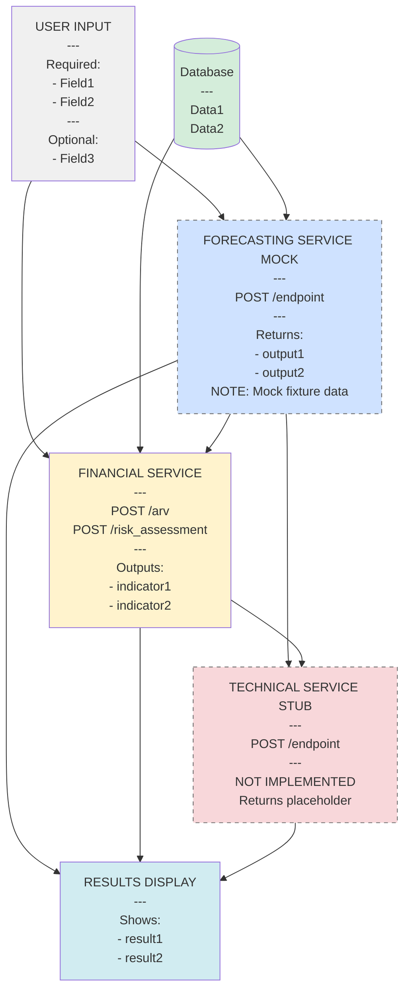
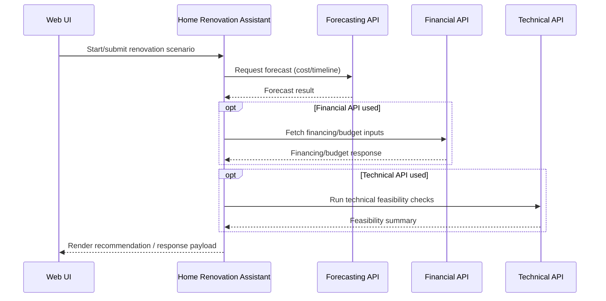
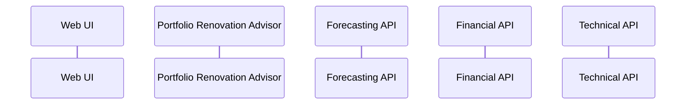
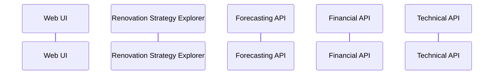
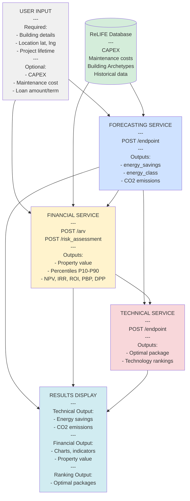
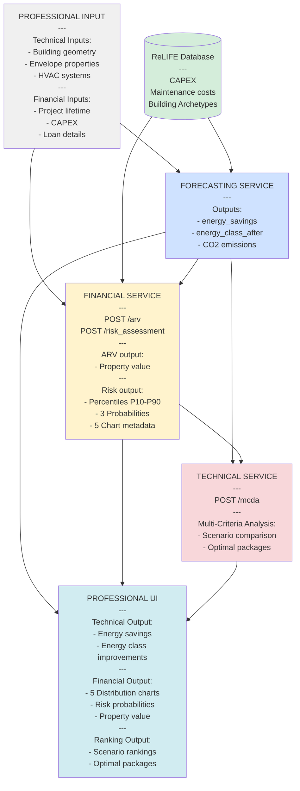

# Renovation Tools Architecture Review (Skill)

## Purpose

This skill guides an end-to-end architecture review of the renovation toolchain in the current repository:

- Home Renovation Assistant
- Portfolio Renovation Advisor
- Renovation Strategy Explorer

It produces:

1. Three separate GitHub-flavored Mermaid `sequenceDiagram`s (one per tool) showing interactions among the system's four primary building blocks:

- Web UI
- Forecasting API
- Financial API
- Technical API

2. A README update that embeds all three diagrams in separate subsections and documents which parts are mocked/stubbed/partial for each tool.

## When to use

Use this skill when you need to:

- Understand how the renovation tools are actually wired into the app.
- Document current request/response flows across the four building blocks.
- Identify mocks/stubs/feature flags that affect runtime behavior.
- Update the root README to reflect the implementation state (not the intended design).

## Non-goals

- Do not redesign architecture or invent missing flows.
- Do not "complete" stubbed APIs unless explicitly asked.
- Do not document hypothetical future behavior as current behavior.

## Definitions (align to code)

- Renovation tools: the three tools listed above (treat them as "tool orchestration units" even if implemented as services, routes, use-cases, etc.).
- Building blocks:
  - Web UI: user-facing frontend (web pages/components) and its API calls.
  - Forecasting API: endpoints/services that generate forecasts (cost/timeline/ROI/etc).
  - Financial API: endpoints/services dealing with financing, budgets, cashflow, rates, etc.
  - Technical API: endpoints/services for feasibility/constraints/technical checks.

## Required outputs

1. Three separate Mermaid sequence diagrams (GitHub-compatible), one for each tool:

- Home Renovation Assistant sequence diagram
- Portfolio Renovation Advisor sequence diagram
- Renovation Strategy Explorer sequence diagram

Each sequence diagram must:

- Show request/response directionality.
- Show responsibilities (who calls whom, and why at a high level).
- Explicitly labels mocked, stubbed, or partially implemented components.

2. Three separate Mermaid flow diagrams (GitHub-compatible), one for each tool:

- Home Renovation Assistant flow diagram
- Portfolio Renovation Advisor flow diagram
- Renovation Strategy Explorer flow diagram

Each flow diagram must:

- Match the style, tone, and scope of the design flow diagrams in `docs/pra-tool-design.md` and `docs/hra-tool-design.md`.
- Use rectangular boxes with multi-line labels showing component names and key details.
- Include ALL THREE service APIs (Forecasting, Financial, Technical) even if they are mocked or stubbed.
- Visually distinguish implemented vs mocked/stubbed/partial components using styling (e.g., different fill colors, borders, or annotations).
- Show data flow from user inputs → database → services → UI results.
- Include inline annotations within boxes showing key inputs/outputs for each component.

3. An updated root `README.md` section containing:

- A higher-level subsection (e.g., "## Renovation tools architecture") that introduces all diagrams.
- Three separate subsections, one for each tool, each containing:
  - The tool's sequence diagram in a fenced ` ```mermaid ` block.
  - The tool's flow diagram in a fenced ` ```mermaid ` block.
  - 2–6 sentences explaining what is real vs mocked/stubbed/partial for that specific tool.
  - Optional: links to key source files (preferred) to anchor the documentation.

## Workflow (do this in order)

### 1) Inventory the tool implementations

For each tool (Home Renovation Assistant, Portfolio Renovation Advisor, Renovation Strategy Explorer):

- Locate implementation entry points:
  - Routes/handlers/controllers.
  - Service layer functions/classes.
  - Any "tool registry" or "agent/tool" wiring.
- Record:
  - Primary module/file path(s).
  - Main exported function/class used at runtime.
  - How Web UI triggers it (page, component, fetch call, form action, etc.).

Concrete actions:

- Search by names and likely aliases (class/function/file names).
- Grep for the tool name in UI, backend, and configuration.
- Identify whether each tool runs client-side, server-side, or both.

### 2) Map calls to the four building blocks

For each tool, trace the real runtime path:

- Web UI → tool entry point
- Tool → Forecasting API (if used)
- Tool → Financial API (if used)
- Tool → Technical API (if used)
- Tool → Web UI (response/render result)

For each interaction, capture:

- Caller → callee
- What the request is for (short phrase)
- What the response provides (short phrase)
- Sync/async expectations if visible (e.g., polling, background jobs, streaming)

### 3) Identify mocks, stubs, partial implementations

Search for:

- Mock handlers (e.g., `mock*`, `fixtures`, `__mocks__`, "fake" adapters).
- Stub implementations (hardcoded returns, TODO branches).
- Feature flags (guarded code paths, environment toggles).
- Placeholder APIs (returns `501`, "not implemented", or static example payloads).

Classify each impacted component as one of:

- Mocked: deterministic fake behavior intended for development/testing.
- Stubbed: minimal scaffolding, incomplete, often placeholders.
- Partial: some scenarios implemented, others missing or gated.

Record evidence:

- File paths and symbols.
- Conditions (e.g., env var, flag, build mode).
- What's missing or simplified.

### 4) Produce three separate Mermaid sequence diagrams (GitHub-compatible)

**Important**: Create a separate sequence diagram for each tool:

- Home Renovation Assistant
- Portfolio Renovation Advisor
- Renovation Strategy Explorer

Rules for each diagram:

- Use `sequenceDiagram`.
- Use short participant labels with clear aliases.
- Show request and response arrows for each significant call.
- Prefer coarse-grained messages (avoid dumping schemas).
- Use `alt` / `opt` blocks for conditional paths (e.g., feature flag, mock mode).
- Use `Note over` or `Note right of` to call out mocked/stubbed/partial behavior.

How to "explicitly indicate" mocked/stubbed/partial:

- In participant alias: `participant F as Financial API (mock)`
- And/or a note: `Note over F: Mock adapter returns fixture data`
- For partial: include what is implemented vs missing (1 sentence).

Diagram scope guidance:

- Each tool should have its own dedicated diagram showing its specific interactions.
- Keep each diagram readable; do not exceed ~60–90 lines if possible.
- Focus each diagram on the unique flow for that specific tool.

### 4.5) Produce three separate Mermaid flow diagrams (GitHub-compatible)

**Important**: Create a separate flow diagram for each tool that matches the design documentation style.

Reference the flow diagrams at the bottom of:
- `docs/pra-tool-design.md` (Professional input → Services → Professional UI)
- `docs/hra-tool-design.md` (User input → Services → Results display)

Rules for each flow diagram:

- Use `flowchart TD` (top-down layout).
- Include ALL components present in the design diagrams:
  - User/Professional Input box (with inline details about input fields)
  - ReLIFE Database cylinder shape
  - Forecasting Service box (with endpoint and key outputs)
  - Financial Service box (with endpoint and key outputs)
  - Technical Service box (with endpoint and key outputs)
  - Results/UI Output box (with what is displayed)
- Use multi-line labels with `<br/>` and `---` dividers to show structure:
  - Component name (bold, ALL CAPS for main sections)
  - Separator line `---`
  - Key details (inputs, outputs, endpoints, etc.)
- Use styling to distinguish implementation status:
  - `style ComponentName fill:#COLOR` at the end of the diagram
  - Suggested colors:
    - Input: `#f0f0f0` (light gray)
    - Database: `#d4edda` (light green)
    - Forecasting: `#cfe2ff` (light blue)
    - Financial: `#fff3cd` (light yellow)
    - Technical: `#f8d7da` (light red)
    - UI/Output: `#d1ecf1` (light cyan) or `#e2e3e5` (light gray)
- Add visual indicators for mocked/stubbed components:
  - Append "(MOCK)" or "(STUB)" to the component name in the box
  - Use a distinct border color or fill shade (e.g., lighter or with dashed border)
  - In the inline details, explicitly note what's missing or simplified
- Show directional arrows for data flow:
  - Input → Service
  - Database → Service
  - Service → Service (when one depends on another)
  - Service → Output
- Keep the diagram visually similar to the design docs so deviations are obvious:
  - If a service is present in design but mocked in implementation, it should still appear in the same position
  - If input fields differ from design, the differences should be visible in the box content
  - If outputs differ, they should be visible in the output box

Example structure (adapt to actual implementation):



Comparison strategy:

- Place the generated flow diagram next to the design diagram (both should be in README)
- Visual alignment makes it obvious where implementation differs from design
- Annotations in boxes call out specific deviations (e.g., "Design specified X, but implemented Y")
- Color and styling differences highlight mock/stub status

### 5) Update root README.md

- Find the most appropriate existing section (e.g., "Architecture", "System Overview", "How it works").
- If none exists, add a higher-level section:

  `## Renovation tools architecture`

- Within this section, create three separate subsections, one for each tool:
  - `### Home Renovation Assistant`
  - `### Portfolio Renovation Advisor`
  - `### Renovation Strategy Explorer`

- For each tool subsection:
  - Insert that tool's sequence diagram in a fenced Mermaid block with a heading like `#### Sequence Diagram`
  - Insert that tool's flow diagram in a fenced Mermaid block with a heading like `#### Flow Diagram`
  - Add an "Implementation status" section directly after the diagrams using proper Markdown bullet points:
    - Start with a brief introductory sentence (optional)
    - Use bullet points (`-`) to list:
      - Which API(s) are mocked/stubbed/partial for this specific tool
      - What that implies for users and contributors (e.g., "financial results are placeholder")
      - Links to code evidence (paths) rather than making vague claims
  - Optionally include a comparison note: "The flow diagram above shows the current implementation. Compare it with the [original design flow diagram](docs/hra-tool-design.md#sequential-flow) to identify deviations."

### 6) Validate documentation correctness

- Ensure both the sequence diagram and flow diagram reflect current code behavior:
  - Names match real modules/services.
  - Calls shown are real (or explicitly called out as stubs/mocks).
  - Flow diagram components and data flows match actual implementation.
- Ensure Mermaid renders on GitHub:
  - Valid syntax, correct code fence, no unsupported extensions.
  - Test both `sequenceDiagram` and `flowchart TD` syntax.
- Compare flow diagrams with design documentation:
  - Visually review side-by-side to identify deviations.
  - Ensure styling differences make mock/stub status obvious.
  - Verify that annotations accurately describe what differs from design.
- If uncertain about any interaction or component status, mark it explicitly in the README as "Unverified" and link to the relevant code for follow-up.

## Mermaid skeleton (replace with real flows)

**Note**: Create three separate diagrams, one for each tool. Below are example skeletons for each:

### Sequence Diagrams

#### Home Renovation Assistant



#### Portfolio Renovation Advisor



#### Renovation Strategy Explorer



---

### Flow Diagrams

These should match the style from `docs/pra-tool-design.md` and `docs/hra-tool-design.md`.

#### Home Renovation Assistant



**Notes for flow diagram generation:**
- Replace component details with actual implementation specifics
- Add "(MOCK)", "(STUB)", or "(PARTIAL)" labels where applicable
- Use dashed borders (`stroke-dasharray: 5 5`) for mocked/stubbed components
- Include inline annotations about what differs from design (e.g., "Design specified X fields, implemented Y")
- Ensure data flow arrows accurately reflect actual API call sequences

#### Portfolio Renovation Advisor



#### Renovation Strategy Explorer

```mermaid
flowchart TD
    %% To be filled based on actual implementation
    %% Follow same pattern as HRA and PRA
    %% Include all service boxes even if mocked/stubbed
```
