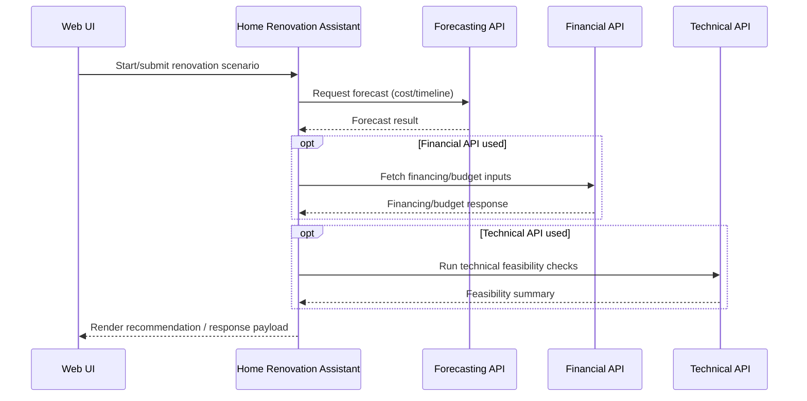
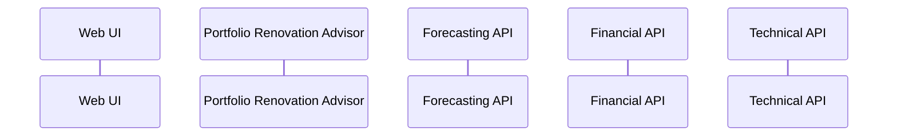
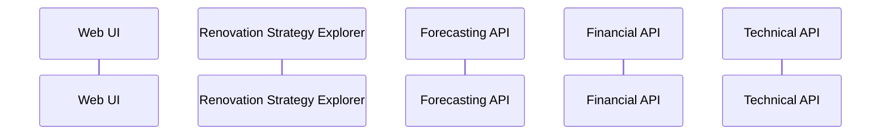

# Renovation Tools Architecture Review (Skill)

## Purpose

This skill guides an end-to-end architecture review of the renovation toolchain in the current repository:

- Home Renovation Assistant
- Portfolio Renovation Advisor
- Renovation Strategy Explorer

It produces:

1. Three separate GitHub-flavored Mermaid `sequenceDiagram`s (one per tool) showing interactions among the system's four primary building blocks:

- Web UI
- Forecasting API
- Financial API
- Technical API

2. A README update that embeds all three diagrams in separate subsections and documents which parts are mocked/stubbed/partial for each tool.

## When to use

Use this skill when you need to:

- Understand how the renovation tools are actually wired into the app.
- Document current request/response flows across the four building blocks.
- Identify mocks/stubs/feature flags that affect runtime behavior.
- Update the root README to reflect the implementation state (not the intended design).

## Non-goals

- Do not redesign architecture or invent missing flows.
- Do not "complete" stubbed APIs unless explicitly asked.
- Do not document hypothetical future behavior as current behavior.

## Definitions (align to code)

- Renovation tools: the three tools listed above (treat them as "tool orchestration units" even if implemented as services, routes, use-cases, etc.).
- Building blocks:
  - Web UI: user-facing frontend (web pages/components) and its API calls.
  - Forecasting API: endpoints/services that generate forecasts (cost/timeline/ROI/etc).
  - Financial API: endpoints/services dealing with financing, budgets, cashflow, rates, etc.
  - Technical API: endpoints/services for feasibility/constraints/technical checks.

## Required outputs

1. Three separate Mermaid sequence diagrams (GitHub-compatible), one for each tool:

- Home Renovation Assistant sequence diagram
- Portfolio Renovation Advisor sequence diagram
- Renovation Strategy Explorer sequence diagram

Each diagram must:

- Show request/response directionality.
- Show responsibilities (who calls whom, and why at a high level).
- Explicitly labels mocked, stubbed, or partially implemented components.

2. An updated root `README.md` section containing:

- A higher-level subsection (e.g., "## Renovation tools architecture") that introduces all sequence diagrams.
- Three separate subsections, one for each tool, each containing:
  - The tool's sequence diagram in a fenced ` ```mermaid ` block.
  - 2–6 sentences explaining what is real vs mocked/stubbed/partial for that specific tool.
  - Optional: links to key source files (preferred) to anchor the documentation.

## Workflow (do this in order)

### 1) Inventory the tool implementations

For each tool (Home Renovation Assistant, Portfolio Renovation Advisor, Renovation Strategy Explorer):

- Locate implementation entry points:
  - Routes/handlers/controllers.
  - Service layer functions/classes.
  - Any "tool registry" or "agent/tool" wiring.
- Record:
  - Primary module/file path(s).
  - Main exported function/class used at runtime.
  - How Web UI triggers it (page, component, fetch call, form action, etc.).

Concrete actions:

- Search by names and likely aliases (class/function/file names).
- Grep for the tool name in UI, backend, and configuration.
- Identify whether each tool runs client-side, server-side, or both.

### 2) Map calls to the four building blocks

For each tool, trace the real runtime path:

- Web UI → tool entry point
- Tool → Forecasting API (if used)
- Tool → Financial API (if used)
- Tool → Technical API (if used)
- Tool → Web UI (response/render result)

For each interaction, capture:

- Caller → callee
- What the request is for (short phrase)
- What the response provides (short phrase)
- Sync/async expectations if visible (e.g., polling, background jobs, streaming)

### 3) Identify mocks, stubs, partial implementations

Search for:

- Mock handlers (e.g., `mock*`, `fixtures`, `__mocks__`, "fake" adapters).
- Stub implementations (hardcoded returns, TODO branches).
- Feature flags (guarded code paths, environment toggles).
- Placeholder APIs (returns `501`, "not implemented", or static example payloads).

Classify each impacted component as one of:

- Mocked: deterministic fake behavior intended for development/testing.
- Stubbed: minimal scaffolding, incomplete, often placeholders.
- Partial: some scenarios implemented, others missing or gated.

Record evidence:

- File paths and symbols.
- Conditions (e.g., env var, flag, build mode).
- What's missing or simplified.

### 4) Produce three separate Mermaid sequence diagrams (GitHub-compatible)

**Important**: Create a separate sequence diagram for each tool:

- Home Renovation Assistant
- Portfolio Renovation Advisor
- Renovation Strategy Explorer

Rules for each diagram:

- Use `sequenceDiagram`.
- Use short participant labels with clear aliases.
- Show request and response arrows for each significant call.
- Prefer coarse-grained messages (avoid dumping schemas).
- Use `alt` / `opt` blocks for conditional paths (e.g., feature flag, mock mode).
- Use `Note over` or `Note right of` to call out mocked/stubbed/partial behavior.

How to "explicitly indicate" mocked/stubbed/partial:

- In participant alias: `participant F as Financial API (mock)`
- And/or a note: `Note over F: Mock adapter returns fixture data`
- For partial: include what is implemented vs missing (1 sentence).

Diagram scope guidance:

- Each tool should have its own dedicated diagram showing its specific interactions.
- Keep each diagram readable; do not exceed ~60–90 lines if possible.
- Focus each diagram on the unique flow for that specific tool.

### 5) Update root README.md

- Find the most appropriate existing section (e.g., "Architecture", "System Overview", "How it works").
- If none exists, add a higher-level section:

  `## Renovation tools architecture`

- Within this section, create three separate subsections, one for each tool:
  - `### Home Renovation Assistant`
  - `### Portfolio Renovation Advisor`
  - `### Renovation Strategy Explorer`

- For each tool subsection:
  - Insert that tool's sequence diagram in a fenced Mermaid block.
  - Add a short "Implementation status" paragraph directly after the diagram that states:
    - Which API(s) are mocked/stubbed/partial for this specific tool.
    - What that implies for users and contributors (e.g., "financial results are placeholder").
  - Prefer linking to code evidence (paths) rather than making vague claims.

### 6) Validate documentation correctness

- Ensure the diagram reflects current code behavior:
  - Names match real modules/services.
  - Calls shown are real (or explicitly called out as stubs/mocks).
- Ensure Mermaid renders on GitHub:
  - Valid syntax, correct code fence, no unsupported extensions.
- If uncertain about any interaction, mark it explicitly in the README as "Unverified" and link to the relevant code for follow-up.

## Mermaid skeleton (replace with real flows)

**Note**: Create three separate diagrams, one for each tool. Below are example skeletons for each:

### Home Renovation Assistant



### Portfolio Renovation Advisor



### Renovation Strategy Explorer


