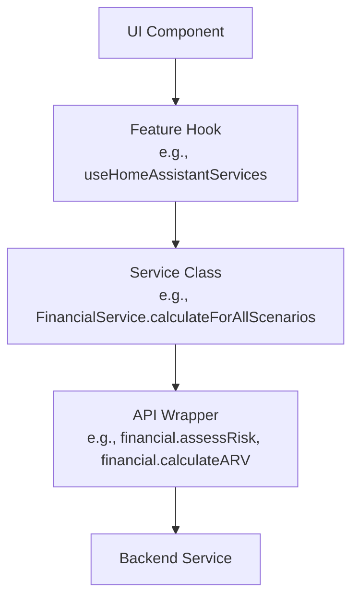

# AGENTS.md

This file provides guidance to AI agents when working with code in this repository.

## Pre-Task Checklist

Before starting any task, verify:

1. **D3.2**: Does this task touch any of the three tools, building data input, financial indicators, MCDA, or EPC reporting? If yes, read [`D32_WEB_UI_GUIDANCE.md`](./D32_WEB_UI_GUIDANCE.md) first.
2. **Versions**: Are the libraries you intend to use listed in [Tech Stack Versions](#tech-stack-versions)? Use only the documented versions.
3. **Scope**: Can the task be solved with a smaller change than initially planned? If yes, do the smaller change.
4. **Conflict**: Does this task conflict with D3.2, the existing architecture, or an adjacent requirement? If yes, stop and ask the user before proceeding.
5. **Ambiguity**: Is the requirement unclear or open to multiple valid interpretations? If yes, ask the user to clarify before writing any code.

### Stop and Ask the User When

- A D3.2 requirement conflicts with the task or user instruction
- Adding a dependency not already in `package.json` is being considered
- The change would touch more than ~3 files in ways not directly requested
- An assumption is being made that the user has not stated explicitly
- Proposed work requires an architectural decision (new pattern, new layer, new abstraction)

---

## ReLIFE Project Context

This repository implements the **ReLIFE Web UI**, part of the EU LIFE program ReLIFE project for building energy renovation in Europe.

### D3.2 Requirements Document

This section summarizes Web UI-relevant requirements from deliverable D3.2 "Methodological Frameworks of ReLIFE Services". The trigger for when to consult [`D32_WEB_UI_GUIDANCE.md`](./D32_WEB_UI_GUIDANCE.md) is defined in the [Pre-Task Checklist](#pre-task-checklist).

#### Key Architectural Constraints from D3.2

- **Three Distinct Tools** must be implemented.
- **Renovation Strategy Explorer** (Group 1: policymakers, researchers).
- **Portfolio Renovation Advisor** (Group 2: financial institutions, ESCOs).
- **Home Renovation Assistant** (Group 3: homeowners).
- **Three Backend Services** the UI must integrate with.
- **Financial Service**: Funding options, financial indicators (NPV, IRR, ROI, PP, DPP, ARV), risk assessment.
- **Forecasting Service**: Building energy simulation, climate scenarios (present/2030/2050).
- **Technical Service**: Technical sheets, MCDA with 5 pillars, building stock analysis.
- **MCDA Framework**: Five evaluation pillars with predefined user personas (Environmentally Conscious, Comfort-Driven, Cost-Optimization Oriented).
- **Compliance Requirements**: GDPR, role-based access, data minimization, consent management.

#### D3.2-Covered Example Areas

Canonical trigger: use the [Pre-Task Checklist](#pre-task-checklist). The examples below are common D3.2-covered areas:

- Implementing any of the three tools or their workflows
- Adding forms for building data input (three pathways: archetype, custom, modified)
- Displaying financial indicators or risk assessment results
- Implementing MCDA scoring or persona selection
- Adding EPC-based reporting features
- Designing data flows between services

#### Handling Conflicts with D3.2

**IMPORTANT**: If D3.2 requirements or guidelines conflict with the current task, user instructions, or practical implementation constraints:

1. **Do NOT silently deviate** from D3.2 or make assumptions
2. **Ask the user directly** for clarification before proceeding
3. Clearly explain the conflict and present options

D3.2 represents formal project requirements, but implementation realities may require adjustments. The user must explicitly approve any deviation from documented requirements.

## Development Process

This project prioritizes transparency, restraint, and verifiability over speed or comprehensiveness.

### 1. Think Before Coding

State assumptions explicitly. If uncertain, ask the user directly.

- Surface multiple interpretations rather than deciding silently.
- Acknowledge simpler alternatives when they exist.
- Pause and clarify when requirements conflict or remain ambiguous.

### 2. Simplicity First

Write minimal code solving the stated problem only.

- Implement exactly what was requested; avoid speculative features or unused abstractions.
- If you can solve the problem in 50 lines instead of 200, choose the simpler solution.
- Validate at system boundaries (API responses, user input); avoid defensive checks for impossible internal states.
- Treat code length as a signal: growing files should be split, not expanded.

### 3. Surgical Changes

Modify only what the request requires; preserve surrounding code style.

- Don't refactor working code or "improve" unrelated sections.
- Don't remove dependencies unless your changes created them.
- Match existing patterns in the file/feature being modified.
- If you spot pre-existing dead code, flag it to the user rather than deleting it silently.

### 4. Goal-Driven Execution

- Transform vague requests into measurable success criteria.
- For multi-step tasks, create a brief verification plan upfront.
- Test before and after changes to establish causality.
- Define success explicitly (metric, target, and measurement method).

---

These principles trade speed for correctness on non-trivial work.

## API Specifications (OpenAPI)

The OpenAPI specifications for the Financial, Forecasting, and Technical services are stored in `api-specs/`. Timestamped subdirectories (e.g., `api-specs/20260114-165540`) track each service evolution. Use these specs as the formal API reference when implementing or reviewing integrations.

## API Integration Architecture

The codebase uses a **two-layer architecture** for backend service integration:

### Layer 1: API Wrappers (`src/api/`)

Low-level HTTP client wrappers that directly communicate with backend REST endpoints:

- **`client.ts`**: Core request utilities with authentication handling (`request`, `uploadRequest`, `downloadRequest`)
- **`financial.ts`**, **`forecasting.ts`**, **`technical.ts`**: Thin wrappers mapping directly to backend endpoints (e.g., `financial.assessRisk()`, `financial.calculateARV()`)
- **`index.ts`**: Re-exports all service clients

These wrappers:

- Handle authentication tokens (via Supabase session)
- Provide typed request/response interfaces aligned with OpenAPI specs
- Throw `APIError` for error handling
- Should NOT contain business logic—they are pure HTTP adapters

### Layer 2: Feature Service Abstractions (`src/features/<tool>/services/`)

Domain-specific service classes that **consume the API wrappers** and add business logic:

- **Example**: `src/features/home-assistant/services/FinancialService.ts` imports `financial` from `src/api`, implements `IFinancialService`, and adds higher-level methods like `calculateForAllScenarios()` with business logic, data transformations, and orchestration of multiple API calls.

- **Interfaces** (in `services/types.ts`): Define contracts like `IFinancialService`, `IBuildingService`, `IEnergyService`, `IMCDAService`
- **Mock implementations** (in `services/mock/`): For testing and development when backend services are unavailable
- **Real implementations**: Use the `src/api/` wrappers and transform data for the UI

### When to Modify Each Layer

| Task                                                       | Modify                               |
| ---------------------------------------------------------- | ------------------------------------ |
| Backend endpoint changed (URL, request/response shape)     | `src/api/<service>.ts`               |
| New backend endpoint added                                 | `src/api/<service>.ts`               |
| Business logic for a feature (calculations, orchestration) | `src/features/<tool>/services/`      |
| New feature-specific data transformations                  | `src/features/<tool>/services/`      |
| Mock data for testing/development                          | `src/features/<tool>/services/mock/` |

### Example Data Flow

## Tech Stack Versions

**CRITICAL**: Always verify that any proposed changes, API usage, or code examples are compatible with the exact versions listed below. Do not suggest features, APIs, or patterns from different versions.

### Core Dependencies

- **React**: `^19.2.0`
- **React DOM**: `^19.2.0`
- **TypeScript**: `~5.9.3`
- **Vite**: `^7.2.4`
- **react-router-dom**: `^7.9.6`
- **@supabase/supabase-js**: `^2.84.0`

### UI Framework

- **@mantine/core**: `^8.3.8`
- **@mantine/hooks**: `^8.3.8`
- **@mantine/form**: `^8.3.12`
- **@mantine/charts**: `^8.3.12`
- **@mantine/dropzone**: `^8.3.12`
- **@tabler/icons-react**: `^3.35.0`
- **react-leaflet**: `^5.0.0`
- **leaflet**: `^1.9.4`

### Development Tools

- **@vitejs/plugin-react**: `^5.1.1`
- **ESLint**: `^9.39.1`
- **TypeScript ESLint**: `^8.46.4`
- **Prettier**: `^3.6.2`
- **Vitest**: `^4.0.18`

### TypeScript Configuration

- **Target**: `ES2022`
- **Module**: `ESNext`
- **JSX**: `react-jsx`
- **Strict mode**: Enabled
- **Module Resolution**: `bundler`

**When in doubt**, consult the official documentation for the specific versions listed above, not the latest documentation.

## Code Style

### General Principles

- **Keep it minimal**: Do not add new dependencies unless strictly necessary and clearly justified.
- **Prefer built-in features** from Vite, React, and Mantine over external libraries.
- **Use TypeScript** with strict typing (`strict: true`) and avoid `any` unless unavoidable (and document why).
- **Always prefer Mantine components and layout primitives**: Use built-in Mantine components for all UI and layout needs. Custom CSS should only be used as a last resort when Mantine does not provide a clean, comparable solution.

**Scope reminder**: If you're adding a feature, don't refactor surrounding code. If you're fixing a bug, don't add error handling for hypothetical scenarios. Write for the problem at hand.

### Project Structure

The `src/` directory is organized as follows:

- `src/api/` – API wrappers (HTTP clients, one file per backend service)
- `src/auth.ts` – Supabase authentication setup
- `src/components/` – Shared, reusable UI components
- `src/config.ts` – App-wide configuration (env vars, constants)
- `src/contexts/` – React contexts (e.g., global loading state)
- `src/features/` – Domain-specific features and pages (one subdirectory per tool)
- `src/hooks/` – Shared hooks
- `src/routes/` – Route definitions (react-router-dom v7)
- `src/services/` – Shared services (non-feature-specific business logic)
- `src/theme.ts` – Central Mantine theme configuration
- `src/types/` – Shared TypeScript types
- `src/utils/` – Shared utility functions

Keep files **short and focused**; split components when they grow too large or complex.

### React & JSX

- Use **function components** and **React hooks**; do not use class components.
- Use **named exports** for components and functions (`export const MyComponent = ...`).
- Use **React.FC** only when needed for props like `children`; otherwise prefer plain function types.
- Keep components **presentational or container-style**.
- Presentational components: UI, no direct API calls.
- Container components/hooks: data fetching, side effects, state.

### Mantine

- Use Mantine components for layout and UI (e.g. `AppShell`, `Stack`, `Group`, `Button`, `TextInput`).
- Configure the central Mantine theme in `src/theme.ts` and reuse it—do not create a second theme file.
- Use the `style` prop (accepts a CSS object) for one-off inline overrides.
- Use `className` and `classNames` (Styles API) for targeting Mantine component internals.
- Custom CSS files should only be used when neither `style` nor `classNames` can achieve the result.
- Use **Mantine hooks** (e.g. `useDisclosure`, `useMantineTheme`) where appropriate instead of adding utility libraries.

### Styling

- Prefer **Mantine props and the `style` prop** for styling over global CSS.
- Use CSS variables or Mantine theme tokens for colors and spacing; avoid hard-coded values (magic numbers).
- Keep consistent spacing & typography using the theme scale.
- **Avoid emojis** in UI code; prefer native icon libraries (e.g. `@tabler/icons-react`) that are already included as dependencies.

### Error Handling & UX

- At **system boundaries** (API responses, user input): always handle errors explicitly and visibly—throw typed errors (`APIError`), catch them in the UI, and show error states using Mantine components (e.g. `Alert`). Never swallow errors silently or rely on `console.error` alone.
- Within **internal code** (pure functions, hooks, data transformations): skip defensive null-checks and try/catch for scenarios that TypeScript or framework guarantees make impossible. Over-defensive internal code adds noise without value.
- Provide simple **loading states** using Mantine (`Loader`, skeletons, disabled buttons).

### State & Data Fetching

- Prefer **local component state and small custom hooks** over global state unless truly necessary.
- If you introduce a state or data-fetching library, it must be justified by a clear need (e.g. caching, invalidation, complex state).
- Any new state or data-fetching library must stay consistent with the "minimal dependencies" guideline.

### Configuration & Environment

- Use **Vite environment variables** (`import.meta.env`) for configuration (API base URL, feature flags).
- Do not hardcode environment-specific URLs (`localhost`, production domains) inside components.
- Keep any dev-only config (e.g. proxy settings) in Vite config files.

### Testing & Quality

- Write **small, focused tests** for API client functions.
- Write **small, focused tests** for critical UI components and hooks.
- Use **Vitest + React Testing Library** (both already included); avoid adding heavy testing frameworks.

### Code Style Essentials

- Use **consistent naming**: components in `PascalCase`; functions, variables, and hooks in `camelCase`; hooks named like `useSomething`.
- Use ES modules and modern syntax: `const` / `let` (no `var`) and arrow functions for callbacks/small utilities.
- Keep imports **sorted and grouped**: external libraries, internal modules, then local-relative imports.
- Avoid dead code, unused imports, and commented-out blocks—delete them instead.

## Universal Dos/Don'ts

Quick-reference checklist. Prefer the [Development Process](#development-process) section for rationale.

### Don't

- Do NOT add dependencies unless native APIs are insufficient and the need is clearly justified.
- Do NOT add speculative features, unused abstractions, or unrelated refactors.
- Do NOT delete pre-existing dead code silently; flag it to the user instead.
- Do NOT hardcode environment-specific URLs, tokens, or magic numbers.
- Do NOT use the `sx` prop (Mantine v8); use `style`, `className`, or `classNames`.
- Do NOT swallow errors silently at system boundaries.
- Do NOT leave dead code, unused imports, or commented-out sections.
- Do NOT make large, unfocused commits or commit secrets.
- Do NOT over-optimize before profiling.
- Do NOT rely on mutable globals or unclear side effects.
- Do NOT omit root-level `README.md` or work outside a git directory.

### Do

- Clarify ambiguous requirements by asking the user directly; surface alternatives explicitly.
- State assumptions clearly; ask rather than assume.
- Transform vague requests into measurable success criteria.
- Search the codebase for existing patterns before implementing new ones.
- Confirm framework/library versions before writing code (see [Tech Stack Versions](#tech-stack-versions)).
- Write minimal code solving exactly what was requested.
- Match existing code patterns and style in the file/feature you're modifying.
- Use TypeScript strict typing and avoid `any` (document if unavoidable).
- Make atomic, descriptive commits that reflect the "why" of changes.
- Run lint and build locally before completing work.
- Generate focused tests for key logic and verify behavior before and after changes.
- Document non-obvious decisions and keep `README.md` up to date.
