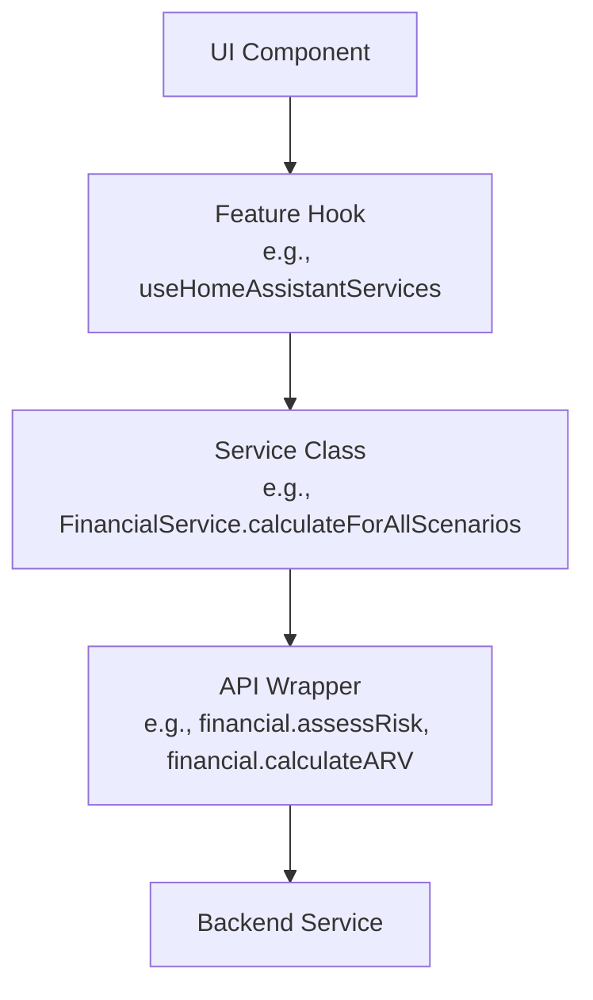

# CLAUDE.md

This file provides guidance to Claude Code (claude.ai/code) when working with code in this repository.

## ReLIFE Project Context

This repository implements the **ReLIFE Web UI**, part of the EU LIFE program ReLIFE project for building energy renovation in Europe.

### D3.2 Requirements Document

**IMPORTANT**: Before implementing features, consult [`D32_WEB_UI_GUIDANCE.md`](./D32_WEB_UI_GUIDANCE.md) which contains Web UI-relevant requirements extracted from deliverable D3.2 "Methodological Frameworks of ReLIFE Services".

#### Key Architectural Constraints from D3.2

1. **Three Distinct Tools** must be implemented:
   - **Renovation Strategy Explorer** (Group 1: policymakers, researchers)
   - **Portfolio Renovation Advisor** (Group 2: financial institutions, ESCOs)
   - **Home Renovation Assistant** (Group 3: homeowners)

2. **Three Backend Services** the UI must integrate with:
   - **Financial Service**: Funding options, financial indicators (NPV, IRR, ROI, PP, DPP, ARV), risk assessment
   - **Forecasting Service**: Building energy simulation, climate scenarios (present/2030/2050)
   - **Technical Service**: Technical sheets, MCDA with 5 pillars, building stock analysis

3. **MCDA Framework**: Five evaluation pillars with predefined user personas (Environmentally Conscious, Comfort-Driven, Cost-Optimization Oriented)

4. **Compliance Requirements**: GDPR, role-based access, data minimization, consent management

#### When to Consult D32_WEB_UI_GUIDANCE.md

- Implementing any of the three tools or their workflows
- Adding forms for building data input (three pathways: archetype, custom, modified)
- Displaying financial indicators or risk assessment results
- Implementing MCDA scoring or persona selection
- Adding EPC-based reporting features
- Designing data flows between services

#### Handling Conflicts with D3.2

**IMPORTANT**: If D3.2 requirements or guidelines conflict with the current task, user instructions, or practical implementation constraints:

1. **Do NOT silently deviate** from D3.2 or make assumptions
2. **Prompt the user for clarification** before proceeding
3. Clearly explain the conflict and present options

D3.2 represents formal project requirements, but implementation realities may require adjustments. The user must explicitly approve any deviation from documented requirements.

## Development Process

This project prioritizes transparency, restraint, and verifiability over speed or comprehensiveness.

### 1. Think Before Coding

**State assumptions explicitly. If uncertain, ask.**

- Surface multiple interpretations rather than deciding silently
- Acknowledge simpler alternatives when they exist
- When encountering ambiguous requirements or conflicts, pause and clarify with the user
- Use `AskUserQuestion` to validate assumptions for anything non-trivial

**Never proceed with uncertainty silently.** This is more important than moving fast.

### 2. Simplicity First

**Write minimal code solving the stated problem only.**

- Implement exactly what was requested; avoid speculative features or unused abstractions
- If you can solve the problem in 50 lines instead of 200, refactor to the simpler solution
- Skip error handling for scenarios that shouldn't occur (trust framework guarantees for internal code; validate only at system boundaries)
- Treat code length as a signal: growing files should be split, not expanded

**Before writing**: Ask "What is the simplest way to solve this?"

### 3. Surgical Changes

**Modify only what the request requires; preserve surrounding code style.**

- Don't refactor working code or "improve" unrelated sections
- Don't remove dependencies unless YOUR changes created them
- Match the existing code patterns in the file/feature you're modifying
- If you spot pre-existing dead code, flag it to the user rather than deleting it silently

**Scope matters**: A bug fix doesn't require code cleanup. A new feature doesn't need comprehensive error handling for edge cases that can't occur.

### 4. Goal-Driven Execution

**Transform vague requests into measurable success criteria.**

- For multi-step tasks, create a brief verification plan upfront
- Test before and after changes to establish causality
- Strong success criteria enable independent iteration and reduce ambiguity

**Example**: Instead of "improve performance", clarify:
- What metric? (load time, render time, bundle size)
- What is "improved"? (10% faster, under 2 seconds)
- How will we measure it? (specific test, profiling tool, benchmark)

---

**These principles trade speed for correctness**—appropriate for non-trivial work. They reduce AI-driven coding mistakes by prioritizing caution and verifiability.

## API Specifications (OpenAPI)

The OpenAPI specifications for the Financial, Forecasting, and Technical services are stored in `api-specs/`. This directory contains timestamped subdirectories that track the evolution of each service's API (e.g., `api-specs/20260114-165540`) and are sortable alphabetically. Use these specs as the formal reference for API interfaces when implementing or reviewing integrations.

## API Integration Architecture

The codebase uses a **two-layer architecture** for backend service integration:

### Layer 1: API Wrappers (`src/api/`)

Low-level HTTP client wrappers that directly communicate with backend REST endpoints:

- **`client.ts`**: Core request utilities with authentication handling (`request`, `uploadRequest`, `downloadRequest`)
- **`financial.ts`**, **`forecasting.ts`**, **`technical.ts`**: Thin wrappers mapping directly to backend endpoints (e.g., `financial.assessRisk()`, `financial.calculateARV()`)
- **`index.ts`**: Re-exports all service clients

These wrappers:

- Handle authentication tokens (via Supabase session)
- Provide typed request/response interfaces aligned with OpenAPI specs
- Throw `APIError` for error handling
- Should NOT contain business logic—they are pure HTTP adapters

### Layer 2: Feature Service Abstractions (`src/features/<tool>/services/`)

Domain-specific service classes that **consume the API wrappers** and add business logic:

- **Example**: `src/features/home-assistant/services/FinancialService.ts`
  - Imports `financial` from `src/api`
  - Implements `IFinancialService` interface
  - Adds higher-level methods like `calculateForAllScenarios()` with business logic, data transformations, and orchestration of multiple API calls

- **Interfaces** (in `services/types.ts`): Define contracts like `IFinancialService`, `IBuildingService`, `IEnergyService`, `IMCDAService`
- **Mock implementations** (in `services/mock/`): For testing and development when backend services are unavailable
- **Real implementations**: Use the `src/api/` wrappers and transform data for the UI

### When to Modify Each Layer

| Task                                                       | Modify                               |
| ---------------------------------------------------------- | ------------------------------------ |
| Backend endpoint changed (URL, request/response shape)     | `src/api/<service>.ts`               |
| New backend endpoint added                                 | `src/api/<service>.ts`               |
| Business logic for a feature (calculations, orchestration) | `src/features/<tool>/services/`      |
| New feature-specific data transformations                  | `src/features/<tool>/services/`      |
| Mock data for testing/development                          | `src/features/<tool>/services/mock/` |

### Example Data Flow

## Tech Stack Versions

**CRITICAL**: Always verify that any proposed changes, API usage, or code examples are compatible with the exact versions listed below. Do not suggest features, APIs, or patterns from different versions.

### Core Dependencies

- **React**: `^19.2.0`
- **React DOM**: `^19.2.0`
- **TypeScript**: `~5.9.3`
- **Vite**: `^7.2.4`

### UI Framework

- **Mantine Core**: `^8.3.8`
- **Mantine Hooks**: `^8.3.8`
- **Tabler Icons React**: `^3.35.0`

### Development Tools

- **@vitejs/plugin-react**: `^5.1.1`
- **ESLint**: `^9.39.1`
- **TypeScript ESLint**: `^8.46.4`
- **Prettier**: `^3.6.2`

### TypeScript Configuration

- **Target**: `ES2022`
- **Module**: `ESNext`
- **JSX**: `react-jsx`
- **Strict mode**: Enabled
- **Module Resolution**: `bundler`

**When in doubt**, consult the official documentation for the specific versions listed above, not the latest documentation.

## Code Style

### General Principles

These principles are grounded in the **Development Process** section above, especially *Simplicity First* and *Surgical Changes*:

- **Keep it minimal**: Do not add new dependencies unless strictly necessary and clearly justified.
- **Prefer built-in features** from Vite, React, and Mantine over external libraries.
- **Use TypeScript** with strict typing (`strict: true`) and avoid `any` unless unavoidable (and document why).
- **Always prefer Mantine components and layout primitives**: Use built-in Mantine components for all UI and layout needs. Custom CSS should only be used as a last resort when Mantine does not provide a clean, comparable solution.

**Scope reminder**: If you're adding a feature, don't refactor surrounding code. If you're fixing a bug, don't add error handling for hypothetical scenarios. Write for the problem at hand.

### Project Structure

- Use a **feature-oriented structure**, e.g.:
  - `src/components/` – reusable UI components
  - `src/features/` – domain-specific features/pages
  - `src/api/` – API client and types
  - `src/hooks/` – shared hooks
  - `src/styles/` – global theme and styles

- Keep files **short and focused**; split components when they grow too large or complex.

### React & JSX

- Use **function components** and **React hooks**; do not use class components.
- Use **named exports** for components and functions (`export const MyComponent = ...`).
- Use **React.FC** only when needed for props like `children`; otherwise prefer plain function types.
- Keep components **presentational or container-style**:
  - Presentational components: UI, no direct API calls.
  - Container components/hooks: data fetching, side effects, state.

### Mantine

- Use Mantine components for layout and UI (e.g. `AppShell`, `Stack`, `Group`, `Button`, `TextInput`).
- Configure a **central Mantine theme** (colors, fonts, radius) in a single `theme` file and reuse it.
- Avoid custom CSS where Mantine props or `sx` can achieve the same result.
- Use **Mantine hooks** (e.g. `useDisclosure`, `useMantineTheme`) where appropriate instead of adding utility libraries.

### Styling

- Prefer **Mantine props and `sx`** for styling over global CSS.
- Use CSS variables or Mantine theme tokens for colors and spacing; avoid hard-coded values (magic numbers).
- Keep consistent spacing & typography using the theme scale.
- **Avoid emojis** in UI code; prefer native icon libraries (e.g. `@tabler/icons-react`) that are already included as dependencies.

### Error Handling & UX

- Handle API errors in the API client and return **typed error objects** or throw typed errors.
- Show user-facing error states with Mantine components (e.g. `Alert`), not `alert()` or console-only errors.
- Provide simple **loading states** using Mantine (`Loader`, skeletons, disabled buttons).

### State & Data Fetching

- Prefer **local component state and small custom hooks** over global state unless truly necessary.
- If you introduce a state or data-fetching library, it must be:
  - Justified by a clear need (e.g. caching, invalidation, complex state).
  - Consistent with the “minimal dependencies” guideline.

### Configuration & Environment

- Use **Vite environment variables** (`import.meta.env`) for configuration (API base URL, feature flags).
- Do not hardcode environment-specific URLs (`localhost`, production domains) inside components.
- Keep any dev-only config (e.g. proxy settings) in Vite config files.

### Testing & Quality

- Write **small, focused tests** for:
  - API client functions.
  - Critical UI components and hooks.

- Prefer **simple testing setups** (e.g. React Testing Library + Vitest/Jest if already included) and avoid heavy testing frameworks unless required.

### Code Style Essentials

- Use **consistent naming**:
  - Components: `PascalCase`
  - Functions, variables, hooks: `camelCase`
  - Hooks: `useSomething`

- Use ES modules and modern syntax:
  - `const` / `let` (no `var`)
  - Arrow functions for callbacks and small utilities.

- Keep imports **sorted and grouped**:
  - External libraries
  - Internal modules
  - Local-relative imports

- Avoid dead code, unused imports, and commented-out blocks—delete them instead.

## Universal Dos/Don'ts

**Grounded in the Development Process above**, these rules ensure code quality, maintainability, and alignment with project values.

### Don't

**Simplicity & Scope**
- Add dependencies unless native APIs are insufficient.
- Add speculative features, unused abstractions, or "future-proofing" beyond the current task.
- Refactor or improve unrelated sections when fixing a bug or implementing a feature.
- Skip error handling for scenarios that can't happen (trust framework guarantees internally).
- Expand files past ~300 lines without splitting them.

**Changes & Commits**
- Make large, unfocused commits; prefer atomic changes.
- Commit secrets—use env vars and `.gitignore` for sensitive files.
- Leave dependency versions unpinned—always specify range (at least major).
- Delete pre-existing dead code silently; flag it instead.

**Configuration & Code Quality**
- Hardcode environment-specific URLs, tokens, or magic numbers; use constants and config files.
- Use inline CSS/styles or violate framework conventions (e.g., always use Mantine components first).
- Leave dead code, unused imports, or commented-out sections.
- Ignore errors; handle all failures visibly with user-facing messages.
- Over-optimize before profiling; ship working code first.
- Rely on mutable globals or unclear side effects.

**Project Integrity**
- Omit root-level README.md.
- Work outside of a git directory.

### Do

**Before Coding**
- Clarify ambiguous requirements with short planning or `AskUserQuestion`; surface alternatives explicitly.
- State assumptions clearly; ask rather than assume.
- Transform vague requests into measurable success criteria.
- Search GitHub/GitLab for real code patterns before complex implementation.
- Confirm framework/library versions before writing code (see Tech Stack Versions).

**During Implementation**
- Write minimal code solving exactly what was requested.
- Match existing code patterns and style in the file/feature you're modifying.
- Use TypeScript strict typing and avoid `any` (document if unavoidable).
- Make atomic, descriptive commits that reflect the "why" of changes.
- Run lint and build locally before completing work.
- Sanitize inputs and follow security best practices (e.g., OWASP Top 10).

**Testing & Verification**
- Generate automated smoke tests for key logic; invite user guidance for complex cases.
- Test before and after changes to establish causality.
- Verify changes work as intended before claiming completion.

**Documentation & Decisions**
- Document the reasoning behind non-obvious code decisions.
- Keep README.md up-to-date with project changes.
- Write comments only for non-obvious logic; self-documenting code is preferred.
