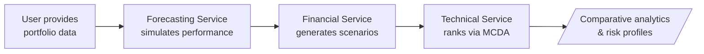
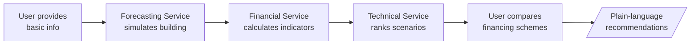
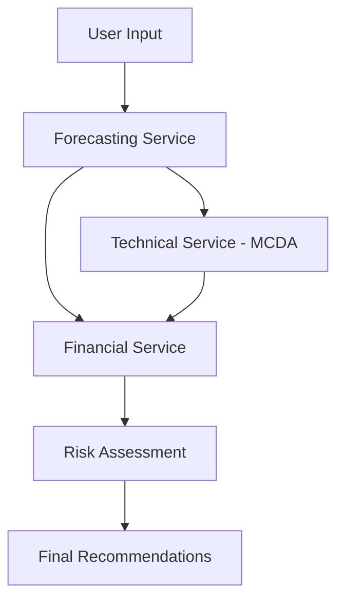

# D3.2 Web UI Guidance Document

> **Source Material**: ReLIFE Deliverable D3.2 "Methodological Frameworks of ReLIFE Services"
> **Version**: 0.5 (dated 31/10/2025)

---

## 1. Executive Summary

This document extracts and synthesizes Web UI-relevant guidance from D3.2 "Methodological Frameworks of ReLIFE Services". D3.2 defines the methodological foundations for three core ReLIFE services (Financial, Forecasting, and Technical) and specifies how they must interact to support three distinct user-facing tools.

**Key Takeaways for Web UI Implementation:**
- The Web UI must support **three distinct tools** targeting different user groups
- Each tool combines all three services but presents them differently based on user expertise
- Specific data input/output contracts are defined for each service
- User personas and MCDA weighting schemes must be implemented in the UI
- Legal and GDPR compliance requirements affect data handling in the frontend

---

## 2. Three Tools and Their Target User Groups

### 2.1 Defined Tools

D3.2 explicitly defines **three open-access tools** that the Web UI must implement:

| Tool Name                        | Target User Group                                                      | Primary Focus                                                          |
| -------------------------------- | ---------------------------------------------------------------------- | ---------------------------------------------------------------------- |
| **Renovation Strategy Explorer** | Group 1: Policymakers, urban planners, researchers, public authorities | National/regional building stock analysis and strategy development     |
| **Portfolio Renovation Advisor** | Group 2: Financial institutions, ESCOs, large-scale building owners    | Portfolio-level renovation assessment with detailed financial analysis |
| **Home Renovation Assistant**    | Group 3: Private homeowners, tenants, small-scale building owners      | Single-building renovation with simplified, user-friendly guidance     |

### 2.2 Tool Workflow Implications for UI

Each tool has a distinct workflow that the UI must support:

#### Renovation Strategy Explorer (Group 1)

1. User selects country/region for analysis
2. Technical Service analyzes building stock and identifies archetypes
3. Forecasting Service simulates renovation measures on archetypes
4. Financial Service calculates investment indicators
5. Technical Service synthesizes and prioritizes results
6. **UI Output**: Regional projections, energy trends, policy-relevant visualizations

#### Portfolio Renovation Advisor (Group 2)

1. User provides detailed building portfolio data
2. Forecasting Service simulates energy performance per building
3. Financial Service generates dynamic financial scenarios with risk assessment
4. Technical Service ranks renovation scenarios via MCDA
5. **UI Output**: Comparative analytics, risk profiles, investment prioritization

#### Home Renovation Assistant (Group 3)

1. User provides basic building information
2. Forecasting Service simulates building and applies predefined renovation packages
3. Financial Service calculates simplified financial indicators
4. Technical Service ranks scenarios in accessible format
5. User compares financing schemes for selected package
6. **UI Output**: Plain-language explanations, clear recommendations, simplified visuals

---

## 3. Explicit User Requirements

D3.2 explicitly defines these user requirements that the Web UI must address:

| ID   | Requirement                                         | Target Groups | UI Implication                                |
| ---- | --------------------------------------------------- | ------------- | --------------------------------------------- |
| UR1  | Single-interface comparison of renovation scenarios | Groups 2 & 3  | Must support real-time comparison workspace   |
| UR2  | EPC-based reporting                                 | All groups    | Display current and projected EPC values      |
| UR3  | Simulation of technical interventions               | Groups 2 & 3  | Show results of envelope/HVAC simulations     |
| UR4  | Cost and energy-savings estimation                  | Groups 2 & 3  | Built-in calculator with actionable data      |
| UR5  | Pre-validated renovation scenarios                  | Groups 2 & 3  | Provide archetype-based scenario library      |
| UR6  | Funding and incentive directory                     | All groups    | Centralized funding scheme directory          |
| UR7  | Interactive financial calculators                   | All groups    | ROI/payback calculators with policy awareness |
| UR8  | Updated funding mechanisms                          | All groups    | Support evolving funding options              |
| UR9  | Insurance and risk-focused analytics                | Group 2       | Risk assessment visualizations                |
| UR10 | Clarity of technical/financial information          | Group 3       | Plain-language explanations, examples         |
| UR11 | Data-driven O&M for occupant well-being             | Groups 2 & 3  | Comfort/well-being insights                   |
| UR12 | Centralized quality-controlled data repository      | All groups    | Standardized data formats, validation         |
| UR13 | Data visualization for energy monitoring            | Group 1       | Graphs, maps, interactive dashboards          |
| UR14 | Inclusion of urban/regional/country factors         | Group 1       | Regional/national filtering capabilities      |
| UR15 | Data-driven policymaking                            | Group 1       | Accurate data gathering, forecasting tools    |
| UR16 | Building Stock Data Analytics                       | Group 1       | Large-scale analytics and assessments         |

---

## 4. Technical Requirements for Web UI

D3.2 explicitly defines these technical requirements:

### Architecture & Infrastructure
- **TR1 Scalability**: UI must handle varying loads
- **TR10 Performance optimization**: Fast load times required

### Data Management & Integration
- **TR13 Input data set uploads**: Allow users to upload CSV and other common formats
- **TR14 Validation of user inputs**: Implement input validation and quality checks
- **TR15 History of job submissions**: Maintain record of past jobs/results
- **TR16 Unified data storage & retrieval**: Single interface for diverse data types

### Interoperability & Services Integration
- **TR3 Interoperability**: APIs based on OpenAPI/HTTP standards
- **TR9 Support for long-running jobs**: Provide notifications for background processes

### User Management & Access Control
- **TR6 Central identity provider**: Single sign-on across all tools
- **TR12 Role-based access management**: Assign roles and permissions to users

### User Tools & Functional Features
- **TR4 User interface & experience**: Three web tools with consistent design and API integration
- **TR17 Pre-validated renovation packages**: Tailored to archetypes/regions
- **TR18 Exportable reports**: Generate and export service outcomes
- **TR19 Pre-validated Scenario Library**: Curated renovation scenarios for quick use
- **TR20 Building portfolio Input Tool**: Manual or automated building data input
- **TR21 Dynamic financial results**: Dynamic financial modelling with indicators and funding options

---

## 5. Service-Specific UI Requirements

### 5.1 Financial Service

#### Funding Options (User Input Required)
The UI must support selection and combination of three funding types:

| Funding Type | Required User Inputs                                          |
| ------------ | ------------------------------------------------------------- |
| **Loan**     | Loan amount (EUR), Loan term (years)                          |
| **Subsidy**  | Subsidy amount (EUR)                                          |
| **On-Bill**  | Loan amount (EUR), Percentage of energy savings for repayment |

*Note: Funding options can be combined.*

#### Financial Indicators to Display

| Indicator                       | Description                  | Display Considerations        |
| ------------------------------- | ---------------------------- | ----------------------------- |
| Initial Investment              | Total capital required       | Show with/without funding     |
| OPEX                            | Annual operational expenses  | Show breakdown by component   |
| Payback Period (PP)             | Years to recover investment  | Simple ratio display          |
| Discounted Payback Period (DPP) | PP adjusted for time value   | Professional users primarily  |
| Net Present Value (NPV)         | Present value of cash flows  | Indicate if positive/negative |
| Internal Rate of Return (IRR)   | Profitability measure        | Higher = more attractive      |
| Return on Investment (ROI)      | Percentage profitability     | Easy to understand            |
| After Renovation Value (ARV)    | Post-renovation market price | Estimated property value      |

#### Risk Assessment Display
- **Monte Carlo simulation results**: Show range of outcomes (worst/typical/best case)
- **Probability distributions**: Histogram visualizations for financial indicators
- **80% confidence intervals**: For energy prices, inflation, interest rate forecasts

#### User Input Requirements - Financial Data

| Input                | Origin     | Description                                    |
| -------------------- | ---------- | ---------------------------------------------- |
| Location             | User Input | Country and address                            |
| Typology             | User Input | Building classification (apartment, SFH, etc.) |
| Year of Construction | User Input | Original construction year                     |
| Year of Renovation   | User Input | Last major renovation (if applicable)          |
| Number of Stories    | User Input | Building stories count                         |
| Floor Area           | User Input | Total floor area (m2)                          |

### 5.2 Forecasting Service

#### Building Definition Pathways
The UI must support **three pathways** for building input:

1. **Option A - Reference Archetype**: Select from predefined building archetypes
2. **Option B - Custom Building Input**: Provide comprehensive building details
3. **Option C - Modified Archetype**: Select archetype, then modify specific parameters

#### Key Building Parameters (User Input)

| Category    | Parameters                                                        | Mandatory                 |
| ----------- | ----------------------------------------------------------------- | ------------------------- |
| Location    | Latitude, Longitude                                               | Yes                       |
| Geometry    | Gross building area, Number of floors, Building height, Perimeter | Partially (with defaults) |
| Thermal     | U-values, Thermal capacity, Thermal bridges                       | Yes (or from archetype)   |
| Systems     | Heating/Cooling system presence, Setpoints, Max power             | Yes                       |
| Operational | Occupancy profiles, Internal gains, Air change rates              | Yes                       |
| Windows     | g-value, Orientation, Area                                        | Yes                       |

#### Simulation Outputs to Display

| Output Category    | Specific Outputs                                 |
| ------------------ | ------------------------------------------------ |
| Energy Consumption | Hourly/monthly/annual heating and cooling (kWh)  |
| Energy Intensity   | Specific energy use (kWh/m2/year)                |
| Peak Loads         | Maximum heating/cooling demands (W/m2)           |
| Indoor Comfort     | Temperature profiles, hours within comfort range |
| Environmental      | CO2 emissions (kgCO2/m2/year)                    |
| EPC Estimation     | Estimated EPC class (where available)            |

#### Climate Scenarios
UI should support simulation under:
- Present-day conditions (TMY)
- Near future (2030 projection)
- Mid-century (2050 projection)

### 5.3 Technical Service

#### Technical Sheets
Standardized information cards with 8 sections:
1. Description
2. Application
3. Generic Information (advantages/disadvantages)
4. Technical Information
5. Embodied Carbon
6. Installation Data
7. Maintenance Data
8. Cost of Labor and Materials

*Categories: Building Envelope, HVAC Systems, On-site Renewables*

#### Multi-Criteria Decision Analysis (MCDA)

##### Five Evaluation Pillars

| Pillar                                    | Criteria                                                                                                         |
| ----------------------------------------- | ---------------------------------------------------------------------------------------------------------------- |
| **Energy Efficiency**                     | Building envelope U-value, Window U-value, Heating system performance (COP/%), Cooling system performance (SEER) |
| **Renewable Energy Integration**          | Solar thermal coverage (%), On-site RES coverage (%), Net energy export to grid (kWh/year)                       |
| **Sustainability & Environmental Impact** | Embodied carbon (kgCO2e/m2), Global Warming Potential (kgCO2e/m2/year)                                           |
| **User Comfort**                          | Thermal comfort - air temperature (%), Thermal comfort - humidity (%)                                            |
| **Financial Viability**                   | Initial investment, Annual operating cost, IRR, NPV, Payback period, ARV                                         |

##### User Personas (Predefined Weighting Schemes)

The UI must support selection of user personas with predefined pillar weights:

| Persona                        | Priority 1 (0.333) | Priority 2 (0.267) | Priority 3 (0.200) | Priority 4 (0.133) | Priority 5 (0.067) |
| ------------------------------ | ------------------ | ------------------ | ------------------ | ------------------ | ------------------ |
| **Environmentally Conscious**  | Sustainability     | RES Integration    | Energy Efficiency  | User Comfort       | Financial          |
| **Comfort-Driven**             | User Comfort       | Energy Efficiency  | Financial          | Sustainability     | RES Integration    |
| **Cost-Optimization Oriented** | Financial          | Energy Efficiency  | RES Integration    | User Comfort       | Sustainability     |

*Alternative: Allow users to define custom weights via AHP procedure*

##### TOPSIS Display
- Show normalized scores (0-100) for each criterion
- Display relative closeness score (0-1) for ranking
- Higher closeness = closer to ideal solution

#### Building Stock Analysis (Group 1 Tool)

| User Input                      | Description                    |
| ------------------------------- | ------------------------------ |
| Number of buildings to renovate | Percentage/count per archetype |
| Time horizon                    | Target year (2030, 2040, 2050) |
| Distribution of interventions   | Phasing across time horizon    |

| Output Metrics                   | Description                   |
| -------------------------------- | ----------------------------- |
| Total investment (EUR)           | Required capital per scenario |
| Annual energy cost savings (EUR) | Monetary savings achieved     |
| Annual energy reduction (kWh)    | Energy consumption reduction  |
| CO2 emissions before/after       | Environmental impact          |
| CO2 reduction per building       | Average impact per unit       |

---

## 6. Data Flow Between Services

The Web UI must respect the following data dependencies:

### Critical Data Flows:

| From                | To                  | Data                                        |
| ------------------- | ------------------- | ------------------------------------------- |
| User                | Forecasting Service | Building characteristics, location, systems |
| Forecasting Service | Financial Service   | Energy savings, energy mix, EPC rating      |
| Forecasting Service | Technical Service   | Performance outputs, comfort metrics        |
| Financial Service   | Technical Service   | Financial indicators for MCDA               |
| Technical Service   | User                | Ranked scenarios, recommendations           |

---

## 7. Legal and Compliance Implications for UI

### 7.1 GDPR Compliance Requirements

D3.2 explicitly states these data protection requirements:

| Requirement                        | UI Implication                                            |
| ---------------------------------- | --------------------------------------------------------- |
| **Data minimization**              | Collect only necessary data; justify each field           |
| **Privacy-by-design**              | Integrate privacy protections from the outset             |
| **Anonymization/Pseudonymization** | Personal data should be anonymized before analysis        |
| **Consent management**             | Clear consent mechanisms where personal data is processed |
| **Data retention limits**          | Implement data lifecycle management                       |
| **Transparency**                   | Document data sourcing, transformation, validation        |

### 7.2 Access Control Requirements

| Requirement                       | UI Implication                                  |
| --------------------------------- | ----------------------------------------------- |
| **Role-based access**             | Users see only datasets relevant to their tasks |
| **Encrypted transfers**           | All data exchange must be encrypted             |
| **Audit logging**                 | Record every access event for auditability      |
| **NDA/Confidentiality awareness** | Respect data sharing protocols                  |

### 7.3 Ethical Data Management

| Requirement                       | UI Implication                                             |
| --------------------------------- | ---------------------------------------------------------- |
| **Bias evaluation**               | Be aware of potential data representativeness issues       |
| **Aggregated/anonymized results** | Publish only aggregated data to protect identities         |
| **Explainability**                | AI/ML model outputs should be traceable and understandable |

---

## 8. Out of Scope / Not Specified in D3.2

The following areas are **NOT explicitly defined** in D3.2 and should be treated as implementation decisions:

- **Frontend technology stack** (frameworks, libraries)
- **UI design patterns or component libraries**
- **Specific API endpoint structures**
- **CI/CD pipeline configuration**
- **Testing strategies beyond general quality requirements**
- **Specific coding standards**
- **Database schema details**
- **Deployment architecture specifics**

---

## 9. Mandatory vs Recommended Requirements Summary

### Mandatory Requirements (Explicit in D3.2)

1. Three distinct tools for three user groups
2. Support for three funding options (Loan, Subsidy, On-Bill)
3. Display of defined financial indicators (NPV, IRR, ROI, PP, DPP, ARV)
4. Risk assessment with Monte Carlo simulation results
5. Three building input pathways (archetype, custom, modified archetype)
6. Five-pillar MCDA framework with defined criteria
7. Three predefined user personas with weighting schemes
8. Building stock analysis for Group 1 users
9. EPC-based reporting
10. Input validation and quality checks
11. Role-based access management
12. GDPR compliance mechanisms

### Implied but Supported Requirements

1. Responsive design for different device types (professional users implied)
2. Export functionality for reports
3. Historical job tracking
4. Notification system for long-running simulations

---

## 10. Key Alignment Risks

| Risk                               | Description                                   | Mitigation                                           |
| ---------------------------------- | --------------------------------------------- | ---------------------------------------------------- |
| Service interconnection errors     | Data not properly flowing between services    | Follow defined data flow patterns                    |
| MCDA weight miscalculation         | Incorrect persona weights                     | Use documented weight values exactly                 |
| EPC translation inaccuracy         | Not all countries have official methodologies | Clearly indicate where EPC estimation is approximate |
| Financial indicator formula errors | Incorrect calculations                        | Follow documented formulas precisely                 |
| Climate scenario confusion         | Users may not understand future projections   | Clear labeling and explanations                      |
| Legal compliance gaps              | Missing GDPR safeguards                       | Implement all documented requirements                |

---

## 11. References to D3.2 Sections

For detailed methodology, consult these D3.2 sections:

| Topic                   | D3.2 Section  |
| ----------------------- | ------------- |
| User Requirements       | Section 2     |
| Financial Service       | Section 3     |
| Forecasting Service     | Section 4     |
| Technical Service       | Section 5     |
| Legal Challenges        | Section 6     |
| Building Stock Analysis | Section 5.2.3 |
| MCDA Framework          | Section 5.2.2 |
| Technical Sheets        | Section 5.2.1 |

---

*Document generated from analysis of D3.2 Methodological Frameworks of ReLIFE Services (v0.5, October 2025)*
