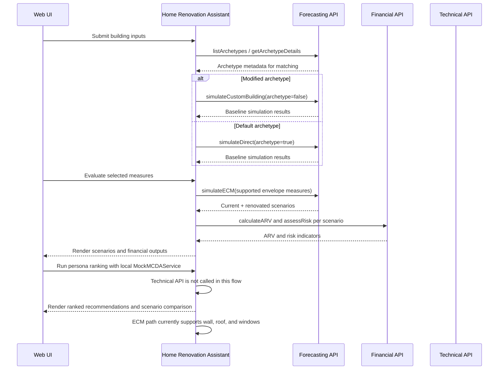
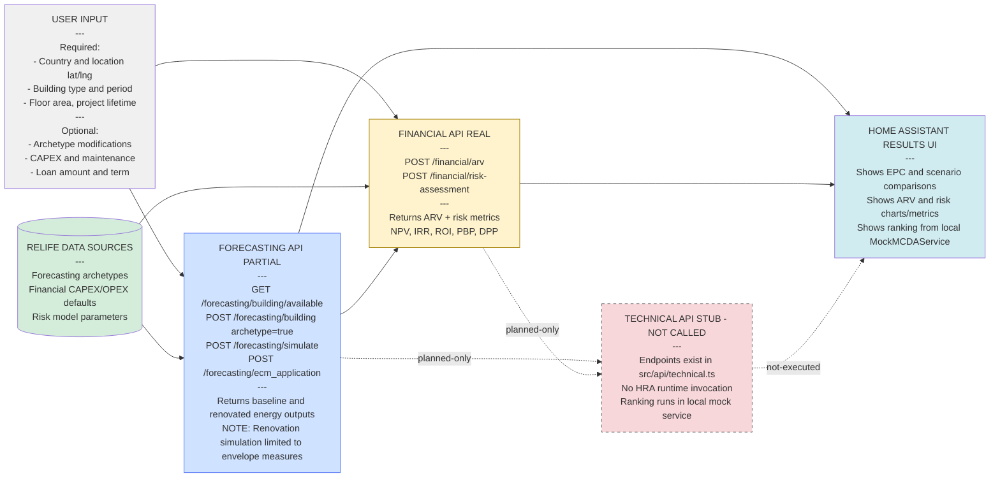
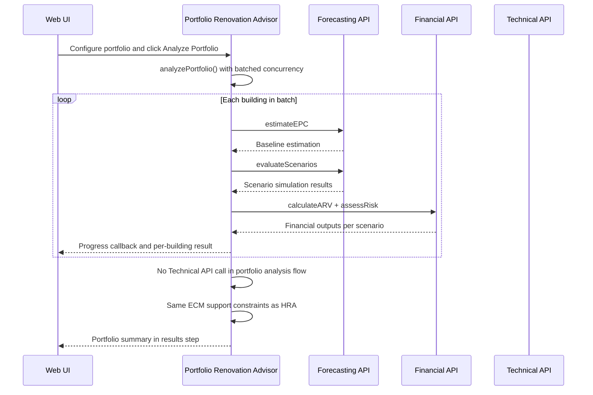
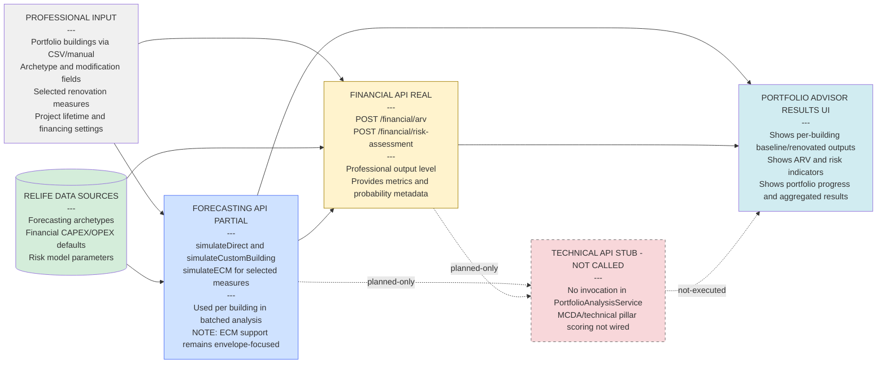
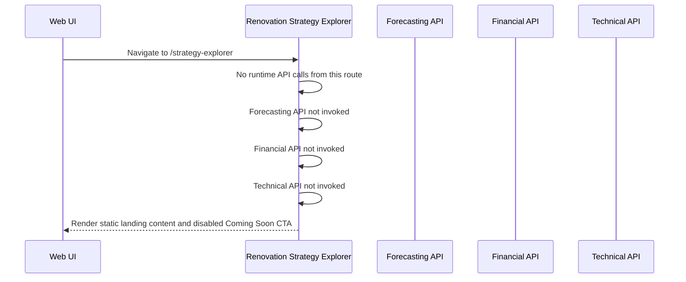
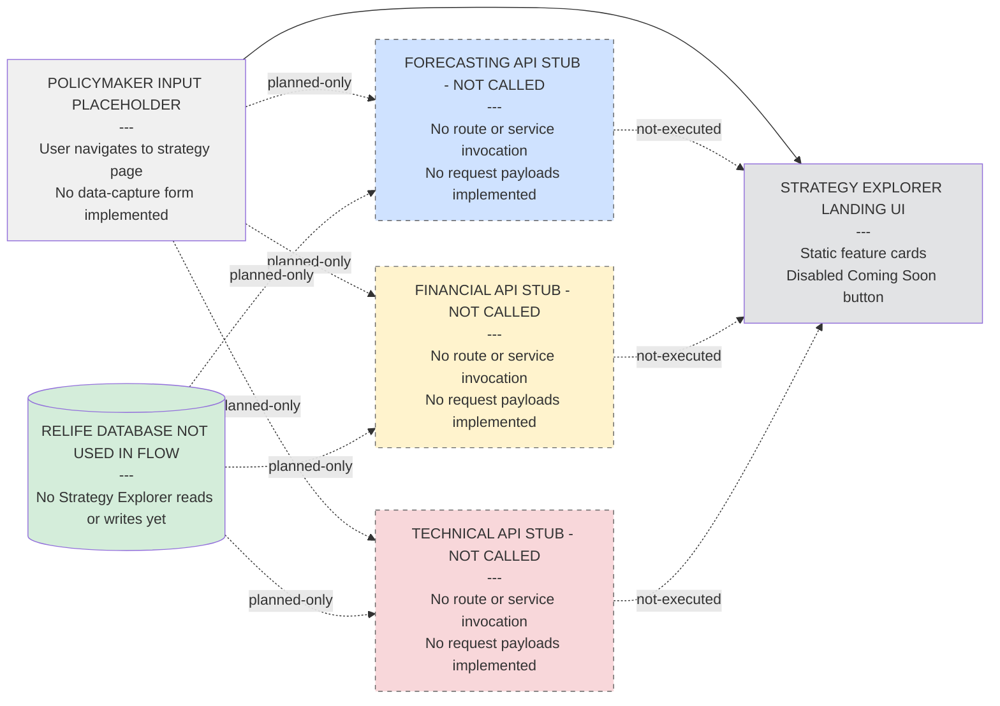

# ReLIFE Web Interface

A minimal, modern web application built with Vite, React, TypeScript, and Mantine UI. This app serves as the primary web interface (UI) for the ReLIFE Platform Services, including the technical, forecasting, and financial services.

## Development

```bash
# Install dependencies
npm install

# Start development server (with API proxy)
npm run dev

# Build for production
npm run build

# Preview production build
npm run preview
```

## Renovation Tools Architecture

The ReLIFE Web UI implements three renovation tools with different implementation maturity levels. The diagrams below document current runtime behavior (not target design), including where services are real, mocked, partial, or not wired yet.

### Home Renovation Assistant

#### Sequence Diagram



#### Flow Diagram



**Implementation status**

- Real Forecasting + Financial integrations are wired through `src/services/BuildingService.ts`, `src/services/EnergyService.ts`, `src/services/RenovationService.ts`, and `src/services/FinancialService.ts`.
- Technical API is not invoked in the HRA runtime path; ranking uses `src/services/mock/MockMCDAService.ts` (local TOPSIS) instead of `src/api/technical.ts`.
- Renovation simulation is partial: `src/services/RenovationService.ts` filters to wall/roof/windows before `forecasting.simulateECM(...)`; other selected measures are currently unsimulated.
- This means energy and financial outputs are backend-backed, while ranking and non-envelope technical effects are local/mock behavior.
- Compare with the design flow in `docs/hra-tool-design.md#sequential-flow`.

### Portfolio Renovation Advisor

#### Sequence Diagram



#### Flow Diagram



**Implementation status**

- Real Forecasting + Financial calls are orchestrated in `src/features/portfolio-advisor/services/PortfolioAnalysisService.ts`, triggered from `src/features/portfolio-advisor/components/steps/FinancingStep.tsx`.
- Service wiring in `src/features/portfolio-advisor/context/ServiceContext.tsx` uses real `EnergyService`, `RenovationService`, and `FinancialService` with concurrency-limited batches.
- Technical API is not called in the PRA analysis path; `src/api/technical.ts` endpoints are currently outside this runtime workflow.
- This means portfolio energy and finance outputs are backend-backed, while technical/MCDA backend scoring remains unimplemented in the production path.
- Compare with the design flow in `docs/pra-tool-design.md#sequential-flow`.

### Renovation Strategy Explorer

#### Sequence Diagram



#### Flow Diagram



**Implementation status**

- The current implementation is a UI stub in `src/routes/StrategyExplorerLanding.tsx`, mounted via `src/App.tsx`.
- The page shows static planned-feature content with a disabled CTA and no orchestration/service layer.
- Forecasting, Financial, and Technical APIs are all uninvoked in this tool path at runtime.
- This means Strategy Explorer is visible in navigation but remains a non-functional placeholder.
