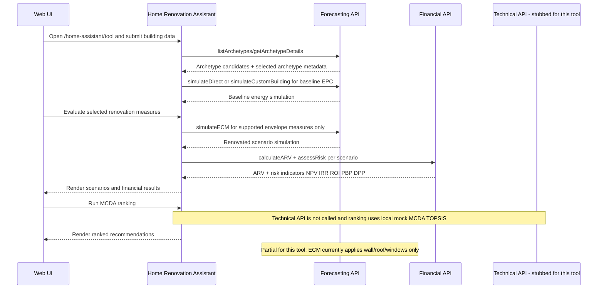
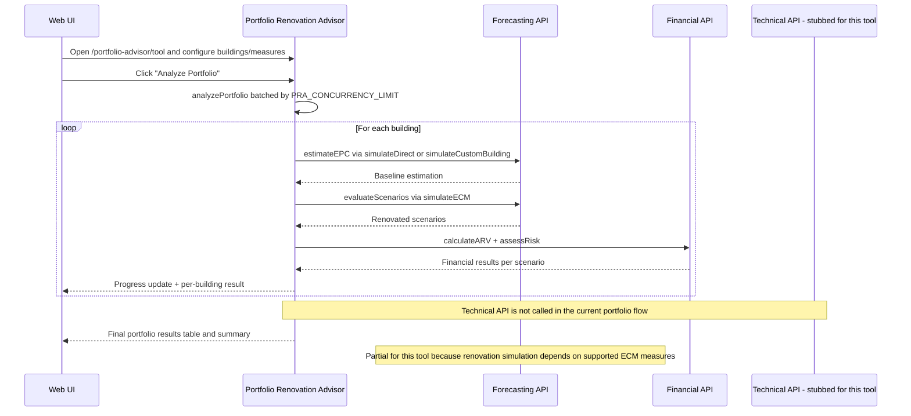
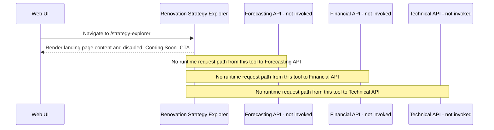

# ReLIFE Web Interface

A minimal, modern web application built with Vite, React, TypeScript, and Mantine UI. This app serves as the primary web interface (UI) for the ReLIFE Platform Services, including the technical, forecasting, and financial services.

## Development

```bash
# Install dependencies
npm install

# Start development server (with API proxy)
npm run dev

# Build for production
npm run build

# Preview production build
npm run preview
```

## Renovation Tools Architecture

The ReLIFE Web UI implements three distinct renovation tools, each targeting different user groups and use cases. The architecture follows a two-layer pattern: API wrappers (`src/api/`) handle low-level HTTP communication, while feature services (`src/features/<tool>/services/`) add business logic and orchestration.

### Home Renovation Assistant



Implementation status: Home Assistant is implemented end-to-end with real Forecasting + Financial API calls via `src/services/BuildingService.ts`, `src/services/EnergyService.ts`, `src/services/RenovationService.ts`, and `src/services/FinancialService.ts`. The Technical API is currently stubbed for this tool path: `mcda.rank(...)` is provided by `src/services/mock/MockMCDAService.ts` rather than `src/api/technical.ts`. Renovation simulation is partial because `simulateECM` currently applies supported envelope measures (wall, roof, windows), while other selected measures are not simulated in the API path.

### Portfolio Renovation Advisor



Implementation status: Portfolio Advisor analysis is implemented with real Forecasting + Financial integrations orchestrated by `src/features/portfolio-advisor/services/PortfolioAnalysisService.ts` and triggered in `src/features/portfolio-advisor/components/steps/FinancingStep.tsx`. The service context at `src/features/portfolio-advisor/context/ServiceContext.tsx` wires real `EnergyService`, `RenovationService`, and `FinancialService`, then processes buildings in batches with progress callbacks. The Technical API remains stubbed for this tool path because no call is made to `src/api/technical.ts`; MCDA state/actions exist but ranking is not executed in the current workflow.

### Renovation Strategy Explorer



Implementation status: Strategy Explorer is currently a landing-page stub only, implemented in `src/routes/StrategyExplorerLanding.tsx` and routed in `src/App.tsx`. The Web UI renders static planned features and a disabled CTA, with no service orchestration layer and no tool-specific feature module yet. Forecasting, Financial, and Technical APIs are all uninvoked in the current runtime path for this tool.
