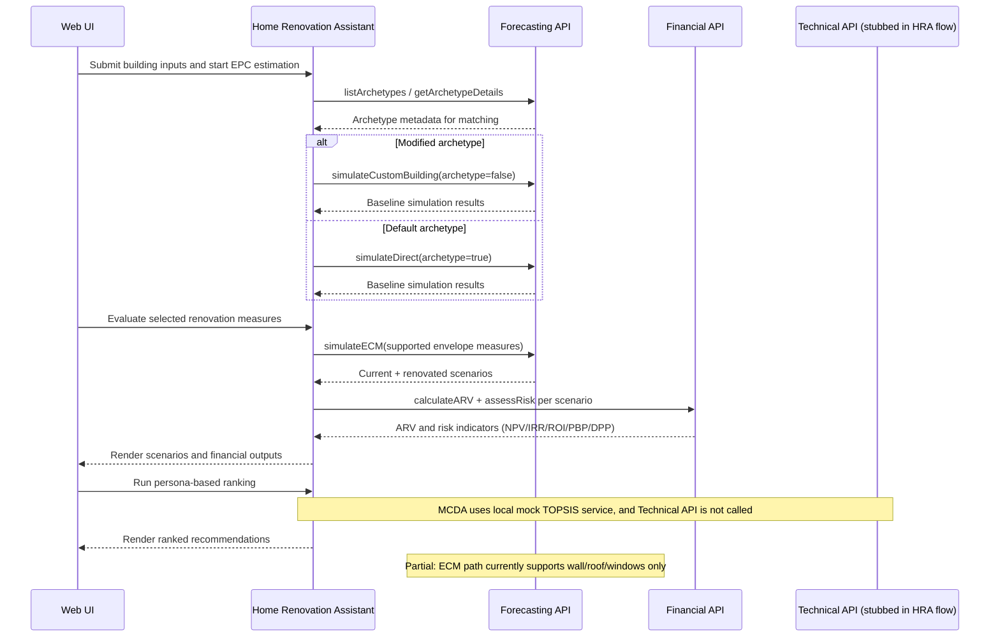
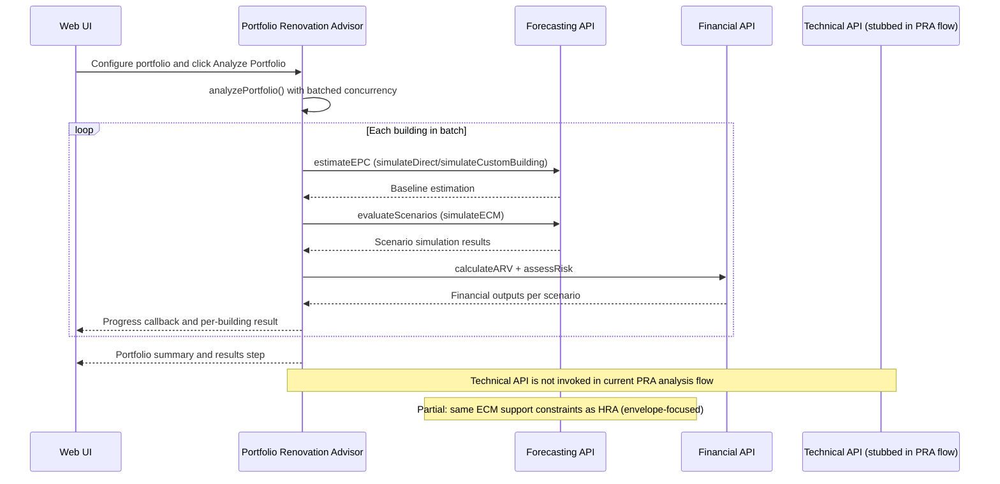
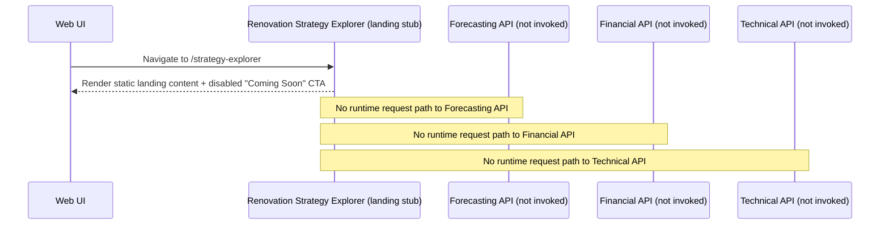

# ReLIFE Web Interface

A minimal, modern web application built with Vite, React, TypeScript, and Mantine UI. This app serves as the primary web interface (UI) for the ReLIFE Platform Services, including the technical, forecasting, and financial services.

## Development

```bash
# Install dependencies
npm install

# Start development server (with API proxy)
npm run dev

# Build for production
npm run build

# Preview production build
npm run preview
```

## Renovation Tools Architecture

The ReLIFE Web UI implements three distinct renovation tools, each targeting different user groups and use cases. The architecture follows a two-layer pattern: API wrappers (`src/api/`) handle low-level HTTP communication, while feature services (`src/features/<tool>/services/`) add business logic and orchestration.

### Home Renovation Assistant



**Implementation status**
- Real Forecasting + Financial integrations are wired through `src/services/BuildingService.ts`, `src/services/EnergyService.ts`, `src/services/RenovationService.ts`, and `src/services/FinancialService.ts`.
- Technical API behavior is mocked/stubbed for this tool path: ranking runs via `src/services/mock/MockMCDAService.ts` and no tool flow calls `src/api/technical.ts`.
- Renovation simulation is partial: `src/services/RenovationService.ts` filters to supported envelope measures before `forecasting.simulateECM(...)`, while unsupported measures remain selectable but unsimulated.
- For users and contributors, this means energy/financial outputs are API-backed, but MCDA ranking and non-envelope renovation effects are not yet backend-validated.

### Portfolio Renovation Advisor



**Implementation status**
- Real Forecasting + Financial calls are orchestrated by `src/features/portfolio-advisor/services/PortfolioAnalysisService.ts`, triggered from `src/features/portfolio-advisor/components/steps/FinancingStep.tsx`.
- The runtime service wiring in `src/features/portfolio-advisor/context/ServiceContext.tsx` uses real `EnergyService`, `RenovationService`, and `FinancialService`, and processes buildings in concurrency-limited batches.
- Technical API usage is currently stubbed/absent in the analysis path: no portfolio-analysis call targets `src/api/technical.ts`, and MCDA is not executed as part of the visible PRA workflow.
- For users and contributors, this means portfolio energy/financial outputs are API-backed, while Technical-service MCDA/pillar scoring is not yet part of production flow.

### Renovation Strategy Explorer



**Implementation status**
- The current implementation is a UI stub in `src/routes/StrategyExplorerLanding.tsx`, exposed by the route registration in `src/App.tsx`.
- The page renders planned feature content only, with a disabled action button and no tool orchestration/service layer.
- Forecasting, Financial, and Technical APIs are all uninvoked in this tool path at runtime.
- For users and contributors, this means Strategy Explorer is discoverable in navigation but not yet functionally integrated with backend services.
