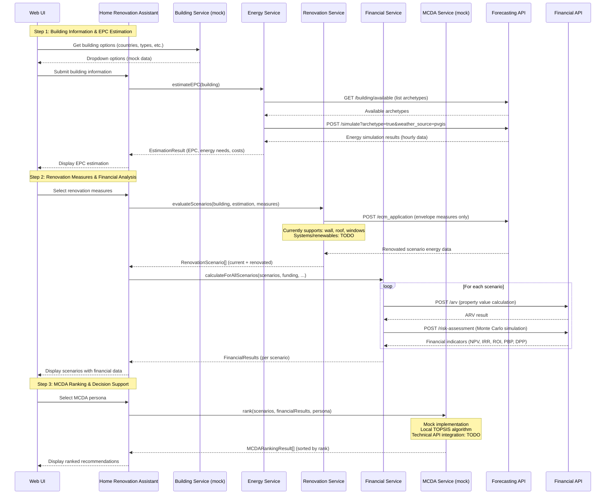
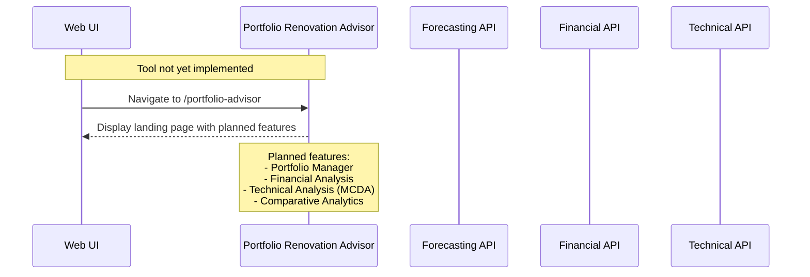
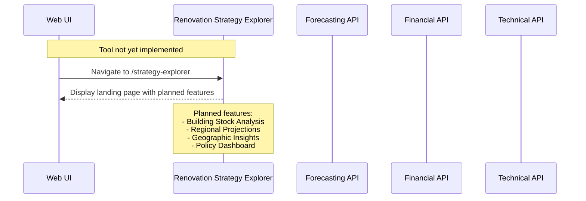

# ReLIFE Web Interface

A minimal, modern web application built with Vite, React, TypeScript, and Mantine UI. This app serves as the primary web interface (UI) for the ReLIFE Platform Services, including the technical, forecasting, and financial services.

## Development

```bash
# Install dependencies
npm install

# Start development server (with API proxy)
npm run dev

# Build for production
npm run build

# Preview production build
npm run preview
```

## Renovation Tools Architecture

The ReLIFE Web UI implements three distinct renovation tools, each targeting different user groups and use cases. The architecture follows a two-layer pattern: API wrappers (`src/api/`) handle low-level HTTP communication, while feature services (`src/features/<tool>/services/`) add business logic and orchestration.

### Home Renovation Assistant



**Implementation Status:**

- **Forecasting API**: Fully integrated. Uses archetype-based simulation (`/simulate` with `archetype=true`) for baseline EPC estimation and ECM application endpoint (`/ecm_application`) for renovation scenarios. Currently supports envelope measures (wall insulation, roof insulation, windows); systems and renewable measures are pending API support.
- **Financial API**: Fully integrated. Calls `/arv` for property value calculation and `/risk-assessment` for Monte Carlo financial analysis. Both endpoints are production-ready.
- **Technical API**: Not integrated. MCDA ranking uses a local mock implementation with TOPSIS algorithm. The Technical API's five pillar endpoints (`/ee`, `/rei`, `/sei`, `/uc`, `/fv`) are not yet called. See [`src/features/home-assistant/services/mock/MockMCDAService.ts`](src/features/home-assistant/services/mock/MockMCDAService.ts).
- **Building Service**: Mock implementation providing static dropdown options. See [`src/features/home-assistant/services/mock/MockBuildingService.ts`](src/features/home-assistant/services/mock/MockBuildingService.ts).

### Portfolio Renovation Advisor



**Implementation Status:**

- **Tool Status**: Not implemented. Only a landing page exists at `/portfolio-advisor` route (see [`src/routes/PortfolioAdvisorLanding.tsx`](src/routes/PortfolioAdvisorLanding.tsx)). The landing page displays planned features but no actual tool functionality is available.
- **Forecasting API**: Not integrated.
- **Financial API**: Not integrated.
- **Technical API**: Not integrated.

### Renovation Strategy Explorer



**Implementation Status:**

- **Tool Status**: Not implemented. Only a landing page exists at `/strategy-explorer` route (see [`src/routes/StrategyExplorerLanding.tsx`](src/routes/StrategyExplorerLanding.tsx)). The landing page displays planned features but no actual tool functionality is available.
- **Forecasting API**: Not integrated.
- **Financial API**: Not integrated.
- **Technical API**: Not integrated.
