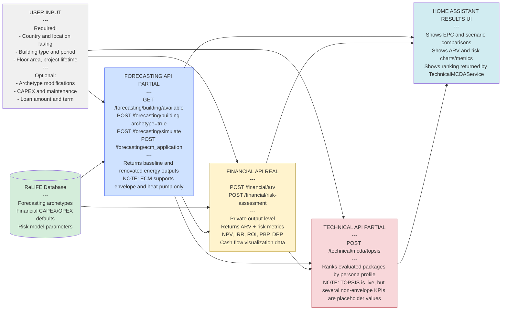
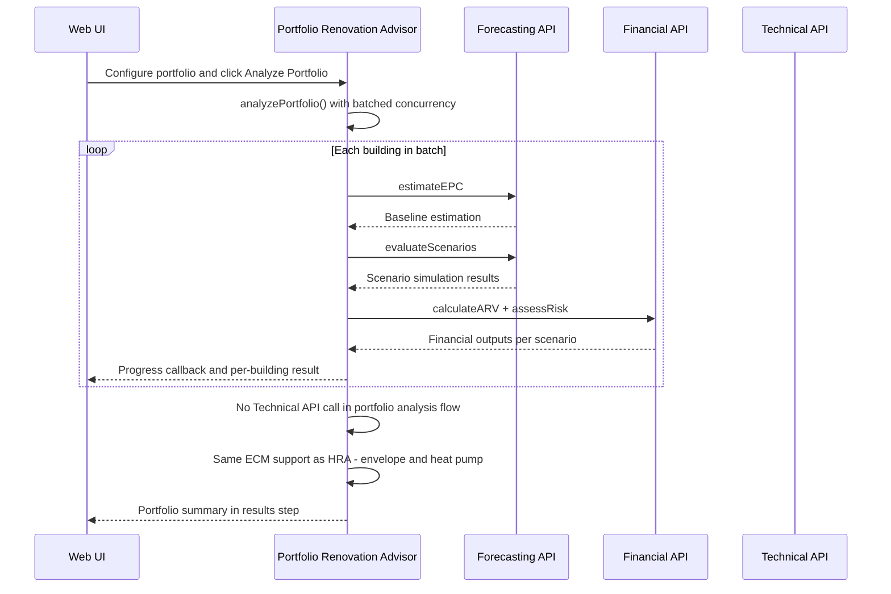
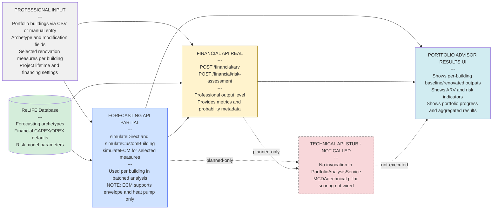
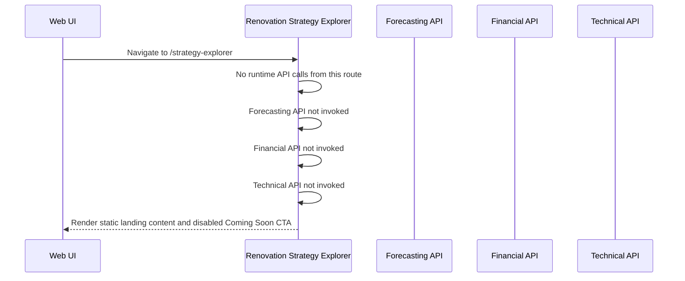
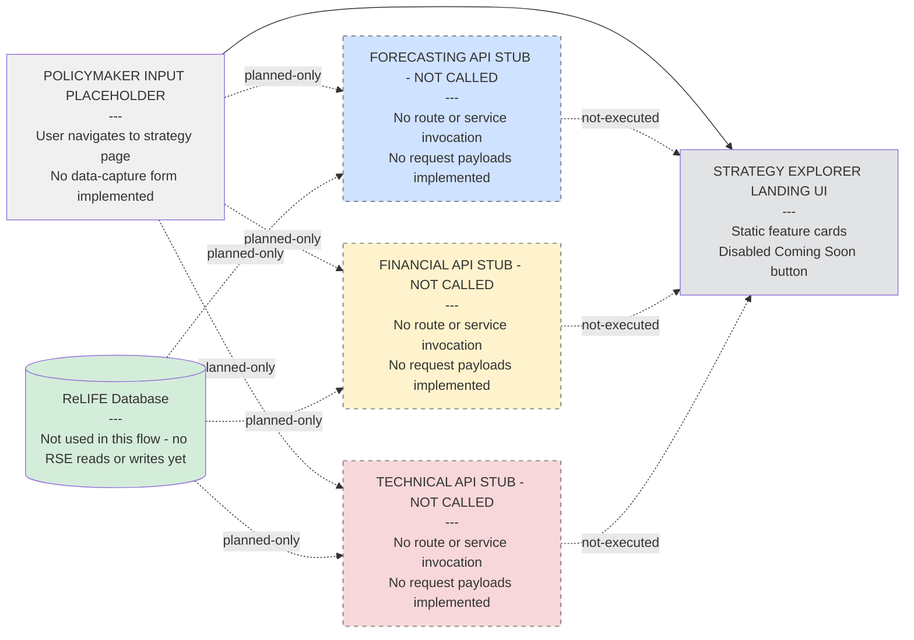

# ReLIFE Web Interface

A minimal, modern web application built with Vite, React, TypeScript, and Mantine UI. This app serves as the primary web interface (UI) for the ReLIFE Platform Services, including the technical, forecasting, and financial services.

## Development

```bash
# Install dependencies
npm install

# Start development server (with API proxy)
npm run dev

# Build for production
npm run build

# Preview production build
npm run preview
```

### Backend service sources and API contracts

The three platform services (financial, forecasting, technical) are developed in separate repositories. For local builds that compile those images, clone them under `external-services/` (this path is gitignored). Use `task fetch-sources` (see [`Taskfile.yml`](./Taskfile.yml)) with the appropriate repo refs.

JSON OpenAPI files under `api-specs/` are **snapshots only** and may not match real behavior. When integrating or changing API clients, verify against the service code or a running stack; see [`AGENTS.md`](./AGENTS.md) (section **API specifications (OpenAPI)**).

## Renovation Tools Architecture

The ReLIFE Web UI implements three renovation tools with different implementation maturity levels. The diagrams below document current runtime behavior (not target design), including where services are real, mocked, partial, or not wired yet.

### Home Renovation Assistant

#### Sequence Diagram


```mermaid
sequenceDiagram
    participant UI as Web UI
    participant HRA as Home Renovation Assistant
    participant FCAST as Forecasting API
    participant FIN as Financial API
    participant TECH as Technical API

    UI->>HRA: Submit building inputs
    HRA->>FCAST: listArchetypes / getArchetypeDetails
    FCAST-->>HRA: Archetype metadata for matching
    alt Modified archetype
      HRA->>FCAST: validateCustomBuilding
      FCAST-->>HRA: Checked building payload
      HRA->>FCAST: simulateCustomBuilding(archetype=false)
      FCAST-->>HRA: Modified building simulation
      HRA->>FCAST: simulateDirect(archetype=true)
      FCAST-->>HRA: Reference simulation results
    else Default archetype
      HRA->>FCAST: simulateDirect(archetype=true)
      FCAST-->>HRA: Baseline simulation results
    end

    UI->>HRA: Evaluate selected measures
    HRA->>FCAST: simulateECM(supported envelope measures)
    FCAST-->>HRA: Current + renovated scenarios
    HRA->>FIN: calculateARV and assessRisk per scenario
    FIN-->>HRA: ARV and risk indicators
    HRA-->>UI: Render scenarios and financial outputs

    UI->>HRA: Run persona ranking
    HRA->>TECH: runTopsis(persona + scenario KPIs)
    TECH-->>HRA: Ranked scenarios with closeness scores
    HRA->>HRA: Technical integration is partial - TOPSIS only, some KPIs are placeholders
    HRA-->>UI: Render ranked recommendations and scenario comparison
    HRA->>HRA: ECM supports wall, roof, floor, windows, air-water heat pump
```

#### Flow Diagram


```mermaid
flowchart LR
    UserInput["USER INPUT<br/>---<br/>Required:<br/>- Country and location lat/lng<br/>- Building type and period<br/>- Floor area, project lifetime<br/>---<br/>Optional:<br/>- Archetype modifications<br/>- CAPEX and maintenance<br/>- Loan amount and term"]

    DB[("ReLIFE Database<br/>---<br/>Forecasting archetypes<br/>Financial CAPEX/OPEX defaults<br/>Risk model parameters")]

    Forecasting["FORECASTING API PARTIAL<br/>---<br/>GET /forecasting/building/available<br/>POST /forecasting/building archetype=true<br/>POST /forecasting/simulate<br/>POST /forecasting/ecm_application<br/>---<br/>Returns baseline and renovated energy outputs<br/>NOTE: ECM supports envelope and heat pump only"]

    Financial["FINANCIAL API REAL<br/>---<br/>POST /financial/arv<br/>POST /financial/risk-assessment<br/>---<br/>Private output level<br/>Returns ARV + risk metrics<br/>NPV, IRR, ROI, PBP, DPP<br/>Cash flow visualization data"]

    Technical["TECHNICAL API PARTIAL<br/>---<br/>POST /technical/mcda/topsis<br/>---<br/>Ranks evaluated packages by persona profile<br/>NOTE: TOPSIS is live, but several non-envelope KPIs are placeholder values"]

    Output["HOME ASSISTANT RESULTS UI<br/>---<br/>Shows EPC and scenario comparisons<br/>Shows ARV and risk charts/metrics<br/>Shows ranking returned by TechnicalMCDAService"]

    UserInput --> Forecasting
    DB --> Forecasting
    UserInput --> Financial
    DB --> Financial
    UserInput --> Technical
    Forecasting --> Financial
    Forecasting --> Output
    Financial --> Output
    Forecasting --> Technical
    Financial --> Technical
    Technical --> Output

    style UserInput fill:#f0f0f0
    style DB fill:#d4edda
    style Forecasting fill:#cfe2ff,stroke:#4c6ef5
    style Financial fill:#fff3cd,stroke:#a37f00
    style Technical fill:#f8d7da,stroke:#b02a37
    style Output fill:#d1ecf1
```

**Implementation status**

- Real Forecasting + Financial integrations are wired through `src/services/BuildingService.ts`, `src/services/EnergyService.ts`, `src/services/RenovationService.ts`, and `src/services/FinancialService.ts`.
- Technical ranking is partially live: `src/features/home-assistant/context/ServiceContext.tsx` wires `src/services/TechnicalMCDAService.ts`, and `src/features/home-assistant/components/results/DecisionSupport.tsx` calls the Technical API on demand from the results step.
- The Technical integration is still partial because only `POST /technical/mcda/topsis` is used; KPI assembly in `src/services/TechnicalMCDAService.ts` sends placeholder values for several non-envelope criteria while the live mapping is still being expanded.
- Renovation simulation is partial: `src/services/RenovationService.ts` can send envelope targets and heat-pump flags to `forecasting.simulateECM(...)`, but the current ranked comparison workflow in `src/features/home-assistant/components/steps/EnergyRenovationStep.tsx` only packages envelope measures.
- This means energy and financial outputs are backend-backed, and the technical ranking is backend-assisted but still incomplete in KPI coverage.
- The flow diagram above shows the current implementation; compare with the [design flow](docs/hra-tool-design.md#sequential-flow) to identify deviations.

### Portfolio Renovation Advisor

#### Sequence Diagram


```mermaid
sequenceDiagram
    participant UI as Web UI
    participant PRA as Portfolio Renovation Advisor
    participant FCAST as Forecasting API
    participant FIN as Financial API
    participant TECH as Technical API

    UI->>PRA: Configure portfolio and click Analyze Portfolio
    PRA->>PRA: analyzePortfolio() with batched concurrency
    loop Each building in batch
      PRA->>FCAST: estimateEPC
      FCAST-->>PRA: Baseline estimation
      PRA->>FCAST: evaluateScenarios
      FCAST-->>PRA: Scenario simulation results
      PRA->>FIN: calculateARV + assessRisk
      FIN-->>PRA: Financial outputs per scenario
      PRA-->>UI: Progress callback and per-building result
    end
    PRA->>PRA: No Technical API call in portfolio analysis flow
    PRA->>PRA: Same ECM support as HRA - envelope and heat pump
    PRA-->>UI: Portfolio summary in results step
```

#### Flow Diagram


```mermaid
flowchart LR
    ProfessionalInput["PROFESSIONAL INPUT<br/>---<br/>Portfolio buildings via CSV or manual entry<br/>Archetype and modification fields<br/>Selected renovation measures per building<br/>Project lifetime and financing settings"]

    DB[("ReLIFE Database<br/>---<br/>Forecasting archetypes<br/>Financial CAPEX/OPEX defaults<br/>Risk model parameters")]

    Forecasting["FORECASTING API PARTIAL<br/>---<br/>simulateDirect and simulateCustomBuilding<br/>simulateECM for selected measures<br/>---<br/>Used per building in batched analysis<br/>NOTE: ECM supports envelope and heat pump only"]

    Financial["FINANCIAL API REAL<br/>---<br/>POST /financial/arv<br/>POST /financial/risk-assessment<br/>---<br/>Professional output level<br/>Provides metrics and probability metadata"]

    Technical["TECHNICAL API STUB - NOT CALLED<br/>---<br/>No invocation in PortfolioAnalysisService<br/>MCDA/technical pillar scoring not wired"]

    ProfessionalUI["PORTFOLIO ADVISOR RESULTS UI<br/>---<br/>Shows per-building baseline/renovated outputs<br/>Shows ARV and risk indicators<br/>Shows portfolio progress and aggregated results"]

    ProfessionalInput --> Forecasting
    DB --> Forecasting
    ProfessionalInput --> Financial
    DB --> Financial
    Forecasting --> Financial
    Forecasting --> ProfessionalUI
    Financial --> ProfessionalUI
    Forecasting -. planned-only .-> Technical
    Financial -. planned-only .-> Technical
    Technical -. not-executed .-> ProfessionalUI

    style ProfessionalInput fill:#f0f0f0
    style DB fill:#d4edda
    style Forecasting fill:#cfe2ff,stroke:#4c6ef5
    style Financial fill:#fff3cd,stroke:#a37f00
    style Technical fill:#f8d7da,stroke:#666,stroke-dasharray: 5 5
    style ProfessionalUI fill:#d1ecf1
```

**Implementation status**

- Real Forecasting + Financial calls are orchestrated in `src/features/portfolio-advisor/services/PortfolioAnalysisService.ts`, triggered from `src/features/portfolio-advisor/components/steps/FinancingStep.tsx`.
- Service wiring in `src/features/portfolio-advisor/context/ServiceContext.tsx` uses real `EnergyService`, `RenovationService`, and `FinancialService` with concurrency-limited batches.
- Technical API is not called in the PRA analysis path; `src/api/technical.ts` endpoints are currently outside this runtime workflow.
- This means portfolio energy and finance outputs are backend-backed, while technical/MCDA backend scoring remains unimplemented in the production path.
- The flow diagram above shows the current implementation; compare with the [design flow](docs/pra-tool-design.md#sequential-flow) to identify deviations.

### Renovation Strategy Explorer

#### Sequence Diagram


```mermaid
sequenceDiagram
    participant UI as Web UI
    participant RSE as Renovation Strategy Explorer
    participant FCAST as Forecasting API
    participant FIN as Financial API
    participant TECH as Technical API

    UI->>RSE: Navigate to /strategy-explorer
    RSE->>RSE: No runtime API calls from this route
    RSE->>RSE: Forecasting API not invoked
    RSE->>RSE: Financial API not invoked
    RSE->>RSE: Technical API not invoked
    RSE-->>UI: Render static landing content and disabled Coming Soon CTA
```

#### Flow Diagram


```mermaid
flowchart LR
    PolicyInput["POLICYMAKER INPUT PLACEHOLDER<br/>---<br/>User navigates to strategy page<br/>No data-capture form implemented"]

    DB[("ReLIFE Database<br/>---<br/>Not used in this flow - no RSE reads or writes yet")]

    Forecasting["FORECASTING API STUB - NOT CALLED<br/>---<br/>No route or service invocation<br/>No request payloads implemented"]

    Financial["FINANCIAL API STUB - NOT CALLED<br/>---<br/>No route or service invocation<br/>No request payloads implemented"]

    Technical["TECHNICAL API STUB - NOT CALLED<br/>---<br/>No route or service invocation<br/>No request payloads implemented"]

    PolicyUI["STRATEGY EXPLORER LANDING UI<br/>---<br/>Static feature cards<br/>Disabled Coming Soon button"]

    PolicyInput --> PolicyUI
    PolicyInput -. planned-only .-> Forecasting
    PolicyInput -. planned-only .-> Financial
    PolicyInput -. planned-only .-> Technical
    DB -. planned-only .-> Forecasting
    DB -. planned-only .-> Financial
    DB -. planned-only .-> Technical
    Forecasting -. not-executed .-> PolicyUI
    Financial -. not-executed .-> PolicyUI
    Technical -. not-executed .-> PolicyUI

    style PolicyInput fill:#f0f0f0
    style DB fill:#d4edda
    style Forecasting fill:#cfe2ff,stroke:#666,stroke-dasharray: 5 5
    style Financial fill:#fff3cd,stroke:#666,stroke-dasharray: 5 5
    style Technical fill:#f8d7da,stroke:#666,stroke-dasharray: 5 5
    style PolicyUI fill:#e2e3e5
```

**Implementation status**

- The current implementation is a UI stub in `src/routes/StrategyExplorerLanding.tsx`, mounted via `src/App.tsx`.
- The page shows static planned-feature content with a disabled CTA and no orchestration/service layer.
- Forecasting, Financial, and Technical APIs are all uninvoked in this tool path at runtime.
- This means Strategy Explorer is visible in navigation but remains a non-functional placeholder.
- The flow diagram above shows the current implementation; compare with the [design flow](docs/rse-tool-design.md#sequential-flow) to identify deviations.
