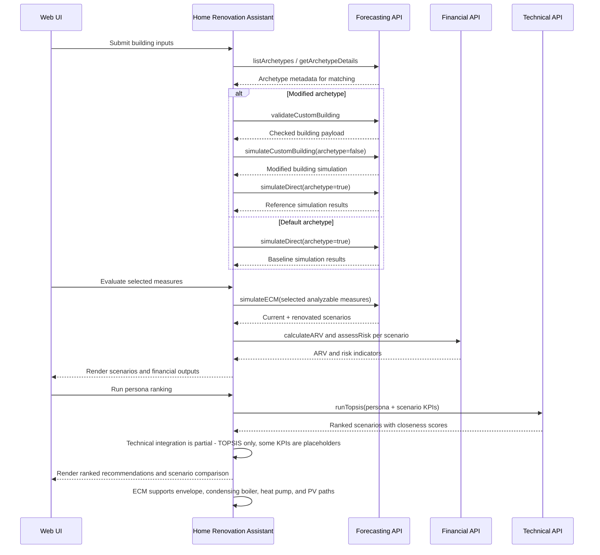
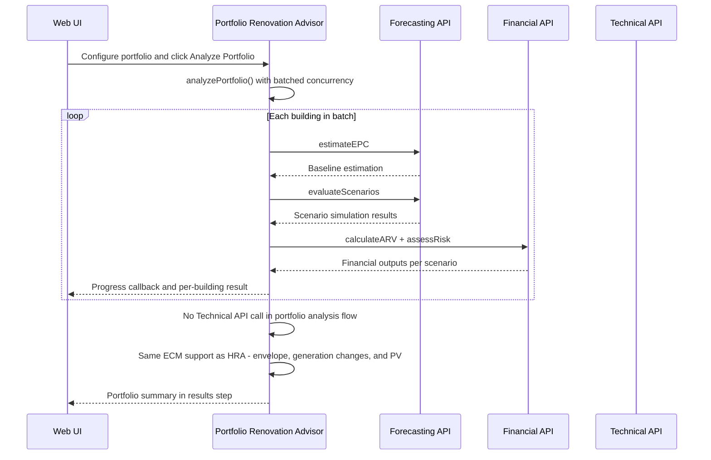
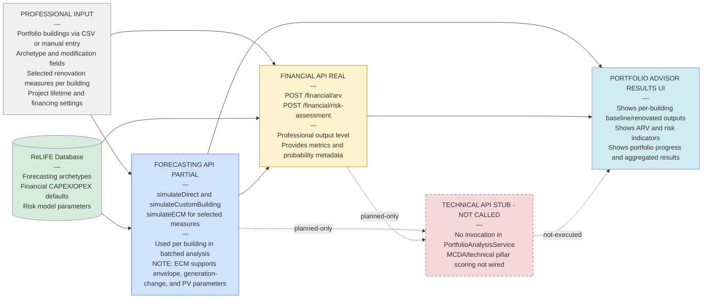
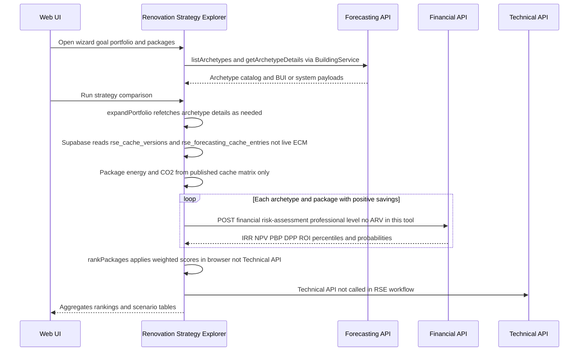
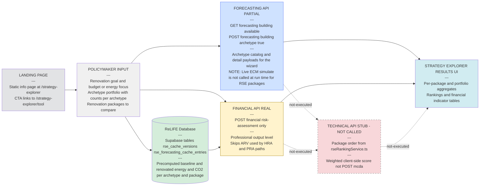

# ReLIFE Web Interface

A minimal, modern web application built with Vite, React, TypeScript, and Mantine UI. This app serves as the primary web interface (UI) for the ReLIFE Platform Services, including the technical, forecasting, and financial services.

## Development

```bash
# Install dependencies
npm install

# Start development server (with API proxy)
npm run dev

# Build for production
npm run build

# Preview production build
npm run preview
```

### Backend service sources and API contracts

The three platform services (financial, forecasting, technical) are developed in separate repositories. For local builds that compile those images, clone them under `external-services/` (this path is gitignored). Use `task fetch-sources` (see [`Taskfile.yml`](./Taskfile.yml)) with the appropriate repo refs.

When integrating or changing API clients, verify contracts against service source (local `external-services/` or the upstream GitHub repos), a running stack, and/or integration tests; see [`AGENTS.md`](./AGENTS.md) (section **Backend API contracts**).

### Visitor analytics

The Docker Compose stack includes a self-hosted Umami instance for privacy-focused visitor tracking. `task up` and `docker compose up` start Umami and run `umami-provision`, which idempotently creates or updates the configured website record from `.env.default` / `.env.local`.

Caddy exposes only the public tracker script at `/umami/script.js` and collection endpoint at `/api/send`. The Umami dashboard is not routed through Caddy; it is bound to `127.0.0.1:${HOST_PORT_UMAMI}` for local operator access only. Override the default Umami passwords and app secret in `.env.local` before using a shared or public deployment.

### Releasing

Releases use SemVer tags (`vMAJOR.MINOR.PATCH`) via a `task` command:

```bash
# Preview the next version and commands without mutating anything
task release -- patch --dry-run

# Cut a release: bump package.json, commit, tag, push
task release -- major|minor|patch
```

The `release` task (see [`scripts/release.sh`](./scripts/release.sh)) enforces that it runs on `main`, the working tree is clean (`git status --porcelain`), and `task format-lint` passes. It bumps `package.json`, commits with a gitmoji message (`🔖 release vX.Y.Z`), creates an annotated `vX.Y.Z` tag, and pushes it. Pushing the tag triggers the existing [`docker-publish` GitHub Actions workflow](.github/workflows/docker-publish.yml) (`v*` trigger), which builds and publishes the image to GHCR with semver tags (`X.Y.Z`, `X.Y`, `X`) and `latest` on `main`.

The `package.json` `version` is the single source of truth for the version surfaced in the UI: it is injected at build time via the `__APP_VERSION__` global (see [`vite.config.ts`](./vite.config.ts)) and shown in the header version chip and the development version notice.

## Renovation Tools Architecture

The ReLIFE Web UI implements three renovation tools with different implementation maturity levels. The diagrams below document current runtime behavior (not target design), including where services are real, mocked, partial, or not wired yet.

### Home Renovation Assistant

#### Sequence Diagram


```mermaid
sequenceDiagram
    participant UI as Web UI
    participant HRA as Home Renovation Assistant
    participant FCAST as Forecasting API
    participant FIN as Financial API
    participant TECH as Technical API

    UI->>HRA: Submit building inputs
    HRA->>FCAST: listArchetypes / getArchetypeDetails
    FCAST-->>HRA: Archetype metadata for matching
    alt Modified archetype
      HRA->>FCAST: validateCustomBuilding
      FCAST-->>HRA: Checked building payload
      HRA->>FCAST: simulateCustomBuilding(archetype=false)
      FCAST-->>HRA: Modified building simulation
      HRA->>FCAST: simulateDirect(archetype=true)
      FCAST-->>HRA: Reference simulation results
    else Default archetype
      HRA->>FCAST: simulateDirect(archetype=true)
      FCAST-->>HRA: Baseline simulation results
    end

    UI->>HRA: Evaluate selected measures
    HRA->>FCAST: simulateECM(selected analyzable measures)
    FCAST-->>HRA: Current + renovated scenarios
    HRA->>FIN: calculateARV and assessRisk per scenario
    FIN-->>HRA: ARV and risk indicators
    HRA-->>UI: Render scenarios and financial outputs

    UI->>HRA: Run persona ranking
    HRA->>TECH: runTopsis(persona + scenario KPIs)
    TECH-->>HRA: Ranked scenarios with closeness scores
    HRA->>HRA: Technical integration is partial - TOPSIS only, some KPIs are placeholders
    HRA-->>UI: Render ranked recommendations and scenario comparison
    HRA->>HRA: ECM supports envelope, condensing boiler, heat pump, and PV paths
```

#### Flow Diagram


```mermaid
flowchart LR
    UserInput["USER INPUT<br/>---<br/>Required:<br/>- Country and location lat/lng<br/>- Building type and period<br/>- Floor area, project lifetime<br/>---<br/>Optional:<br/>- Archetype modifications<br/>- CAPEX and maintenance<br/>- Loan amount and term"]

    DB[("ReLIFE Database<br/>---<br/>Forecasting archetypes<br/>Financial CAPEX/OPEX defaults<br/>Risk model parameters")]

    Forecasting["FORECASTING API PARTIAL<br/>---<br/>GET /forecasting/building/available<br/>POST /forecasting/building archetype=true<br/>POST /forecasting/simulate<br/>POST /forecasting/ecm_application<br/>---<br/>Returns baseline and renovated energy outputs<br/>NOTE: ECM supports envelope, generation-change, and PV parameters"]

    Financial["FINANCIAL API REAL<br/>---<br/>POST /financial/arv<br/>POST /financial/risk-assessment<br/>---<br/>Private output level<br/>Returns ARV + risk metrics<br/>NPV, IRR, ROI, PBP, DPP<br/>Cash flow visualization data"]

    Technical["TECHNICAL API PARTIAL<br/>---<br/>POST /technical/mcda/topsis<br/>---<br/>Ranks evaluated packages by persona profile<br/>NOTE: TOPSIS is live, but several non-envelope KPIs are placeholder values"]

    Output["HOME ASSISTANT RESULTS UI<br/>---<br/>Shows EPC and scenario comparisons<br/>Shows ARV and risk charts/metrics<br/>Shows ranking returned by TechnicalMCDAService"]

    UserInput --> Forecasting
    DB --> Forecasting
    UserInput --> Financial
    DB --> Financial
    UserInput --> Technical
    Forecasting --> Financial
    Forecasting --> Output
    Financial --> Output
    Forecasting --> Technical
    Financial --> Technical
    Technical --> Output

    style UserInput fill:#f0f0f0
    style DB fill:#d4edda
    style Forecasting fill:#cfe2ff,stroke:#4c6ef5
    style Financial fill:#fff3cd,stroke:#a37f00
    style Technical fill:#f8d7da,stroke:#b02a37
    style Output fill:#d1ecf1
```

**Implementation status**

- Real Forecasting + Financial integrations are wired through `src/services/BuildingService.ts`, `src/services/EnergyService.ts`, `src/services/RenovationService.ts`, and `src/services/FinancialService.ts`.
- Technical ranking is partially live: `src/features/home-assistant/context/ServiceContext.tsx` wires `src/services/TechnicalMCDAService.ts`, and `src/features/home-assistant/components/steps/ResultsStep.tsx` auto-ranks scenarios from the results step.
- The Technical integration is still partial because only `POST /technical/mcda/topsis` is used; KPI assembly in `src/services/TechnicalMCDAService.ts` sends placeholder values for several non-envelope criteria while the live mapping is still being expanded.
- Renovation simulation is partial: `src/services/RenovationService.ts` can send envelope, generation-change, and PV parameters to `forecasting.simulateECM(...)`, but the current package workflow is still limited to the analyzable measure set declared in that service.
- This means energy and financial outputs are backend-backed, and the technical ranking is backend-assisted but still incomplete in KPI coverage.
- The flow diagram above shows the current implementation; compare with the [design flow](docs/hra-tool-design.md#sequential-flow) to identify deviations.

#### Current HRA Energy-Savings Semantic

- `annual_energy_savings = max(0, baseline delivered system energy - renovated delivered system energy)`
- The values come from Forecasting/UNI outputs and are scaled to the user's floor area.
- This is system-energy savings, not thermal-needs savings and not the frontend flat-tariff estimate.
- Boiler and heat-pump upgrades can therefore improve financial results even when thermal needs change little.
- The Financial API converts saved kWh to EUR using its own assumptions, so HRA should present EUR outputs as indicative comparison values.

### Portfolio Renovation Advisor

#### Sequence Diagram


```mermaid
sequenceDiagram
    participant UI as Web UI
    participant PRA as Portfolio Renovation Advisor
    participant FCAST as Forecasting API
    participant FIN as Financial API
    participant TECH as Technical API

    UI->>PRA: Configure portfolio and click Analyze Portfolio
    PRA->>PRA: analyzePortfolio() with batched concurrency
    loop Each building in batch
      PRA->>FCAST: estimateEPC
      FCAST-->>PRA: Baseline estimation
      PRA->>FCAST: evaluateScenarios
      FCAST-->>PRA: Scenario simulation results
      PRA->>FIN: calculateARV + assessRisk
      FIN-->>PRA: Financial outputs per scenario
      PRA-->>UI: Progress callback and per-building result
    end
    PRA->>PRA: No Technical API call in portfolio analysis flow
    PRA->>PRA: Same ECM support as HRA - envelope, generation changes, and PV
    PRA-->>UI: Portfolio summary in results step
```

#### Flow Diagram


```mermaid
flowchart LR
    ProfessionalInput["PROFESSIONAL INPUT<br/>---<br/>Portfolio buildings via CSV or manual entry<br/>Archetype and modification fields<br/>Selected renovation measures per building<br/>Project lifetime and financing settings"]

    DB[("ReLIFE Database<br/>---<br/>Forecasting archetypes<br/>Financial CAPEX/OPEX defaults<br/>Risk model parameters")]

    Forecasting["FORECASTING API PARTIAL<br/>---<br/>simulateDirect and simulateCustomBuilding<br/>simulateECM for selected measures<br/>---<br/>Used per building in batched analysis<br/>NOTE: ECM supports envelope, generation-change, and PV parameters"]

    Financial["FINANCIAL API REAL<br/>---<br/>POST /financial/arv<br/>POST /financial/risk-assessment<br/>---<br/>Professional output level<br/>Provides metrics and probability metadata"]

    Technical["TECHNICAL API STUB - NOT CALLED<br/>---<br/>No invocation in PortfolioAnalysisService<br/>MCDA/technical pillar scoring not wired"]

    ProfessionalUI["PORTFOLIO ADVISOR RESULTS UI<br/>---<br/>Shows per-building baseline/renovated outputs<br/>Shows ARV and risk indicators<br/>Shows portfolio progress and aggregated results"]

    ProfessionalInput --> Forecasting
    DB --> Forecasting
    ProfessionalInput --> Financial
    DB --> Financial
    Forecasting --> Financial
    Forecasting --> ProfessionalUI
    Financial --> ProfessionalUI
    Forecasting -. planned-only .-> Technical
    Financial -. planned-only .-> Technical
    Technical -. not-executed .-> ProfessionalUI

    style ProfessionalInput fill:#f0f0f0
    style DB fill:#d4edda
    style Forecasting fill:#cfe2ff,stroke:#4c6ef5
    style Financial fill:#fff3cd,stroke:#a37f00
    style Technical fill:#f8d7da,stroke:#666,stroke-dasharray: 5 5
    style ProfessionalUI fill:#d1ecf1
```

**Implementation status**

- Real Forecasting + Financial calls are orchestrated in `src/features/portfolio-advisor/services/PortfolioAnalysisService.ts`, triggered from `src/features/portfolio-advisor/components/steps/FinancingStep.tsx`.
- Service wiring in `src/features/portfolio-advisor/context/ServiceContext.tsx` uses real `EnergyService`, `RenovationService`, and `FinancialService` with concurrency-limited batches.
- `MockMCDAService` is registered on the context as `mcda` but is not invoked by `PortfolioAnalysisService`; ranking and technical pillars are not part of the analyze flow today.
- Technical API is not called in the PRA analysis path; `src/api/technical.ts` endpoints are currently outside this runtime workflow.
- This means portfolio energy and finance outputs are backend-backed, while technical/MCDA backend scoring remains unimplemented in the production path.
- The flow diagram above shows the current implementation; compare with the [design flow](docs/pra-tool-design.md#sequential-flow) to identify deviations.

### Renovation Strategy Explorer

#### Sequence Diagram


```mermaid
sequenceDiagram
    participant UI as Web UI
    participant RSE as Renovation Strategy Explorer
    participant FCAST as Forecasting API
    participant FIN as Financial API
    participant TECH as Technical API

    UI->>RSE: Open wizard goal portfolio and packages
    RSE->>FCAST: listArchetypes and getArchetypeDetails via BuildingService
    FCAST-->>RSE: Archetype catalog and BUI or system payloads
    UI->>RSE: Run strategy comparison
    RSE->>RSE: expandPortfolio refetches archetype details as needed
    RSE->>RSE: Supabase reads rse_cache_versions and rse_forecasting_cache_entries not live ECM
    RSE->>RSE: Package energy and CO2 from published cache matrix only
    loop Each archetype and package with positive savings
        RSE->>FIN: POST financial risk-assessment professional level no ARV in this tool
        FIN-->>RSE: IRR NPV PBP DPP ROI percentiles and probabilities
    end
    RSE->>RSE: rankPackages applies weighted scores in browser not Technical API
    RSE->>TECH: Technical API not called in RSE workflow
    RSE-->>UI: Aggregates rankings and scenario tables
```

#### Flow Diagram


```mermaid
flowchart LR
    PolicyInput["POLICYMAKER INPUT<br/>---<br/>Renovation goal and budget or energy focus<br/>Archetype portfolio with counts per archetype<br/>Renovation packages to compare"]
    LandingPage["LANDING PAGE<br/>---<br/>Static info page at /strategy-explorer<br/>CTA links to /strategy-explorer/tool"]

    DB[("ReLIFE Database<br/>---<br/>Supabase tables rse_cache_versions<br/>rse_forecasting_cache_entries<br/>---<br/>Precomputed baseline and renovated energy and CO2 per archetype and package")]

    Forecasting["FORECASTING API PARTIAL<br/>---<br/>GET forecasting building available<br/>POST forecasting building archetype true<br/>---<br/>Archetype catalog and detail payloads for the wizard<br/>NOTE: Live ECM simulate is not called at run time for RSE packages"]

    Financial["FINANCIAL API REAL<br/>---<br/>POST financial risk-assessment only<br/>---<br/>Professional output level<br/>Skips ARV used by HRA and PRA paths"]

    Technical["TECHNICAL API STUB - NOT CALLED<br/>---<br/>Package order from rseRankingService.ts<br/>---<br/>Weighted client-side score not POST mcda"]

    PolicyUI["STRATEGY EXPLORER RESULTS UI<br/>---<br/>Per-package and portfolio aggregates<br/>Rankings and financial indicator tables"]

    LandingPage --> PolicyInput
    PolicyInput --> Forecasting
    PolicyInput --> DB
    PolicyInput --> Financial
    DB --> Financial
    Forecasting -. not-executed .-> Technical
    Financial -. not-executed .-> Technical
    Forecasting --> PolicyUI
    Financial --> PolicyUI
    Technical -. not-executed .-> PolicyUI

    style LandingPage fill:#e2e3e5
    style PolicyInput fill:#f0f0f0
    style DB fill:#d4edda
    style Forecasting fill:#cfe2ff,stroke:#4c6ef5
    style Financial fill:#fff3cd,stroke:#a37f00
    style Technical fill:#f8d7da,stroke:#666,stroke-dasharray: 5 5
    style PolicyUI fill:#d1ecf1
```

**Implementation status**

- The Strategy Explorer follows the same landing/tool route pattern as the other tools: `/strategy-explorer` serves a static landing page, and `/strategy-explorer/tool` mounts the multi-step wizard in `src/features/strategy-explorer/StrategyExplorer.tsx`.
- Forecasting is **partial**: `src/features/strategy-explorer/services/archetypePortfolioService.ts` uses `BuildingService` for archetype metadata only. Per-package energy and CO2 for the comparison run come from the published Supabase cache loaded by `src/features/strategy-explorer/api/rseCacheApi.ts` and `src/features/strategy-explorer/services/rseForecastingCacheService.ts`, not from live `simulateECM` calls in the browser.
- RSE cache entries must store a true unrenovated `baseline` plus the package `renovated` scenario. RSE energy savings use delivered system energy from UNI totals, while thermal needs remain a separate building-fabric metric.
- Financial is **real** for the wizard run path: `src/features/strategy-explorer/services/rseFinancialService.ts` calls `financial.assessRisk` with concurrency limits orchestrated by `src/features/strategy-explorer/services/rseWorkflowService.ts`. ARV is intentionally skipped for RSE.
- Technical API is **not used**; rankings are computed locally in `src/features/strategy-explorer/services/rseRankingService.ts`.
- Offline cache generation that feeds the database tables lives under `scripts/rse-cache/` and is outside the SPA runtime; if no published cache version exists, the workflow returns an empty or unavailable result rather than calling Forecasting for simulations.
- The flow diagram above shows the current implementation; compare with the [design flow](docs/rse-tool-design.md#sequential-flow) to identify deviations.
