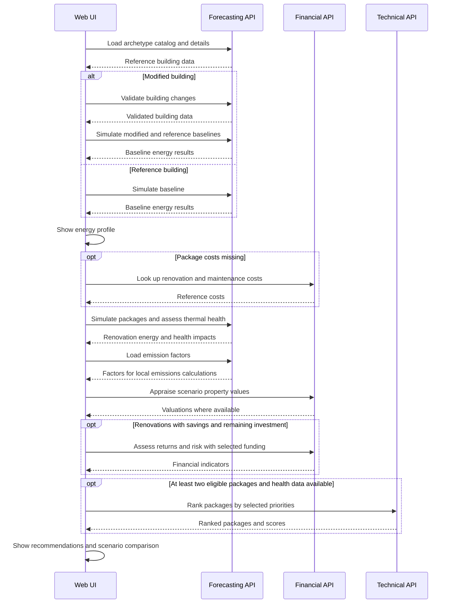
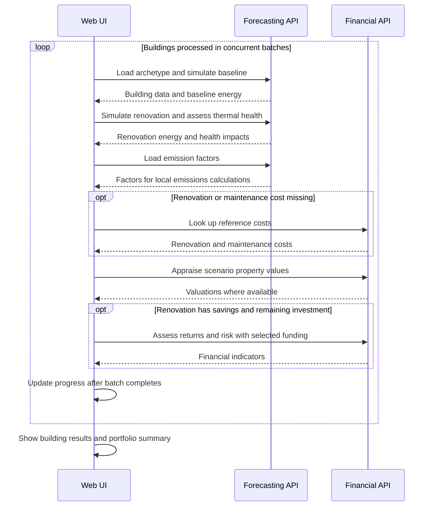
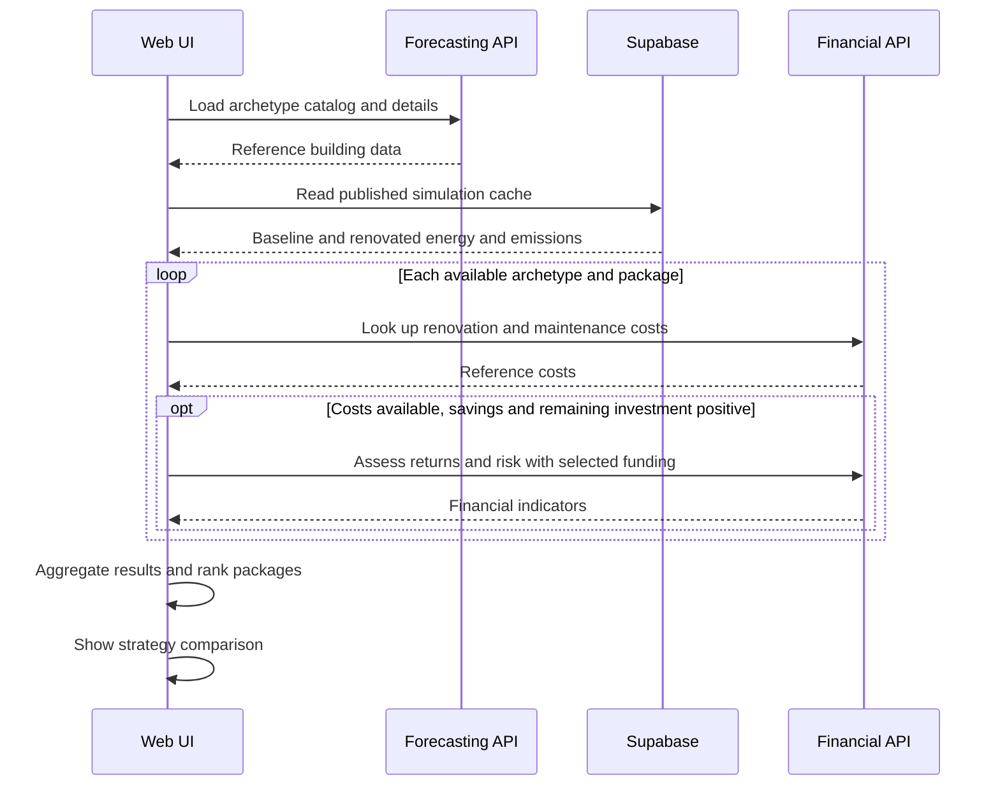

# ReLIFE Web Interface

Web interface for ReLIFE’s building-renovation tools, built with Vite, React, TypeScript, and Mantine UI.

## Development

```bash
# Install dependencies
npm install

# Start development server (with API proxy)
npm run dev

# Build for production
npm run build

# Preview production build
npm run preview
```

### Backend service sources and API contracts

For local backend builds, `task fetch-sources` clones the financial, forecasting, and technical services into `external-services/`. See [`Taskfile.yml`](./Taskfile.yml) for revision options and [`AGENTS.md`](./AGENTS.md#backend-api-contracts) for API contract verification.

### Testing

- `task test-unit`: Vitest unit and component tests, no backend required.
- `task test-e2e`: starts the locally built Docker stack and runs Playwright journeys for HRA and PRA. See [E2E prerequisites and commands](./tests/e2e/README.md).
- `task test`: both of the above.

### Visitor analytics

The Docker Compose stack starts Umami for visitor tracking. Its dashboard is available locally at `127.0.0.1:${HOST_PORT_UMAMI}`. Override the default Umami passwords and app secret in `.env.local` before using a shared or public deployment.

### Releasing

Releases use SemVer tags (`vMAJOR.MINOR.PATCH`):

```bash
# Preview the next version and commands
task release -- patch --dry-run

# Bump the version, commit, tag, and push. Use minor or major for larger releases.
task release -- patch
```

The [release script](./scripts/release.sh) requires `main`, a clean working tree, and passing `task format-lint` checks. Pushing the release tag triggers the [Docker publish workflow](.github/workflows/docker-publish.yml) to publish the image to GHCR.

## Renovation Tools Architecture

Each tool runs in the browser and calls the services below.

Single-Family and Multi-Family Houses represent whole buildings. An Apartment represents one flat, with energy, envelope costs, and material carbon scaled to its share of the reference building’s floor area.

### Home Renovation Assistant


```mermaid
sequenceDiagram
    participant UI as Web UI
    participant FCAST as Forecasting API
    participant FIN as Financial API
    participant TECH as Technical API

    UI->>FCAST: Load archetype catalog and details
    FCAST-->>UI: Reference building data
    alt Modified building
      UI->>FCAST: Validate building changes
      FCAST-->>UI: Validated building data
      UI->>FCAST: Simulate modified and reference baselines
      FCAST-->>UI: Baseline energy results
    else Reference building
      UI->>FCAST: Simulate baseline
      FCAST-->>UI: Baseline energy results
    end
    UI->>UI: Show energy profile

    opt Package costs missing
      UI->>FIN: Look up renovation and maintenance costs
      FIN-->>UI: Reference costs
    end
    UI->>FCAST: Simulate packages and assess thermal health
    FCAST-->>UI: Renovation energy and health impacts
    UI->>FCAST: Load emission factors
    FCAST-->>UI: Factors for local emissions calculations
    UI->>FIN: Appraise scenario property values
    FIN-->>UI: Valuations where available
    opt Renovations with savings and remaining investment
      UI->>FIN: Assess returns and risk with selected funding
      FIN-->>UI: Financial indicators
    end
    opt At least two eligible packages and health data available
      UI->>TECH: Rank packages by selected priorities
      TECH-->>UI: Ranked packages and scores
    end
    UI->>UI: Show recommendations and scenario comparison
```

### Portfolio Renovation Advisor


```mermaid
sequenceDiagram
    participant UI as Web UI
    participant FCAST as Forecasting API
    participant FIN as Financial API

    loop Buildings processed in concurrent batches
      UI->>FCAST: Load archetype and simulate baseline
      FCAST-->>UI: Building data and baseline energy
      UI->>FCAST: Simulate renovation and assess thermal health
      FCAST-->>UI: Renovation energy and health impacts
      UI->>FCAST: Load emission factors
      FCAST-->>UI: Factors for local emissions calculations
      opt Renovation or maintenance cost missing
        UI->>FIN: Look up reference costs
        FIN-->>UI: Renovation and maintenance costs
      end
      UI->>FIN: Appraise scenario property values
      FIN-->>UI: Valuations where available
      opt Renovation has savings and remaining investment
        UI->>FIN: Assess returns and risk with selected funding
        FIN-->>UI: Financial indicators
      end
      UI->>UI: Update progress after batch completes
    end
    UI->>UI: Show building results and portfolio summary
```

### Renovation Strategy Explorer


```mermaid
sequenceDiagram
    participant UI as Web UI
    participant FCAST as Forecasting API
    participant DB as Supabase
    participant FIN as Financial API

    UI->>FCAST: Load archetype catalog and details
    FCAST-->>UI: Reference building data
    UI->>DB: Read published simulation cache
    DB-->>UI: Baseline and renovated energy and emissions
    loop Each available archetype and package
      UI->>FIN: Look up renovation and maintenance costs
      FIN-->>UI: Reference costs
      opt Costs available, savings and remaining investment positive
        UI->>FIN: Assess returns and risk with selected funding
        FIN-->>UI: Financial indicators
      end
    end
    UI->>UI: Aggregate results and rank packages
    UI->>UI: Show strategy comparison
```
