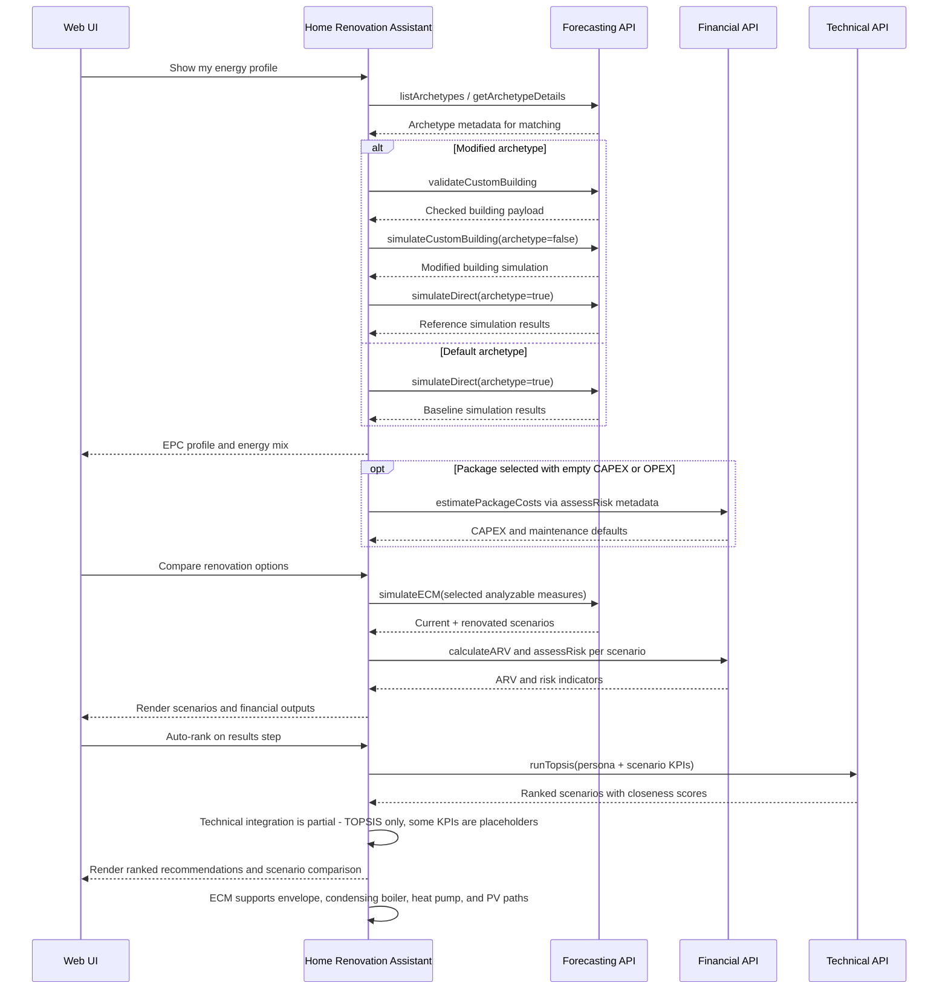
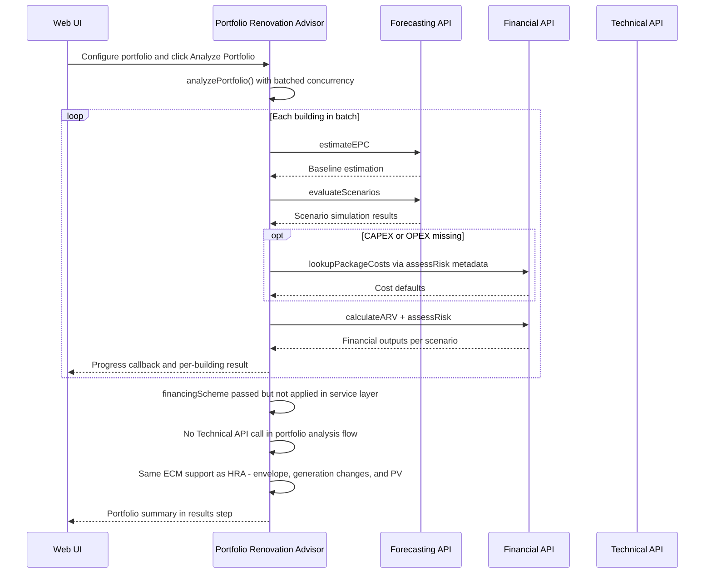
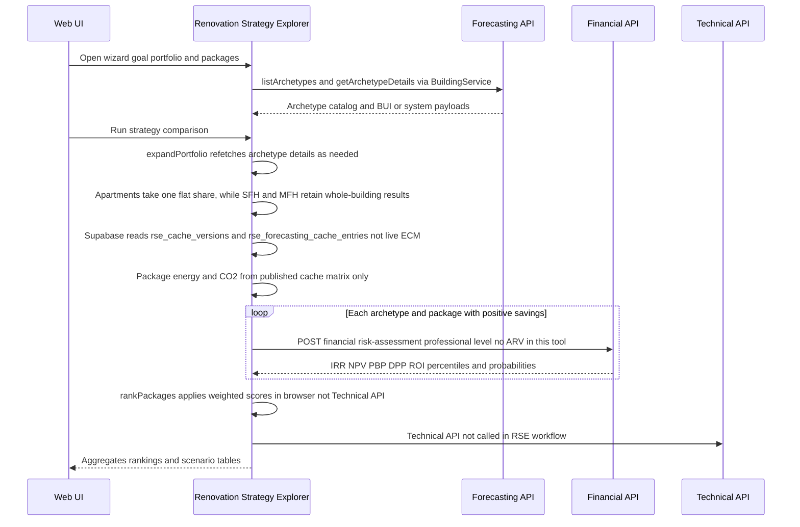

# ReLIFE Web Interface

A minimal, modern web application built with Vite, React, TypeScript, and Mantine UI. This app serves as the primary web interface (UI) for the ReLIFE Platform Services, including the technical, forecasting, and financial services.

## Development

```bash
# Install dependencies
npm install

# Start development server (with API proxy)
npm run dev

# Build for production
npm run build

# Preview production build
npm run preview
```

### Backend service sources and API contracts

The three platform services (financial, forecasting, technical) are developed in separate repositories. For local builds that compile those images, clone them under `external-services/` (this path is gitignored). Use `task fetch-sources` (see [`Taskfile.yml`](./Taskfile.yml)) with the appropriate repo refs.

When integrating or changing API clients, verify contracts against service source (local `external-services/` or the upstream GitHub repos) and/or a running stack; see [`AGENTS.md`](./AGENTS.md) (section **Backend API contracts**).

### Testing

- `task test-unit` (`npm run test:unit`): Vitest unit and component tests, no backend required.
- `task test-e2e` (`npm run test:e2e`): Playwright browser journeys for HRA and PRA against the Docker Compose stack. Each run captures audit-trace artifacts under `.work/e2e/artifacts/` for AI-assisted result validation via the `renovation-result-validator` skill. RSE E2E coverage is deferred until the planned UX refactor. See [`tests/e2e/README.md`](./tests/e2e/README.md).
- `task test`: both of the above.

### Visitor analytics

The Docker Compose stack includes a self-hosted Umami instance for privacy-focused visitor tracking. `task up` and `docker compose up` start Umami and run `umami-provision`, which idempotently creates or updates the configured website record from `.env.default` / `.env.local`.

Caddy exposes only the public tracker script at `/umami/script.js` and collection endpoint at `/api/send`. The Umami dashboard is not routed through Caddy; it is bound to `127.0.0.1:${HOST_PORT_UMAMI}` for local operator access only. Override the default Umami passwords and app secret in `.env.local` before using a shared or public deployment.

### Releasing

Releases use SemVer tags (`vMAJOR.MINOR.PATCH`) via a `task` command:

```bash
# Preview the next version and commands without mutating anything
task release -- patch --dry-run

# Cut a release: bump package.json, commit, tag, push
task release -- major|minor|patch
```

The `release` task (see [`scripts/release.sh`](./scripts/release.sh)) enforces that it runs on `main`, the working tree is clean (`git status --porcelain`), and `task format-lint` passes. It bumps `package.json`, commits with a gitmoji message (`🔖 release vX.Y.Z`), creates an annotated `vX.Y.Z` tag, and pushes it. Pushing the tag triggers the existing [`docker-publish` GitHub Actions workflow](.github/workflows/docker-publish.yml) (`v*` trigger), which builds and publishes the image to GHCR with semver tags (`X.Y.Z`, `X.Y`, `X`) and `latest` on `main`.

The `package.json` `version` is the single source of truth for the version surfaced in the UI: it is injected at build time via the `__APP_VERSION__` global (see [`vite.config.ts`](./vite.config.ts)) and shown in the header version chip and the development version notice.

## Renovation Tools Architecture

The ReLIFE Web UI implements three renovation tools with different implementation maturity levels. The diagrams below document current runtime behavior (not target design), including where services are real, mocked, partial, or not wired yet.

All three tools model Single-Family and Multi-Family Houses as whole buildings,
with the MFH owner renovating all family units together. An Apartment represents
one flat: its energy, envelope costs, and material carbon use its floor-area
share of the reference block. RSE counts these modeled units as **properties**;
CSV floor areas describe the same unit. Backend archetype category identifiers
remain unchanged.

### Home Renovation Assistant


```mermaid
sequenceDiagram
    participant UI as Web UI
    participant HRA as Home Renovation Assistant
    participant FCAST as Forecasting API
    participant FIN as Financial API
    participant TECH as Technical API

    UI->>HRA: Show my energy profile
    HRA->>FCAST: listArchetypes / getArchetypeDetails
    FCAST-->>HRA: Archetype metadata for matching
    alt Modified archetype
      HRA->>FCAST: validateCustomBuilding
      FCAST-->>HRA: Checked building payload
      HRA->>FCAST: simulateCustomBuilding(archetype=false)
      FCAST-->>HRA: Modified building simulation
      HRA->>FCAST: simulateDirect(archetype=true)
      FCAST-->>HRA: Reference simulation results
    else Default archetype
      HRA->>FCAST: simulateDirect(archetype=true)
      FCAST-->>HRA: Baseline simulation results
    end
    HRA-->>UI: EPC profile and energy mix

    opt Package selected with empty CAPEX or OPEX
      HRA->>FIN: estimatePackageCosts via assessRisk metadata
      FIN-->>HRA: CAPEX and maintenance defaults
    end

    UI->>HRA: Compare renovation options
    HRA->>FCAST: simulateECM(selected analyzable measures)
    FCAST-->>HRA: Current + renovated scenarios
    HRA->>FIN: calculateARV and assessRisk per scenario
    FIN-->>HRA: ARV and risk indicators
    HRA-->>UI: Render scenarios and financial outputs

    UI->>HRA: Auto-rank on results step
    HRA->>TECH: runTopsis(persona + scenario KPIs)
    TECH-->>HRA: Ranked scenarios with closeness scores
    HRA->>HRA: Technical integration is partial - TOPSIS only, some KPIs are placeholders
    HRA-->>UI: Render ranked recommendations and scenario comparison
    HRA->>HRA: ECM supports envelope, condensing boiler, heat pump, and PV paths
```

### Portfolio Renovation Advisor


```mermaid
sequenceDiagram
    participant UI as Web UI
    participant PRA as Portfolio Renovation Advisor
    participant FCAST as Forecasting API
    participant FIN as Financial API
    participant TECH as Technical API

    UI->>PRA: Configure portfolio and click Analyze Portfolio
    PRA->>PRA: analyzePortfolio() with batched concurrency
    loop Each building in batch
      PRA->>FCAST: estimateEPC
      FCAST-->>PRA: Baseline estimation
      PRA->>FCAST: evaluateScenarios
      FCAST-->>PRA: Scenario simulation results
      opt CAPEX or OPEX missing
        PRA->>FIN: lookupPackageCosts via assessRisk metadata
        FIN-->>PRA: Cost defaults
      end
      PRA->>FIN: calculateARV + assessRisk
      FIN-->>PRA: Financial outputs per scenario
      PRA-->>UI: Progress callback and per-building result
    end
    PRA->>PRA: financingScheme passed but not applied in service layer
    PRA->>PRA: No Technical API call in portfolio analysis flow
    PRA->>PRA: Same ECM support as HRA - envelope, generation changes, and PV
    PRA-->>UI: Portfolio summary in results step
```

### Renovation Strategy Explorer


```mermaid
sequenceDiagram
    participant UI as Web UI
    participant RSE as Renovation Strategy Explorer
    participant FCAST as Forecasting API
    participant FIN as Financial API
    participant TECH as Technical API

    UI->>RSE: Open wizard goal portfolio and packages
    RSE->>FCAST: listArchetypes and getArchetypeDetails via BuildingService
    FCAST-->>RSE: Archetype catalog and BUI or system payloads
    UI->>RSE: Run strategy comparison
    RSE->>RSE: expandPortfolio refetches archetype details as needed
    RSE->>RSE: Apartments take one flat share, while SFH and MFH retain whole-building results
    RSE->>RSE: Supabase reads rse_cache_versions and rse_forecasting_cache_entries not live ECM
    RSE->>RSE: Package energy and CO2 from published cache matrix only
    loop Each archetype and package with positive savings
        RSE->>FIN: POST financial risk-assessment professional level no ARV in this tool
        FIN-->>RSE: IRR NPV PBP DPP ROI percentiles and probabilities
    end
    RSE->>RSE: rankPackages applies weighted scores in browser not Technical API
    RSE->>TECH: Technical API not called in RSE workflow
    RSE-->>UI: Aggregates rankings and scenario tables
```
