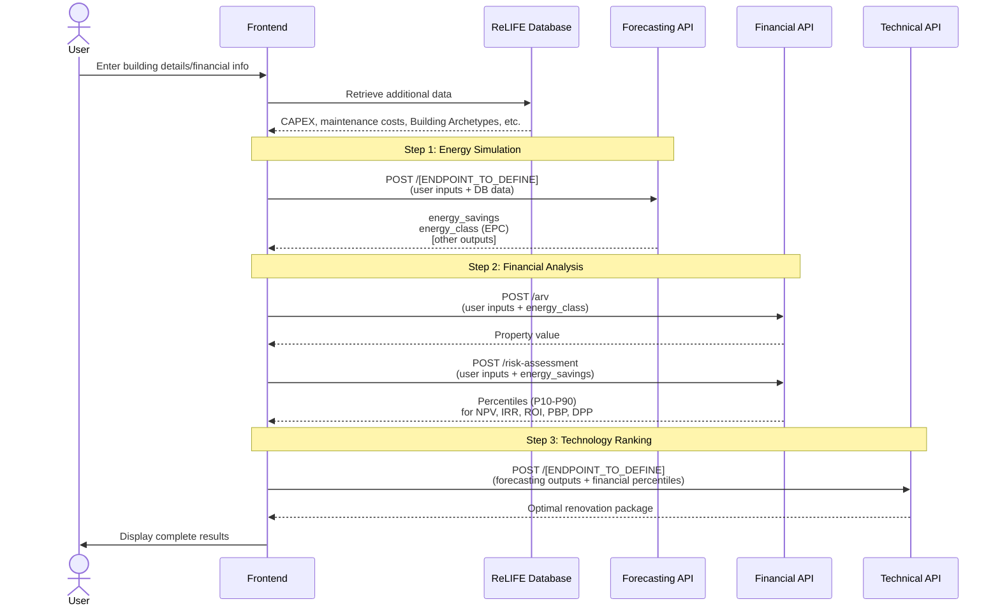
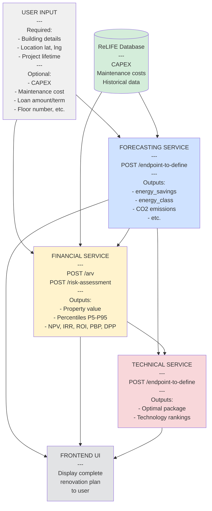

# ReLIFE HRA Tool - API Flow Diagram

## Home Renovation Assistant (HRA)

This document shows the sequence of API calls needed to implement the HRA (Home Renovation Assistant) tool.

---

## API Call Flow

> [!NOTE]
> Although the ReLIFE Database is shown as a separate entity, for now each of the Service APIs will bundle the relevant datasets internally, instead of fetching them from the central ReLIFE Database.



---

## 1. User Inputs

Each API team should specify which inputs they need from the user.

### Forecasting API

**Forecasting Team:** Define your required and optional user inputs.

**Required Inputs:**
- [To be defined by Forecasting team]

**Optional Inputs:**
- [To be defined by Forecasting team]

**Data from ReLIFE Database:**
- [To be defined by Forecasting team]

---

### Financial API

**Required Inputs from User:**
- `project_lifetime` (int, 1-30 years)
- Property location: `lat`, `lng`
- Property details: `floor_area`, `construction_year`, `number_of_floors`, `property_type`

**Optional Inputs from User:**
- `capex` (float) - If not provided, retrieved from database
- `annual_maintenance_cost` (float) - If not provided, retrieved from database
- `loan_amount` (float, default: 0.0)
- `loan_term` (int, default: 0)
- `floor_number` (int, default: null)
- `renovated_last_5_years` (bool, default: true)

**Frontend-Defined Inputs (Not User-Facing):**
- `output_level` (string) - Automatically set based on tool being used:
  - **Home Renovation Assistant (HRA)**: `"private"`
  - Other tools: `"professional"`, `"public"`, or `"complete"` as appropriate

**Data from ReLIFE Database:**
- `capex` (when not provided by user)
- `annual_maintenance_cost` (when not provided by user)

---

### Technical API

**Technical Team:** Define your required and optional user inputs.

**Required Inputs:**
- [To be defined by Technical team]

**Optional Inputs:**
- [To be defined by Technical team]

---

## 2. API Endpoints & Data Flow

### Forecasting API

**Forecasting Team:** Document your endpoint(s).

**Endpoint:** `POST /[TO_BE_DEFINED]`

**Inputs:**
- User inputs (defined above)
- Data from ReLIFE Database

**Outputs (Required by other APIs):**
- `annual_energy_savings` (float, kWh/year) - Required by Financial API
- `energy_class` (string, EPC label after renovation) - Required by Financial API
- [Other outputs to be defined] - May be required by Technical API

**Status:** To be documented

---

### Financial API

**Endpoints:**

#### POST `/arv` - After Renovation Value

**Input Example:**
```json
{
  "lat": 37.981,
  "lng": 23.728,
  "floor_area": 85.0,
  "construction_year": 1985,
  "number_of_floors": 5,
  "property_type": "Apartment",
  "floor_number": 2,
  "energy_class": "Β+",  // FROM FORECASTING API
  "renovated_last_5_years": true
}
```

**Output Example:**
```json
{
  "price_per_sqm": 1235.50,
  "total_price": 105017.50
}
```

---

#### POST `/risk-assessment` - Monte Carlo Risk Analysis

**Input Example:**
```json
{
  "annual_energy_savings": 27400,  // FROM FORECASTING API
  "project_lifetime": 20,
  "output_level": "private",  // SET BY FRONTEND ("private" for HRA tool)
  "capex": 60000,  // OPTIONAL: From user or DB
  "annual_maintenance_cost": 2000,  // OPTIONAL: From user or DB
  "loan_amount": 25000,  // OPTIONAL
  "loan_term": 15  // OPTIONAL
  // NOTE: "indicators" is NOT an input - automatically determined by API based on output_level
}
```

**Output Example (Percentile Distributions):**
```json
{
  "percentiles": {
    "NPV": {"P5": 1200, "P10": 2100, "P25": 3500, "P50": 5432, "P75": 7800, "P90": 9800, "P95": 11500},
    "IRR": {"P5": 0.023, "P10": 0.031, "P25": 0.042, "P50": 0.057, "P75": 0.073, "P90": 0.089, "P95": 0.098},
    "ROI": {"P5": 0.08, "P10": 0.10, "P25": 0.13, "P50": 0.15, "P75": 0.18, "P90": 0.21, "P95": 0.24},
    "PBP": {"P5": 6.2, "P10": 7.1, "P25": 7.8, "P50": 8.3, "P75": 9.5, "P90": 10.8, "P95": 12.1},
    "DPP": {"P5": 8.5, "P10": 9.8, "P25": 11.2, "P50": 12.5, "P75": 14.3, "P90": 16.2, "P95": 18.5}
  }
}
```

**Note:** Percentile distributions (P5-P95) are sent to Technical API for TOPSIS ranking.

**Status:** Documented

---

### Technical API

**Technical Team:** Document your endpoint(s).

**Endpoint:** `POST /[TO_BE_DEFINED]`

**Inputs:**
- Percentiles from Financial API (NPV, IRR, ROI, PBP, DPP)
- [Outputs from Forecasting API - to be defined]
- [Other inputs to be defined]

**Outputs:**
- Optimal renovation package
- Technology rankings
- [Other outputs to be defined]

**Status:** To be documented

---

## 3. Frontend Implementation

### Sequential Flow


