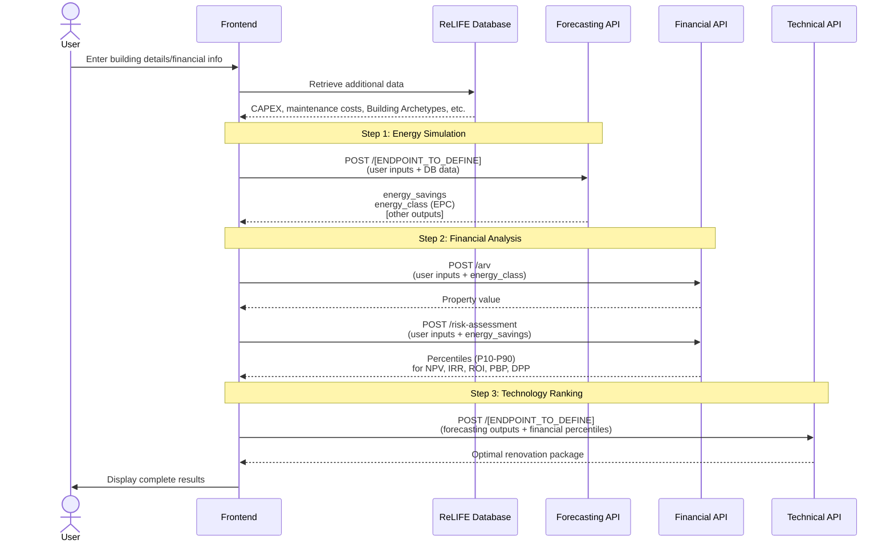
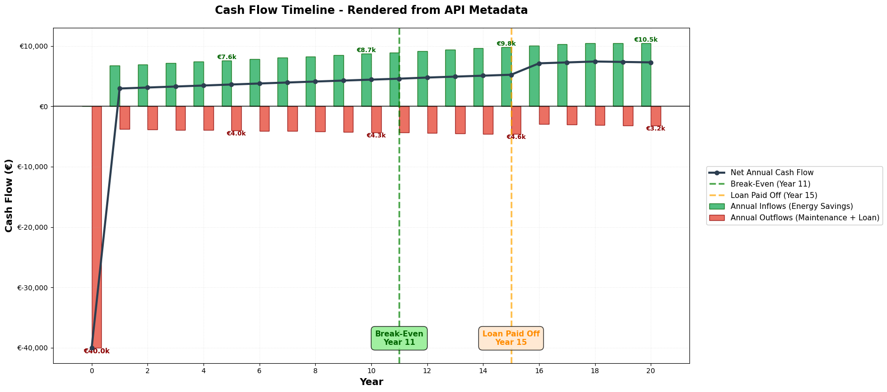
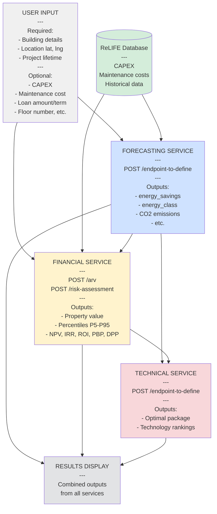

# ReLIFE HRA Tool - API Flow Diagram

## Home Renovation Assistant (HRA)

This document shows the sequence of API calls needed to implement the HRA (Home Renovation Assistant) tool.

---

## API Call Flow

> [!NOTE]
> Although the ReLIFE Database is shown as a separate entity, for now each of the Service APIs will bundle the relevant datasets internally, instead of fetching them from the central ReLIFE Database.



---

## 1. User Inputs

### Overview of All User Inputs

The following inputs are collected from the user at the beginning of the HRA workflow and are categorized by type:

#### Renovation Package Selection

User selects one or more renovation actions to evaluate (multi-select):

- **Wall insulation** 
- **Roof insulation** 
- **Floor insulation** 
- **Windows** 
- **Air-water heat pump** 
- **Condensing boiler** 
- **PV** 
- **Solar thermal panels** 

#### Technical Inputs

Building and location characteristics:

- Building type and construction details
- Floor area (m²)
- Construction year
- Number of floors
- Climate zone / Location (lat, lng)
- Current heating/cooling/hot water systems
- Current glazing type
- [Additional inputs to be defined by Forecasting team]

#### Financial Inputs

Economic parameters for the renovation:

- Project lifetime (years, typically 1-30)
- CAPEX (Capital expenditure) - Optional, can be retrieved from database
- Annual maintenance cost - Optional, can be retrieved from database
- Financing type - User chooses: **Equity** or **Loan**
  - If **Loan** is selected, the following become required:
    - Loan amount
    - Loan term (years)
    - Interest rate


---

### API-Specific Input Requirements

Each API developer should specify which of the above inputs (and any additional ones) they need.

#### Forecasting API

**Forecasting Team:** Define your required and optional user inputs.

**Required Inputs:**

- [To be defined by Daniele]

**Optional Inputs:**

- [To be defined by Daniele]

**Data from ReLIFE Database:**

- [To be defined by Daniele]

---

#### Financial API

**Required Inputs from User:**

- `project_lifetime` (int, 1-30 years)
- Property location: `lat`, `lng`
- Property details: `floor_area`, `construction_year`, `number_of_floors`, `property_type`

**Optional Inputs from User:**

- `capex` (float) - If not provided, retrieved from database
- `annual_maintenance_cost` (float) - If not provided, retrieved from database
- `loan_amount` (float, default: 0.0)
- `loan_term` (int, default: 0)
- `floor_number` (int, default: null)
- `renovated_last_5_years` (bool, default: true)

**Frontend-Defined Inputs (Not User-Facing):**

- `output_level` (string) - Automatically set based on tool being used:
  - **Home Renovation Assistant (HRA)**: `"private"`
  - Other tools: `"professional"`, `"public"`, or `"complete"` as appropriate

**Data from ReLIFE Database:**

- `capex` (when not provided by user)
- `annual_maintenance_cost` (when not provided by user)

---

#### Technical API

**Technical Team:** Define your required and optional user inputs.

**Required Inputs:**

- [To be defined by Eric/Fabio]

**Optional Inputs:**

- [To be defined by Eric/Fabio]

---

## 2. API Endpoints & Data Flow

### Forecasting API

**Daniele:** Document your endpoint(s).

**Endpoint:** `POST /[TO_BE_DEFINED]`

**Inputs:**

- User inputs (defined above)
- Data from ReLIFE Database

**Outputs (Required by other APIs):**

- `annual_energy_savings` (float, kWh/year) - Required by Financial API
- `energy_class` (string, EPC label after renovation) - Required by Financial API
- [Other outputs to be defined] - May be required by Technical API


---

### Financial API

**Endpoints:**

#### POST `/arv` - After Renovation Value

**Input Example:**

```json
{
  "lat": 37.981,
  "lng": 23.728,
  "floor_area": 85.0,
  "construction_year": 1985,
  "number_of_floors": 5,
  "property_type": "Apartment",
  "floor_number": 2,
  "energy_class": "Β+", // FROM FORECASTING API
  "renovated_last_5_years": true
}
```

**Output Example:**

```json
{
  "price_per_sqm": 1235.5,
  "total_price": 105017.5
}
```

---

#### POST `/risk-assessment` - Monte Carlo Risk Analysis

**Input Example:**

```json
{
  "annual_energy_savings": 27400, // FROM FORECASTING API
  "project_lifetime": 20,
  "output_level": "private", // SET BY FRONTEND ("private" for HRA tool)
  "capex": 60000, // OPTIONAL: From user or DB
  "annual_maintenance_cost": 2000, // OPTIONAL: From user or DB
  "loan_amount": 25000, // OPTIONAL
  "loan_term": 15 // OPTIONAL
  // NOTE: "indicators" is NOT an input - automatically determined by API based on output_level
}
```

**Output Example (Private Level - for HRA Tool):**

```json
{
  "point_forecasts": {
    "NPV": 15511.19,
    "IRR": 0.084,
    "ROI": 1.423,
    "PBP": 10.9,
    "DPP": 12.5,
    "MonthlyAvgSavings": 231.30,
    "SuccessRate": 0.982
  },
  "percentiles": {
    "NPV": {
      "P10": 2100.0,
      "P20": 3200.0,
      "P30": 4100.0,
      "P40": 4800.0,
      "P50": 5432.1,
      "P60": 6100.0,
      "P70": 6900.0,
      "P80": 7800.0,
      "P90": 9800.0
    },
    "IRR": {
      "P10": 0.031,
      "P20": 0.038,
      "P30": 0.044,
      "P40": 0.050,
      "P50": 0.057,
      "P60": 0.064,
      "P70": 0.071,
      "P80": 0.079,
      "P90": 0.089
    },
    "ROI": {
      "P10": 0.10,
      "P20": 0.115,
      "P30": 0.125,
      "P40": 0.138,
      "P50": 0.15,
      "P60": 0.163,
      "P70": 0.177,
      "P80": 0.192,
      "P90": 0.21
    },
    "PBP": {
      "P10": 7.1,
      "P20": 7.4,
      "P30": 7.6,
      "P40": 7.9,
      "P50": 8.3,
      "P60": 8.7,
      "P70": 9.2,
      "P80": 9.8,
      "P90": 10.8
    },
    "DPP": {
      "P10": 9.8,
      "P20": 10.3,
      "P30": 10.7,
      "P40": 11.2,
      "P50": 11.8,
      "P60": 12.5,
      "P70": 13.3,
      "P80": 14.2,
      "P90": 16.2
    }
  },
  "metadata": {
    "n_sims": 10000,
    "project_lifetime": 20,
    "capex": 60000,
    "annual_maintenance_cost": 250,
    "annual_energy_savings": 27400,
    "loan_amount": 20000,
    "loan_term": 15,
    "annual_loan_payment": 1737.50,
    "loan_rate_percent": 3.5,
    "output_level": "private",
    "indicators_requested": ["NPV", "IRR", "ROI", "PBP", "DPP"],
    "cash_flow_data": {
      "years": [0, 1, 2, 3, 4, 5, 6, 7, 8, 9, 10, 11, 12, 13, 14, 15, 16, 17, 18, 19, 20],
      "initial_investment": 40000.0,
      "annual_inflows": [0.0, 6740.40, 6959.60, 7180.80, 7404.10, 7629.60, 7857.40, 8087.60, 8320.30, 8555.50, 8793.30, 9033.80, 9277.10, 9523.30, 9772.50, 10024.80, 10280.30, 10539.10, 10801.30, 11067.00, 11336.30],
      "annual_outflows": [40000.0, 1994.00, 2000.95, 2008.00, 2015.15, 2022.40, 2029.75, 2037.20, 2044.75, 2052.40, 2060.15, 350.00, 352.50, 355.05, 357.65, 360.30, 0.0, 0.0, 0.0, 0.0, 0.0],
      "annual_net_cash_flow": [-40000.0, 4746.40, 4958.65, 5172.80, 5388.95, 5607.20, 5827.65, 6050.40, 6275.55, 6503.10, 6733.15, 8683.80, 8924.60, 9168.25, 9414.85, 9664.50, 10280.30, 10539.10, 10801.30, 11067.00, 11336.30],
      "cumulative_cash_flow": [-40000.0, -35253.60, -30294.95, -25122.15, -19733.20, -14126.00, -8298.35, -2247.95, 4027.60, 10530.70, 17263.85, 25947.65, 34872.25, 44040.50, 53455.35, 63119.85, 73400.15, 83939.25, 94740.55, 105807.55, 117143.85],
      "breakeven_year": 8,
      "loan_term": 15
    }
  }
}
```

**Notes:** 
- **Point Forecasts:** Median (P50) values + additional metrics (MonthlyAvgSavings, SuccessRate)
- **Percentiles:** Full distribution (P10-P90) for all financial KPIs, enabling uncertainty visualization
- **Metadata:** Contains simulation parameters AND cash flow data for chart rendering
- **Cash Flow Data:** Provides all data needed for frontend to render interactive cash flow timeline chart:
  - `years`: Timeline array including Year 0
  - `initial_investment`: Out-of-pocket investment at Year 0 (CAPEX - loan)
  - `annual_inflows`: Energy savings revenue per year
  - `annual_outflows`: Total costs (maintenance + loan payments)
  - `annual_net_cash_flow`: Net position per year
  - `cumulative_cash_flow`: Running total showing path to profitability
  - `breakeven_year`: Year when project becomes profitable (null if never)
  - `loan_term`: Years until loan is paid off (null if no loan)
- **For Technical API:** Percentile distributions are sent for TOPSIS ranking

---

### Cash Flow Chart Rendering Example

The `cash_flow_data` object in the metadata provides all necessary data for the frontend to render an interactive cash flow timeline chart. Below is a Python/Matplotlib example showing how to render this chart using **only the API metadata** (simulating what the frontend will do with a charting library like Recharts or Chart.js):

```python
import matplotlib.pyplot as plt
import numpy as np

# Extract cash_flow_data from API response metadata
cash_flow_data = response['metadata']['cash_flow_data']

# Create figure and axis
fig, ax = plt.subplots(1, 1, figsize=(18, 8))

bar_width = 0.35
years = cash_flow_data['years']
x_pos = np.arange(len(years))

# Extract data arrays
inflows = np.array(cash_flow_data['annual_inflows'])
outflows = np.array(cash_flow_data['annual_outflows'])
cumulative = np.array(cash_flow_data['cumulative_cash_flow'])

# Calculate net cash flow: inflows - outflows
# (outflows are stored as positive values, so we subtract them)
net_cf = inflows - outflows

# Plot inflows (green bars)
bars_inflow = ax.bar(x_pos - bar_width/2, inflows, bar_width, 
                      label='Annual Inflows (Energy Savings)', 
                      color='#27ae60', alpha=0.8, edgecolor='darkgreen')

# Plot outflows (red bars - negate to show as negative)
bars_outflow = ax.bar(x_pos + bar_width/2, -outflows, bar_width,
                       label='Annual Outflows (Maintenance + Loan)', 
                       color='#e74c3c', alpha=0.8, edgecolor='darkred')

# Add net cash flow line
ax.plot(x_pos, net_cf, color='#2c3e50', linewidth=3, marker='o', 
         markersize=6, label='Net Annual Cash Flow', zorder=5)

# Zero line
ax.axhline(y=0, color='black', linestyle='-', linewidth=1.5, alpha=0.7)

# Get y-axis limits for annotations
y_min, y_max = ax.get_ylim()

# Add break-even marker
if cash_flow_data['breakeven_year'] is not None:
    bey = cash_flow_data['breakeven_year']
    ax.axvline(x=bey, color='green', linestyle='--', linewidth=2.5, 
               alpha=0.7, label=f'Break-Even (Year {bey})')
    ax.text(bey, y_min + (y_max - y_min)*0.05, f'Break-Even\nYear {bey}',
           ha='center', va='bottom', fontsize=11, fontweight='bold', color='darkgreen',
           bbox=dict(boxstyle='round,pad=0.5', facecolor='lightgreen', alpha=0.85))

# Add loan payoff marker
if cash_flow_data['loan_term'] is not None and cash_flow_data['loan_term'] > 0:
    lt = cash_flow_data['loan_term']
    ax.axvline(x=lt, color='orange', linestyle='--', linewidth=2.5, 
               alpha=0.7, label=f'Loan Paid Off (Year {lt})')
    ax.text(lt, y_min + (y_max - y_min)*0.05, f'Loan Paid Off\nYear {lt}',
           ha='center', va='bottom', fontsize=11, fontweight='bold', color='darkorange',
           bbox=dict(boxstyle='round,pad=0.5', facecolor='#ffe6cc', alpha=0.85))

# Add value labels every 5 years
for i in range(0, len(years), 5):
    if i == 0:
        # Year 0: Show outflow as negative
        ax.text(i + bar_width/2, -outflows[i], f'€{outflows[i]/1000:.1f}k',
               ha='center', va='top', fontsize=10, fontweight='bold', color='darkred')
    else:
        # Inflow label
        ax.text(i - bar_width/2, inflows[i], f'€{inflows[i]/1000:.1f}k',
               ha='center', va='bottom', fontsize=9, fontweight='bold', color='darkgreen')
        # Outflow label
        ax.text(i + bar_width/2, -outflows[i], f'€{outflows[i]/1000:.1f}k',
               ha='center', va='top', fontsize=9, fontweight='bold', color='darkred')

# Formatting
ax.set_xlabel('Year', fontsize=14, fontweight='bold')
ax.set_ylabel('Cash Flow (€)', fontsize=14, fontweight='bold')
ax.set_title('Cash Flow Timeline - Rendered from API Metadata', 
             fontsize=16, fontweight='bold', pad=20)

# Legend outside
ax.legend(loc='center left', bbox_to_anchor=(1.02, 0.5), fontsize=11, framealpha=0.95)

ax.grid(True, alpha=0.3, linestyle=':', linewidth=0.8)
ax.set_xticks(x_pos[::2])
ax.set_xticklabels(years[::2])
ax.yaxis.set_major_formatter(plt.FuncFormatter(lambda x, p: f'€{x:,.0f}'))

plt.tight_layout()
plt.show()
```

**Rendered Output:**



**Key Chart Elements:**

- **Green bars (positive):** Annual inflows from energy savings, growing over time due to energy price inflation
- **Red bars (negative):** Annual outflows including maintenance costs and loan payments
- **Dark line with markers:** Net annual cash flow (inflows - outflows)
- **Year 0:** Large red bar showing initial out-of-pocket investment (CAPEX - loan amount)
- **Green dashed line:** Break-even marker when cumulative cash flow becomes positive
- **Orange dashed line:** Loan payoff marker when debt is fully repaid
- **Value labels:** Display key amounts every 5 years for easy reference

**Frontend Implementation Notes:**

- The frontend can render this chart using libraries like **Recharts**, **Chart.js**, or **D3.js**
- All data comes directly from the API response - no server-side image generation needed
- The chart should be interactive with tooltips showing exact values on hover
- Consider adding zoom/pan controls for longer project lifetimes
- Mobile-responsive design should simplify the chart appropriately


---

### Technical API

**Eric/Fabio:** Document your endpoint(s).

**Endpoint:** `POST /[TO_BE_DEFINED]`

**Inputs:**

- Percentiles from Financial API (NPV, IRR, ROI, PBP, DPP)
- [Outputs from Forecasting API - to be defined]
- [Other inputs to be defined]

**Outputs:**

- Optimal renovation package
- Technology rankings
- [Other outputs to be defined]


---

## 3. Frontend Implementation

### Sequential Flow


