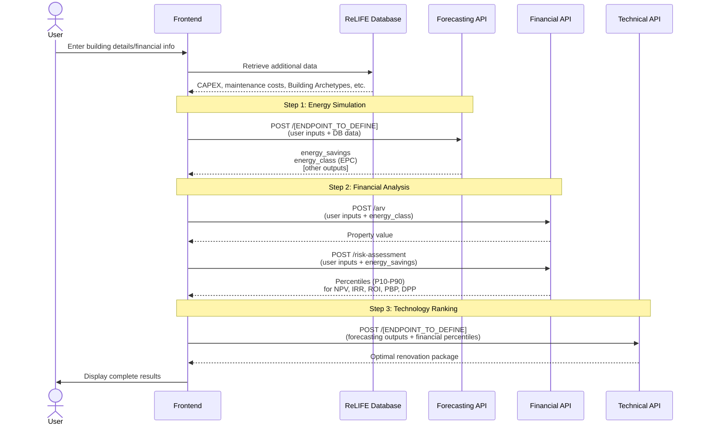
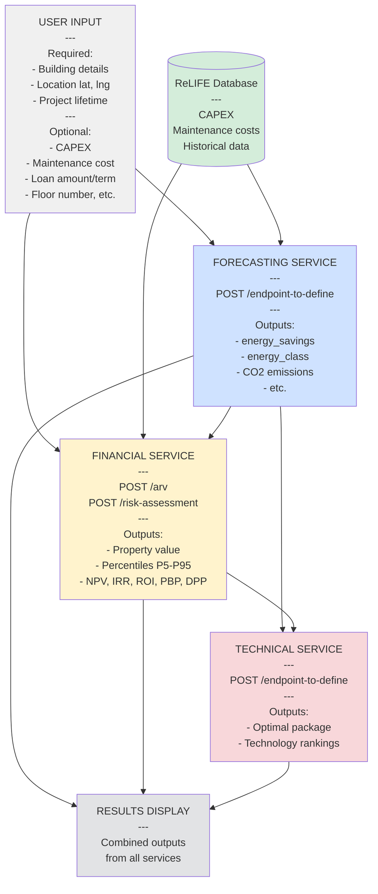

# ReLIFE HRA Tool - API Flow Diagram

## Home Renovation Assistant (HRA)

This document shows the sequence of API calls needed to implement the HRA (Home Renovation Assistant) tool.

---

## API Call Flow

> [!NOTE]
> Although the ReLIFE Database is shown as a separate entity, for now each of the Service APIs will bundle the relevant datasets internally, instead of fetching them from the central ReLIFE Database.



---

## 1. User Inputs

### Overview of All User Inputs

The following inputs are collected from the user at the beginning of the HRA workflow and are categorized by type:

#### Renovation Package Selection

User selects one or more renovation actions to evaluate (multi-select):

- **Wall insulation**
- **Roof insulation**
- **Floor insulation**
- **Windows**
- **Air-water heat pump**
- **Condensing boiler**
- **PV**
- **Solar thermal panels**

#### Technical Inputs

Building and location characteristics:

- Building type and construction details
- Floor area (m²)
- Construction year
- Number of floors
- Climate zone / Location (lat, lng)
- Current heating/cooling/hot water systems
- Current glazing type
- [Additional inputs to be defined by Forecasting team]

#### Financial Inputs

Economic parameters for the renovation:

- Project lifetime (years, typically 1-30)
- CAPEX (Capital expenditure) - Optional, can be retrieved from database
- Annual maintenance cost - Optional, can be retrieved from database
- Financing type - User chooses: **Equity** or **Loan**
  - If **Loan** is selected, the following become required:
    - Loan amount
    - Loan term (years)
    - Interest rate

---

### API-Specific Input Requirements

Each API developer should specify which of the above inputs (and any additional ones) they need.

#### Forecasting API

**Required Inputs:**

##### Building

| Key                              | Type       | Description                                                              |
| -------------------------------- | ---------- | ------------------------------------------------------------------------ |
| `name`                           | str        | Building name or identifier.                                             |
| `azimuth_relative_to_true_north` | float (°)  | Orientation of the building relative to north. (0=N, 90=E, 180=S, 270=W) |
| `latitude`, `longitude`          | float      | Coordinates (used for weather and solar position).                       |
| `exposed_perimeter`              | float (m)  | External perimeter.                                                      |
| `height`                         | float (m)  | Building height (floor to roof).                                         |
| `wall_thickness`                 | float (m)  | Average wall layer total thickness                                       |
| `n_floors`                       | int        | Number of floors.                                                        |
| `building_type_class`            | str        | Type of building (e.g., _Residential_apartment_, _Office_).              |
| `net_floor_area`                 | float (m²) | Conditioned floor area.                                                  |

##### Envelope Elements: `building_surface`

Describes all external and internal surfaces forming the building envelope.

###### Common attributes

| Key                   | Description                                               |
| --------------------- | --------------------------------------------------------- |
| `name`                | Surface name.                                             |
| `type`                | `"opaque"`, `"transparent"`, `"adiabatic"`, `"adjacent"`. |
| `area`                | Surface area (m²).                                        |
| `sky_view_factor`     | Fraction of visible sky (0–1).                            |
| `u_value`             | Thermal transmittance (W/m²K).                            |
| `solar_absorptance`   | Fraction of solar radiation absorbed (0–1).               |
| `thermal_capacity`    | Thermal capacity (J/KgK).                                 |
| `orientation.azimuth` | Azimuth (0 = N, 90 = E, 180 = S, 270 = W).                |
| `orientation.tilt`    | Tilt angle (0 = horizontal, 90 = vertical).               |
| `name_adj_zone`       | Linked adjacent zone (if applicable).                     |

###### Transparent surfaces

Include window-specific attributes:
| Key | Description |
|------|-------------|
| `g_value` | Solar transmittance of glazing. |
| `height`, `width` | Window dimensions (m). |
| `parapet` | Window sill height above floor (m). |
| `shading`, `shading_type` | Boolean and type of shading (e.g., _horizontal_overhang_). |
| `width_or_distance_of_shading_elements` | Distance or overhang width. |
| `overhang_proprieties` | Additional geometric data for shading devices. |

---

##### Unit Definitions: `units`

Defines unit conventions for each physical quantity.

| Key                     | Example            | Meaning                           |
| ----------------------- | ------------------ | --------------------------------- |
| `area`                  | `"m²"`             | Surface area unit.                |
| `u_value`               | `"W/m²K"`          | Heat transmittance.               |
| `thermal_capacity`      | `"J/kgK"`          | Heat storage capacity.            |
| `azimuth`, `tilt`       | `"degrees"`        | Orientation conventions.          |
| `internal_gain`         | `"W/m²"`           | Internal gain density.            |
| `internal_gain_profile` | `"Normalized 0–1"` | Profile normalization rule.       |
| `HVAC_profile`          | `"0: off, 1: on"`  | HVAC operating schedule encoding. |

---

##### Thermal, System, and Operational Settings: `building_parameters`

###### Temperature Setpoints

| Key                                   | Description                            |
| ------------------------------------- | -------------------------------------- |
| `heating_setpoint`, `heating_setback` | Comfort and setback temperatures (°C). |
| `cooling_setpoint`, `cooling_setback` | Cooling comfort and setback (°C).      |
| `units`                               | `"°C"`.                                |

###### System Capacities

| Key                                    | Description                    |
| -------------------------------------- | ------------------------------ |
| `heating_capacity`, `cooling_capacity` | Maximum system capacities (W). |
| `units`                                | `"W"`.                         |

###### Airflow Rates

| Key                 | Description                            |
| ------------------- | -------------------------------------- |
| `infiltration_rate` | Airflow in air changes per hour (ACH). |
| `units`             | `"ACH"`.                               |

###### Internal Gains

Each internal source (occupants, appliances, lighting) defines:
| Key | Description |
|------|-------------|
| `name` | Gain type. |
| `full_load` | Peak power density (W/m²). |
| `weekday`, `weekend` | 24-hour normalized (0–1) schedules. |

###### Construction

| Key               | Description                                |
| ----------------- | ------------------------------------------ |
| `wall_thickness`  | Wall thickness (m).                        |
| `thermal_bridges` | Linear thermal bridge coefficient (W/m·K). |

###### Climate Parameters

| Key             | Description                                 |
| --------------- | ------------------------------------------- |
| `coldest_month` | Index of coldest month (1 = Jan, 12 = Dec). |

###### HVAC and Ventilation Profiles

Hourly normalized profiles for system operation:

| Profile               | Description                            |
| --------------------- | -------------------------------------- |
| `heating_profile`     | 24‑hour on/off (0–1) heating activity. |
| `cooling_profile`     | 24‑hour on/off cooling activity.       |
| `ventilation_profile` | 24‑hour on/off ventilation schedule.   |

---

##### System

###### Emitter block (room-side heat delivery)

| Field                       | Type               | Example                                   | Meaning                                                                                          |
| --------------------------- | ------------------ | ----------------------------------------- | ------------------------------------------------------------------------------------------------ |
| `emitter_type`              | `str`              | `"Floor heating 1"`                       | Emitter family/preset. Used to pick default emission characteristics.                            |
| `nominal_power`             | `float`            | `8`                                       | Nominal emitter power (kW thermal). Used for checks and backstops in emission calc.              |
| `emission_efficiency`       | `float`            | `90`                                      | Emission efficiency in **%** (heat delivered to room vs heat from circuit).                      |
| `flow_temp_control_type`    | `str`              | `"Type 2 - Based on outdoor temperature"` | How the **emitter** flow temperature is determined. See control strategies below.                |
| `selected_emm_cont_circuit` | `int`              | `0`                                       | Index if multiple heating zones/circuits exist (0-based).                                        |
| `mixing_valve`              | `bool`             | `True`                                    | If a mixing valve is present on emitter circuit (affects achievable flow temp and differential). |
| `mixing_valve_delta`        | `float`            | `2`                                       | °C delta used when mixing valve is active (typical blending margin).                             |
| `constant_flow_temp`        | `float` (optional) | `42`                                      | Overrides control curve with a constant emitter flow setpoint (°C). _Commented by default_.      |

###### Optional custom emitter tables

You can override internal presets using one or both of the following:

- **`TB14`**: a custom structure/table with manufacturer data (e.g., output vs. ΔT, flow temperature limits). Uncomment and provide your object to replace defaults.
- **`heat_emission_data`**: a compact `pandas.DataFrame` describing key points for the emitter control for a given circuit. Example:

```python
heat_emission_data = pd.DataFrame({
    "θH_em_flw_max_sahz_i": [45],  # Max flow temp (°C) for space-heating zone i
    "ΔθH_em_w_max_sahz_i": [8],    # Max ΔT flow-return (K) for zone i
    "θH_em_ret_req_sahz_i": [20],  # Desired return temp (°C)
    "βH_em_req_sahz_i": [80],      # Desired load factor at ON/OFF (%)
    "θH_em_flw_min_tz_i": [28],    # Minimum flow temp (°C) for zone i
}, index=[
    "Max flow temperature HZ1",
    "Max Δθ flow / return HZ1",
    "Desired return temperature HZ1",
    "Desired load factor with ON-OFF for HZ1",
    "Minimum flow temperature for HZ1"
])
```

> **Tip**: If both `TB14` and `heat_emission_data` are provided, clarify which one your backend prioritizes to avoid ambiguity.

---

###### Distribution block (piping network & auxiliaries)

| Field                         | Type    | Example | Meaning                                                                              |
| ----------------------------- | ------- | ------- | ------------------------------------------------------------------------------------ |
| `heat_losses_recovered`       | `bool`  | `True`  | If pipe losses are partly useful to the heated space.                                |
| `distribution_loss_recovery`  | `float` | `90`    | % of distribution losses **recovered** inside the conditioned volume.                |
| `simplified_approach`         | `float` | `80`    | % shortcut for simplified loss approach (e.g., rule-of-thumb recovery or reduction). |
| `distribution_aux_recovery`   | `float` | `80`    | % of auxiliary power (pumps/controls) considered as useful internal gain.            |
| `distribution_aux_power`      | `float` | `30`    | Auxiliary electric power (W) of distribution.                                        |
| `distribution_loss_coeff`     | `float` | `48`    | Global distribution loss coefficient (W/K) or equivalent scalar used by model.       |
| `distribution_operation_time` | `float` | `1`     | Fraction of time distribution is active (0..1, per-step multiplier).                 |

---

###### Generator block (plant production side)

| Field                                   | Type    | Example         | Meaning                                                                      |
| --------------------------------------- | ------- | --------------- | ---------------------------------------------------------------------------- |
| `full_load_power`                       | `float` | `27`            | Generator thermal capacity at full load (kW).                                |
| `max_monthly_load_factor`               | `float` | `100`           | % cap on monthly load factor (for derating/limitations).                     |
| `tH_gen_i_ON`                           | `float` | `1`             | Minimum ON time (h) or start-up horizon used for cycling logic.              |
| `auxiliary_power_generator`             | `float` | `0`             | % or W (per model) for generator auxiliary power; used in energy balances.   |
| `fraction_of_auxiliary_power_generator` | `float` | `40`            | % of generator auxiliaries credited as internal gains.                       |
| `generator_circuit`                     | `str`   | `"independent"` | Hydraulic layout: `"direct"` or `"independent"` (primary/secondary with HX). |

###### Generator flow-temperature control

| Field                          | Type           | Example                                   | Meaning                                                    |
| ------------------------------ | -------------- | ----------------------------------------- | ---------------------------------------------------------- |
| `gen_flow_temp_control_type`   | `str`          | `"Type A - Based on outdoor temperature"` | Generator flow control strategy (see §5).                  |
| `gen_outdoor_temp_data`        | `pd.DataFrame` | see below                                 | Outdoor reset curve for the generator flow temperature.    |
| `speed_control_generator_pump` | `str`          | `"variable"`                              | Pump control mode: `"fixed"` or `"variable"`.              |
| `generator_nominal_deltaT`     | `float`        | `20`                                      | Nominal ΔT (K) across the generator loop.                  |
| `mixing_valve_delta`           | `float`        | `2`                                       | If a mixing valve exists on primary, blending margin (°C). |
| `θHW_gen_flw_set`              | `float` (opt)  | `50`                                      | **Override**: fixed generator flow temperature (°C).       |
| `θHW_gen_ret_set`              | `float` (opt)  | `40`                                      | **Override**: fixed generator return temperature (°C).     |

**Example: outdoor reset table**

```python
gen_outdoor_temp_data = pd.DataFrame({
    "θext_min_gen": [-7],   # cold design outdoor temp (°C)
    "θext_max_gen": [15],   # warm boundary (°C)
    "θflw_gen_max": [60],   # flow setpoint at θext_min_gen (°C)
    "θflw_gen_min": [35],   # flow setpoint at θext_max_gen (°C)
}, index=["Generator curve"])
```

The controller interpolates a target flow temperature between `(θext_min_gen, θflw_gen_max)` and `(θext_max_gen, θflw_gen_min)`. Values are clipped outside the range.

---

###### Control strategies (cheat sheet)

**Emitter `flow_temp_control_type`**

Common patterns (implementation-dependent; typical meanings):

- **Type 1 – Constant setpoint**: use `constant_flow_temp` (°C).
- **Type 2 – Based on outdoor temperature**: emitter flow is computed via an outdoor reset (may reuse the generator curve or a dedicated one).
- **Type 3 – Room feedback**: modulate flow to maintain room operative temperature; requires a PI logic in the backend.
- **Type 4 – Return-limited**: aim for a maximum return temperature (useful in condensing systems).

> **Note**: Your codebase may define the exact meanings of each "Type N". Ensure the UI/CLI lists allowed values.

**Generator `gen_flow_temp_control_type`**

- **Type A – Based on outdoor temperature**: uses `gen_outdoor_temp_data` (reset curve).
- **Type B – Constant**: use `θHW_gen_flw_set` and optionally `θHW_gen_ret_set`.
- **Type C – Demand-following**: track emitter request (requires coupling logic and min/max clamps).

---

##### Efficiency model

| Field              | Allowed                               | Notes                                                                                                                                                |
| ------------------ | ------------------------------------- | ---------------------------------------------------------------------------------------------------------------------------------------------------- |
| `efficiency_model` | `"simple"`, `"map"`, `"manufacturer"` | `"simple"` applies fixed or curve-based efficiencies. `"map"` uses performance maps. `"manufacturer"` expects detailed tables (COP/η vs. temp/load). |

Backends typically compute **delivered heat**, **electric/primary energy**, and **auxiliary fractions** accordingly.

---

##### Calculation options

| Field                        | Type   | Meaning                                                                                                                        |
| ---------------------------- | ------ | ------------------------------------------------------------------------------------------------------------------------------ |
| `calc_when_QH_positive_only` | `bool` | If `True`, run generator/distribution only when building heating need `Q_H > 0`.                                               |
| `off_compute_mode`           | `str`  | How to treat the system when off: `"full"` (still compute temps/losses), `"idle"` (minimal), or `"temps"` (only temperatures). |

---

##### Units & conventions

- Temperatures in **°C**, ΔT in **K** (numerically the same scale).
- Powers: `kW` for generator/emitter nominal; auxiliaries commonly in **W** (check your backend).
- Efficiencies and fractions input as **percent** (0–100) unless otherwise specified.
- Curves are **per-circuit** unless stated global.
- Time base: typically **hourly** steps.

---

for more information refers to `Guidelines`: <https://eurac-eebgroup.github.io/pybuildingenergy-docs/iso_52016_input/>

---

##### Inputs for photovoltaic system and heat pump will be available soon

---

##### Input if archetype is selected

- `category` (str): Name of the building typology. "Sigle family house", "Multi family house", "office", etc..
- `countries`: list of countries to include
- `names`: list of archetype names to include

##### Input for cobenefit

- `energy_source` (str): Name of the energy source. "grid_electricity", "natural_gas", "lpg", "diesel", "biomass", "district_heating", "solar_pv", "wind", "heat_pump_electric"
- `country`: country to select the emission factors to be used (e.g. "IT", "DE", "FR", etc.)
- `annual_energy_consumption` (float): annual Energy consumption (kWh) directly coming from simulation of if already available from own data

##### Optional Inputs

- There are no optional parameters, only the possibility of preloading them by using building archetypes from Reliefe Database.

##### Data from ReLIFE Database

- All inputs defined in point 1 from archetypes database.
- `Emission factors`: values of emission factors for each system type and country. Example

```Bash
"IT": {  # Italia
        "grid_electricity": 0.280,      # Mix elettrico nazionale
        "natural_gas": 0.202,           # Gas naturale (uso termico)
        "lpg": 0.234,                   # GPL
        "diesel": 0.267,                # Gasolio da riscaldamento
        "biomass": 0.030,               # Pellet/legna (quasi neutrale)
        "district_heating": 0.180,      # Teleriscaldamento (media)
        "solar_pv": 0.040,              # Fotovoltaico (LCA)
        "wind": 0.012,                  # Eolico (LCA)
        "heat_pump_electric": 0.070,    # PdC con mix elettrico (COP≈4)
    }
```

---

#### Financial API

**Required Inputs from User:**

- `project_lifetime` (int, 1-30 years)
- Property location: `lat`, `lng`
- Property details: `floor_area`, `construction_year`, `number_of_floors`, `property_type`

**Optional Inputs from User:**

- `capex` (float) - If not provided, retrieved from database
- `annual_maintenance_cost` (float) - If not provided, retrieved from database
- `loan_amount` (float, default: 0.0)
- `loan_term` (int, default: 0)
- `floor_number` (int, default: null)
- `renovated_last_5_years` (bool, default: true)

**Frontend-Defined Inputs (Not User-Facing):**

- `output_level` (string) - Automatically set based on tool being used:
  - **Home Renovation Assistant (HRA)**: `"private"`
  - Other tools: `"professional"`, `"public"`, or `"complete"` as appropriate

**Data from ReLIFE Database:**

- `capex` (when not provided by user)
- `annual_maintenance_cost` (when not provided by user)

---

#### Technical API

**Technical Team:** Define your required and optional user inputs.

**Required Inputs:**

- [To be defined by Eric/Fabio]

**Optional Inputs:**

- [To be defined by Eric/Fabio]

---

## 2. API Endpoints & Data Flow

### Forecasting API

**Daniele:** Document your endpoint(s).

**Endpoint:** `POST /[TO_BE_DEFINED]`

**Inputs:**

- User inputs (defined above)
- Data from ReLIFE Database

**Outputs (Required by other APIs):**

- `annual_energy_savings` (float, kWh/year) - Required by Financial API
- `energy_class` (string, EPC label after renovation) - Required by Financial API
- [Other outputs to be defined] - May be required by Technical API

---

### Financial API

**Endpoints:**

#### POST `/arv` - After Renovation Value

**Input Example:**

```json
{
  "lat": 37.981,
  "lng": 23.728,
  "floor_area": 85.0,
  "construction_year": 1985,
  "number_of_floors": 5,
  "property_type": "Apartment",
  "floor_number": 2,
  "energy_class": "Β+", // FROM FORECASTING API
  "renovated_last_5_years": true
}
```

**Output Example:**

```json
{
  "price_per_sqm": 1235.5,
  "total_price": 105017.5
}
```

---

#### POST `/risk-assessment` - Monte Carlo Risk Analysis

**Input Example:**

```json
{
  "annual_energy_savings": 27400, // FROM FORECASTING API
  "project_lifetime": 20,
  "output_level": "private", // SET BY FRONTEND ("private" for HRA tool)
  "capex": 60000, // OPTIONAL: From user or DB
  "annual_maintenance_cost": 2000, // OPTIONAL: From user or DB
  "loan_amount": 25000, // OPTIONAL
  "loan_term": 15 // OPTIONAL
  // NOTE: "indicators" is NOT an input - automatically determined by API based on output_level
}
```

**Output Example (Private Level - for HRA Tool):**

```json
{
  "point_forecasts": {
    "NPV": 15511.19,
    "IRR": 0.084,
    "ROI": 1.423,
    "PBP": 10.9,
    "DPP": 12.5,
    "MonthlyAvgSavings": 231.3,
    "SuccessRate": 0.982
  },
  "percentiles": {
    "NPV": {
      "P10": 2100.0,
      "P20": 3200.0,
      "P30": 4100.0,
      "P40": 4800.0,
      "P50": 5432.1,
      "P60": 6100.0,
      "P70": 6900.0,
      "P80": 7800.0,
      "P90": 9800.0
    },
    "IRR": {
      "P10": 0.031,
      "P20": 0.038,
      "P30": 0.044,
      "P40": 0.05,
      "P50": 0.057,
      "P60": 0.064,
      "P70": 0.071,
      "P80": 0.079,
      "P90": 0.089
    },
    "ROI": {
      "P10": 0.1,
      "P20": 0.115,
      "P30": 0.125,
      "P40": 0.138,
      "P50": 0.15,
      "P60": 0.163,
      "P70": 0.177,
      "P80": 0.192,
      "P90": 0.21
    },
    "PBP": {
      "P10": 7.1,
      "P20": 7.4,
      "P30": 7.6,
      "P40": 7.9,
      "P50": 8.3,
      "P60": 8.7,
      "P70": 9.2,
      "P80": 9.8,
      "P90": 10.8
    },
    "DPP": {
      "P10": 9.8,
      "P20": 10.3,
      "P30": 10.7,
      "P40": 11.2,
      "P50": 11.8,
      "P60": 12.5,
      "P70": 13.3,
      "P80": 14.2,
      "P90": 16.2
    }
  },
  "metadata": {
    "n_sims": 10000,
    "project_lifetime": 20,
    "capex": 60000,
    "annual_maintenance_cost": 250,
    "annual_energy_savings": 27400,
    "loan_amount": 20000,
    "loan_term": 15,
    "annual_loan_payment": 1737.5,
    "loan_rate_percent": 3.5,
    "output_level": "private",
    "indicators_requested": ["NPV", "IRR", "ROI", "PBP", "DPP"],
    "cash_flow_data": {
      "years": [
        0, 1, 2, 3, 4, 5, 6, 7, 8, 9, 10, 11, 12, 13, 14, 15, 16, 17, 18, 19, 20
      ],
      "initial_investment": 40000.0,
      "annual_inflows": [
        0.0, 6740.4, 6959.6, 7180.8, 7404.1, 7629.6, 7857.4, 8087.6, 8320.3,
        8555.5, 8793.3, 9033.8, 9277.1, 9523.3, 9772.5, 10024.8, 10280.3,
        10539.1, 10801.3, 11067.0, 11336.3
      ],
      "annual_outflows": [
        40000.0, 1994.0, 2000.95, 2008.0, 2015.15, 2022.4, 2029.75, 2037.2,
        2044.75, 2052.4, 2060.15, 350.0, 352.5, 355.05, 357.65, 360.3, 0.0, 0.0,
        0.0, 0.0, 0.0
      ],
      "annual_net_cash_flow": [
        -40000.0, 4746.4, 4958.65, 5172.8, 5388.95, 5607.2, 5827.65, 6050.4,
        6275.55, 6503.1, 6733.15, 8683.8, 8924.6, 9168.25, 9414.85, 9664.5,
        10280.3, 10539.1, 10801.3, 11067.0, 11336.3
      ],
      "cumulative_cash_flow": [
        -40000.0, -35253.6, -30294.95, -25122.15, -19733.2, -14126.0, -8298.35,
        -2247.95, 4027.6, 10530.7, 17263.85, 25947.65, 34872.25, 44040.5,
        53455.35, 63119.85, 73400.15, 83939.25, 94740.55, 105807.55, 117143.85
      ],
      "breakeven_year": 8,
      "loan_term": 15
    }
  }
}
```

**Notes:**

- **Point Forecasts:** Median (P50) values + additional metrics (MonthlyAvgSavings, SuccessRate)
- **Percentiles:** Full distribution (P10-P90) for all financial KPIs, enabling uncertainty visualization
- **Metadata:** Contains simulation parameters AND cash flow data for chart rendering
- **Cash Flow Data:** Provides all data needed for frontend to render interactive cash flow timeline chart:
  - `years`: Timeline array including Year 0
  - `initial_investment`: Out-of-pocket investment at Year 0 (CAPEX - loan)
  - `annual_inflows`: Energy savings revenue per year
  - `annual_outflows`: Total costs (maintenance + loan payments)
  - `annual_net_cash_flow`: Net position per year
  - `cumulative_cash_flow`: Running total showing path to profitability
  - `breakeven_year`: Year when project becomes profitable (null if never)
  - `loan_term`: Years until loan is paid off (null if no loan)
- **For Technical API:** Percentile distributions are sent for TOPSIS ranking

---

### Cash Flow Chart Rendering Example

The `cash_flow_data` object in the metadata provides all necessary data for the frontend to render an interactive cash flow timeline chart. Below is a Python/Matplotlib example showing how to render this chart using **only the API metadata** (simulating what the frontend will do with a charting library like Recharts or Chart.js):

```python
import matplotlib.pyplot as plt
import numpy as np

# Extract cash_flow_data from API response metadata
cash_flow_data = response['metadata']['cash_flow_data']

# Create figure and axis
fig, ax = plt.subplots(1, 1, figsize=(18, 8))

bar_width = 0.35
years = cash_flow_data['years']
x_pos = np.arange(len(years))

# Extract data arrays
inflows = np.array(cash_flow_data['annual_inflows'])
outflows = np.array(cash_flow_data['annual_outflows'])
cumulative = np.array(cash_flow_data['cumulative_cash_flow'])

# Calculate net cash flow: inflows - outflows
# (outflows are stored as positive values, so we subtract them)
net_cf = inflows - outflows

# Plot inflows (green bars)
bars_inflow = ax.bar(x_pos - bar_width/2, inflows, bar_width,
                      label='Annual Inflows (Energy Savings)',
                      color='#27ae60', alpha=0.8, edgecolor='darkgreen')

# Plot outflows (red bars - negate to show as negative)
bars_outflow = ax.bar(x_pos + bar_width/2, -outflows, bar_width,
                       label='Annual Outflows (Maintenance + Loan)',
                       color='#e74c3c', alpha=0.8, edgecolor='darkred')

# Add net cash flow line
ax.plot(x_pos, net_cf, color='#2c3e50', linewidth=3, marker='o',
         markersize=6, label='Net Annual Cash Flow', zorder=5)

# Zero line
ax.axhline(y=0, color='black', linestyle='-', linewidth=1.5, alpha=0.7)

# Get y-axis limits for annotations
y_min, y_max = ax.get_ylim()

# Add break-even marker
if cash_flow_data['breakeven_year'] is not None:
    bey = cash_flow_data['breakeven_year']
    ax.axvline(x=bey, color='green', linestyle='--', linewidth=2.5,
               alpha=0.7, label=f'Break-Even (Year {bey})')
    ax.text(bey, y_min + (y_max - y_min)*0.05, f'Break-Even\nYear {bey}',
           ha='center', va='bottom', fontsize=11, fontweight='bold', color='darkgreen',
           bbox=dict(boxstyle='round,pad=0.5', facecolor='lightgreen', alpha=0.85))

# Add loan payoff marker
if cash_flow_data['loan_term'] is not None and cash_flow_data['loan_term'] > 0:
    lt = cash_flow_data['loan_term']
    ax.axvline(x=lt, color='orange', linestyle='--', linewidth=2.5,
               alpha=0.7, label=f'Loan Paid Off (Year {lt})')
    ax.text(lt, y_min + (y_max - y_min)*0.05, f'Loan Paid Off\nYear {lt}',
           ha='center', va='bottom', fontsize=11, fontweight='bold', color='darkorange',
           bbox=dict(boxstyle='round,pad=0.5', facecolor='#ffe6cc', alpha=0.85))

# Add value labels every 5 years
for i in range(0, len(years), 5):
    if i == 0:
        # Year 0: Show outflow as negative
        ax.text(i + bar_width/2, -outflows[i], f'€{outflows[i]/1000:.1f}k',
               ha='center', va='top', fontsize=10, fontweight='bold', color='darkred')
    else:
        # Inflow label
        ax.text(i - bar_width/2, inflows[i], f'€{inflows[i]/1000:.1f}k',
               ha='center', va='bottom', fontsize=9, fontweight='bold', color='darkgreen')
        # Outflow label
        ax.text(i + bar_width/2, -outflows[i], f'€{outflows[i]/1000:.1f}k',
               ha='center', va='top', fontsize=9, fontweight='bold', color='darkred')

# Formatting
ax.set_xlabel('Year', fontsize=14, fontweight='bold')
ax.set_ylabel('Cash Flow (€)', fontsize=14, fontweight='bold')
ax.set_title('Cash Flow Timeline - Rendered from API Metadata',
             fontsize=16, fontweight='bold', pad=20)

# Legend outside
ax.legend(loc='center left', bbox_to_anchor=(1.02, 0.5), fontsize=11, framealpha=0.95)

ax.grid(True, alpha=0.3, linestyle=':', linewidth=0.8)
ax.set_xticks(x_pos[::2])
ax.set_xticklabels(years[::2])
ax.yaxis.set_major_formatter(plt.FuncFormatter(lambda x, p: f'€{x:,.0f}'))

plt.tight_layout()
plt.show()
```

**Rendered Output:**


**Key Chart Elements:**

- **Green bars (positive):** Annual inflows from energy savings, growing over time due to energy price inflation
- **Red bars (negative):** Annual outflows including maintenance costs and loan payments
- **Dark line with markers:** Net annual cash flow (inflows - outflows)
- **Year 0:** Large red bar showing initial out-of-pocket investment (CAPEX - loan amount)
- **Green dashed line:** Break-even marker when cumulative cash flow becomes positive
- **Orange dashed line:** Loan payoff marker when debt is fully repaid
- **Value labels:** Display key amounts every 5 years for easy reference

**Frontend Implementation Notes:**

- The frontend can render this chart using libraries like **Recharts**, **Chart.js**, or **D3.js**
- All data comes directly from the API response - no server-side image generation needed
- The chart should be interactive with tooltips showing exact values on hover
- Consider adding zoom/pan controls for longer project lifetimes
- Mobile-responsive design should simplify the chart appropriately

---

### Technical API

**Eric/Fabio:** Document your endpoint(s).

**Endpoint:** `POST /[TO_BE_DEFINED]`

**Inputs:**

- Percentiles from Financial API (NPV, IRR, ROI, PBP, DPP)
- [Outputs from Forecasting API - to be defined]
- [Other inputs to be defined]

**Outputs:**

- Optimal renovation package
- Technology rankings
- [Other outputs to be defined]

---

## 3. Frontend Implementation

### Sequential Flow


