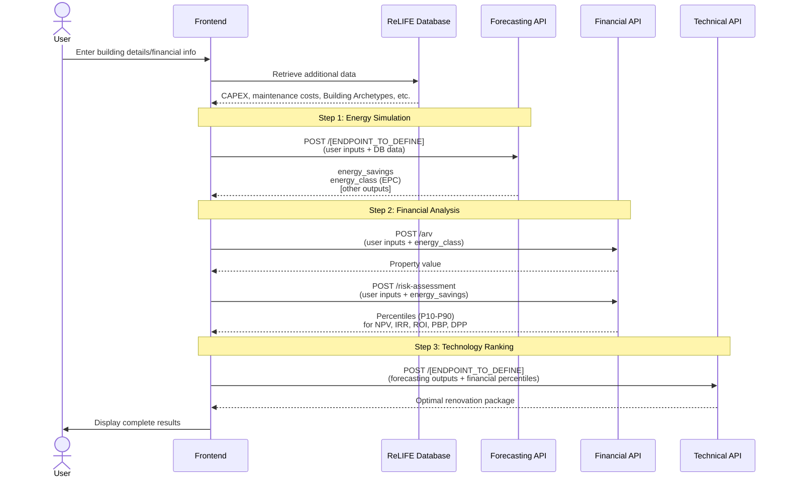
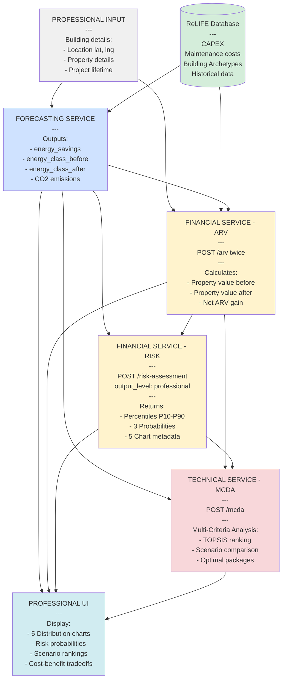

# ReLIFE PRA Tool - API Flow Diagram

**Portfolio Renovation Assistant (PRA)**

**Purpose:** The Professional Risk Assessment (PRA) tool is an Energy Renovation Action Support Tool designed for professional consultants, energy auditors, and property managers. It provides comprehensive risk analysis and decision support for building renovation projects, delivering detailed statistical distributions, success probabilities, and multi-criteria analysis to enable informed investment decisions.

This document shows the sequence of API calls needed to implement the PRA tool.

---

## Output Level Comparison by API

### Financial API

| Aspect | HMA (Private) | PRA (Professional) |
|--------|---------------|-------------------|
| **Output Level** | `"private"` | `"professional"` |
| **Percentiles** | P10-P90 for all indicators | P10-P90 for all indicators |
| **Success Metrics** | MonthlyAvgSavings, SuccessRate | 3 Probabilities (NPV>0, PBP<lifetime, DPP<lifetime) |
| **Visualization** | cash_flow_data (1 timeline chart) | chart_metadata (5 distribution histograms) |
| **Response Size** | ~10 KB | ~20 KB |

For detailed comparison, see [PRIVATE_VS_PROFESSIONAL_OUTPUT.md](../PRIVATE_VS_PROFESSIONAL_OUTPUT.md).

### Forecasting API

> **To be defined by Daniele**

### Technical API

> **To be defined by Eric**

---

## API Call Flow



---

## 1. User Inputs

Each API team should specify which inputs they need from the user.

### Forecasting API

**Required Inputs:**
  
### Building
| Key | Type | Description |
|------|------|-------------|
| `name` | str | Building name or identifier. |
| `azimuth_relative_to_true_north` | float (°) | Orientation of the building relative to north.  (0=N, 90=E, 180=S, 270=W)|
| `latitude`, `longitude` | float | Coordinates (used for weather and solar position). |
| `exposed_perimeter` | float (m) | External perimeter. |
| `height` | float (m) | Building height (floor to roof). |
| `wall_thickness` | float (m) | Average wall layer total thickness  |
| `n_floors` | int | Number of floors. |
| `building_type_class` | str | Type of building (e.g., *Residential_apartment*, *Office*). |
| `net_floor_area` | float (m²) | Conditioned floor area. |


### <h3 style="color:#df1b12; margin-bottom:0px; font-weight:bold"><strong>Envelope Elements: `"building_surface"`</strong></h3> 

Describes all external and internal surfaces forming the building envelope.

### Common attributes
| Key | Description |
|------|-------------|
| `name` | Surface name. |
| `type` | `"opaque"`, `"transparent"`, `"adiabatic"`, `"adjacent"`. |
| `area` | Surface area (m²). |
| `sky_view_factor` | Fraction of visible sky (0–1). |
| `u_value` | Thermal transmittance (W/m²K). |
| `solar_absorptance` | Fraction of solar radiation absorbed (0–1). |
| `thermal_capacity` |  Thermal capacity (J/KgK). |
| `orientation.azimuth` | Azimuth (0 = N, 90 = E, 180 = S, 270 = W). |
| `orientation.tilt` | Tilt angle (0 = horizontal, 90 = vertical). |
| `name_adj_zone` | Linked adjacent zone (if applicable). |

### Transparent surfaces
Include window-specific attributes:
| Key | Description |
|------|-------------|
| `g_value` | Solar transmittance of glazing. |
| `height`, `width` | Window dimensions (m). |
| `parapet` | Window sill height above floor (m). |
| `shading`, `shading_type` | Boolean and type of shading (e.g., *horizontal_overhang*). |
| `width_or_distance_of_shading_elements` | Distance or overhang width. |
| `overhang_proprieties` | Additional geometric data for shading devices. |

---

### <h3 style="color:#df1b12; margin-bottom:0px; font-weight:bold"><strong>Unit Definitions: `"units"`</strong></h3> 

Defines unit conventions for each physical quantity.

| Key | Example | Meaning |
|------|----------|----------|
| `area` | `"m²"` | Surface area unit. |
| `u_value` | `"W/m²K"` | Heat transmittance. |
| `thermal_capacity` | `"J/kgK"` | Heat storage capacity. |
| `azimuth`, `tilt` | `"degrees"` | Orientation conventions. |
| `internal_gain` | `"W/m²"` | Internal gain density. |
| `internal_gain_profile` | `"Normalized 0–1"` | Profile normalization rule. |
| `HVAC_profile` | `"0: off, 1: on"` | HVAC operating schedule encoding. |

---

### <h3 style="color:#df1b12; margin-bottom:0px; font-weight:bold"><strong>Thermal, System, and Operational Settings: `"building_parameters"`</strong></h3> 

#### Temperature Setpoints
| Key | Description |
|------|-------------|
| `heating_setpoint`, `heating_setback` | Comfort and setback temperatures (°C). |
| `cooling_setpoint`, `cooling_setback` | Cooling comfort and setback (°C). |
| `units` | `"°C"`. |

#### System Capacities
| Key | Description |
|------|-------------|
| `heating_capacity`, `cooling_capacity` | Maximum system capacities (W). |
| `units` | `"W"`. |

#### Airflow Rates
| Key | Description |
|------|-------------|
| `infiltration_rate` | Airflow in air changes per hour (ACH). |
| `units` | `"ACH"`. |

#### Internal Gains
Each internal source (occupants, appliances, lighting) defines:
| Key | Description |
|------|-------------|
| `name` | Gain type. |
| `full_load` | Peak power density (W/m²). |
| `weekday`, `weekend` | 24-hour normalized (0–1) schedules. |

#### Construction
| Key | Description |
|------|-------------|
| `wall_thickness` | Wall thickness (m). |
| `thermal_bridges` | Linear thermal bridge coefficient (W/m·K). |

#### Climate Parameters
| Key | Description |
|------|-------------|
| `coldest_month` | Index of coldest month (1 = Jan, 12 = Dec). |

#### HVAC and Ventilation Profiles
Hourly normalized profiles for system operation:

| Profile | Description |
|----------|-------------|
| `heating_profile` | 24‑hour on/off (0–1) heating activity. |
| `cooling_profile` | 24‑hour on/off cooling activity. |
| `ventilation_profile` | 24‑hour on/off ventilation schedule. |

---


### System

#### Emitter block (room-side heat delivery)

| Field | Type | Example | Meaning |
|---|---|---|---|
| `emitter_type` | `str` | `"Floor heating 1"` | Emitter family/preset. Used to pick default emission characteristics. |
| `nominal_power` | `float` | `8` | Nominal emitter power (kW thermal). Used for checks and backstops in emission calc. |
| `emission_efficiency` | `float` | `90` | Emission efficiency in **%** (heat delivered to room vs heat from circuit). |
| `flow_temp_control_type` | `str` | `"Type 2 - Based on outdoor temperature"` | How the **emitter** flow temperature is determined. See control strategies below. |
| `selected_emm_cont_circuit` | `int` | `0` | Index if multiple heating zones/circuits exist (0-based). |
| `mixing_valve` | `bool` | `True` | If a mixing valve is present on emitter circuit (affects achievable flow temp and differential). |
| `mixing_valve_delta` | `float` | `2` | °C delta used when mixing valve is active (typical blending margin). |
| `constant_flow_temp` | `float` (optional) | `42` | Overrides control curve with a constant emitter flow setpoint (°C). *Commented by default*. |

##### Optional custom emitter tables

You can override internal presets using one or both of the following:

- **`TB14`**: a custom structure/table with manufacturer data (e.g., output vs. ΔT, flow temperature limits). Uncomment and provide your object to replace defaults.
- **`heat_emission_data`**: a compact `pandas.DataFrame` describing key points for the emitter control for a given circuit. Example:

```python
heat_emission_data = pd.DataFrame({
    "θH_em_flw_max_sahz_i": [45],  # Max flow temp (°C) for space-heating zone i
    "ΔθH_em_w_max_sahz_i": [8],    # Max ΔT flow-return (K) for zone i
    "θH_em_ret_req_sahz_i": [20],  # Desired return temp (°C)
    "βH_em_req_sahz_i": [80],      # Desired load factor at ON/OFF (%)
    "θH_em_flw_min_tz_i": [28],    # Minimum flow temp (°C) for zone i
}, index=[
    "Max flow temperature HZ1",
    "Max Δθ flow / return HZ1",
    "Desired return temperature HZ1",
    "Desired load factor with ON-OFF for HZ1",
    "Minimum flow temperature for HZ1"
])
```

> **Tip**: If both `TB14` and `heat_emission_data` are provided, clarify which one your backend prioritizes to avoid ambiguity.

---

#### Distribution block (piping network & auxiliaries)

| Field | Type | Example | Meaning |
|---|---|---|---|
| `heat_losses_recovered` | `bool` | `True` | If pipe losses are partly useful to the heated space. |
| `distribution_loss_recovery` | `float` | `90` | % of distribution losses **recovered** inside the conditioned volume. |
| `simplified_approach` | `float` | `80` | % shortcut for simplified loss approach (e.g., rule-of-thumb recovery or reduction). |
| `distribution_aux_recovery` | `float` | `80` | % of auxiliary power (pumps/controls) considered as useful internal gain. |
| `distribution_aux_power` | `float` | `30` | Auxiliary electric power (W) of distribution. |
| `distribution_loss_coeff` | `float` | `48` | Global distribution loss coefficient (W/K) or equivalent scalar used by model. |
| `distribution_operation_time` | `float` | `1` | Fraction of time distribution is active (0..1, per-step multiplier). |

---

#### Generator block (plant production side)

| Field | Type | Example | Meaning |
|---|---|---|---|
| `full_load_power` | `float` | `27` | Generator thermal capacity at full load (kW). |
| `max_monthly_load_factor` | `float` | `100` | % cap on monthly load factor (for derating/limitations). |
| `tH_gen_i_ON` | `float` | `1` | Minimum ON time (h) or start-up horizon used for cycling logic. |
| `auxiliary_power_generator` | `float` | `0` | % or W (per model) for generator auxiliary power; used in energy balances. |
| `fraction_of_auxiliary_power_generator` | `float` | `40` | % of generator auxiliaries credited as internal gains. |
| `generator_circuit` | `str` | `"independent"` | Hydraulic layout: `"direct"` or `"independent"` (primary/secondary with HX). |

##### Generator flow-temperature control

| Field | Type | Example | Meaning |
|---|---|---|---|
| `gen_flow_temp_control_type` | `str` | `"Type A - Based on outdoor temperature"` | Generator flow control strategy (see §5). |
| `gen_outdoor_temp_data` | `pd.DataFrame` | see below | Outdoor reset curve for the generator flow temperature. |
| `speed_control_generator_pump` | `str` | `"variable"` | Pump control mode: `"fixed"` or `"variable"`. |
| `generator_nominal_deltaT` | `float` | `20` | Nominal ΔT (K) across the generator loop. |
| `mixing_valve_delta` | `float` | `2` | If a mixing valve exists on primary, blending margin (°C). |
| `θHW_gen_flw_set` | `float` (opt) | `50` | **Override**: fixed generator flow temperature (°C). |
| `θHW_gen_ret_set` | `float` (opt) | `40` | **Override**: fixed generator return temperature (°C). |

**Example: outdoor reset table**

```python
gen_outdoor_temp_data = pd.DataFrame({
    "θext_min_gen": [-7],   # cold design outdoor temp (°C)
    "θext_max_gen": [15],   # warm boundary (°C)
    "θflw_gen_max": [60],   # flow setpoint at θext_min_gen (°C)
    "θflw_gen_min": [35],   # flow setpoint at θext_max_gen (°C)
}, index=["Generator curve"])
```

The controller interpolates a target flow temperature between `(θext_min_gen, θflw_gen_max)` and `(θext_max_gen, θflw_gen_min)`. Values are clipped outside the range.

---

#### Control strategies (cheat sheet)

##### Emitter `flow_temp_control_type`
Common patterns (implementation-dependent; typical meanings):

- **Type 1 – Constant setpoint**: use `constant_flow_temp` (°C).  
- **Type 2 – Based on outdoor temperature**: emitter flow is computed via an outdoor reset (may reuse the generator curve or a dedicated one).
- **Type 3 – Room feedback**: modulate flow to maintain room operative temperature; requires a PI logic in the backend.
- **Type 4 – Return-limited**: aim for a maximum return temperature (useful in condensing systems).

> **Note**: Your codebase may define the exact meanings of each "Type N". Ensure the UI/CLI lists allowed values.

##### Generator `gen_flow_temp_control_type`
- **Type A – Based on outdoor temperature**: uses `gen_outdoor_temp_data` (reset curve).  
- **Type B – Constant**: use `θHW_gen_flw_set` and optionally `θHW_gen_ret_set`.  
- **Type C – Demand-following**: track emitter request (requires coupling logic and min/max clamps).

---

### Efficiency model

| Field | Allowed | Notes |
|---|---|---|
| `efficiency_model` | `"simple"`, `"map"`, `"manufacturer"` | `"simple"` applies fixed or curve-based efficiencies. `"map"` uses performance maps. `"manufacturer"` expects detailed tables (COP/η vs. temp/load). |

Backends typically compute **delivered heat**, **electric/primary energy**, and **auxiliary fractions** accordingly.

---

### Calculation options

| Field | Type | Meaning |
|---|---|---|
| `calc_when_QH_positive_only` | `bool` | If `True`, run generator/distribution only when building heating need `Q_H > 0`. |
| `off_compute_mode` | `str` | How to treat the system when off: `"full"` (still compute temps/losses), `"idle"` (minimal), or `"temps"` (only temperatures). |

---

### Units & conventions

- Temperatures in **°C**, ΔT in **K** (numerically the same scale).
- Powers: `kW` for generator/emitter nominal; auxiliaries commonly in **W** (check your backend).
- Efficiencies and fractions input as **percent** (0–100) unless otherwise specified.
- Curves are **per-circuit** unless stated global.
- Time base: typically **hourly** steps.

---

for more information refers to  `Guidelines`: <https://eurac-eebgroup.github.io/pybuildingenergy-docs/iso_52016_input/>


---

### <h3 style="color:#ff2c2c; margin-bottom:0px; font-weight:bold"><strong>Inputs for photovoltaic system and Heat pump will be available soon</strong></h3> 

---

#### Input if archetype is selected:
- `category` (str): Name of the building typology. "Sigle family house", "Multi family house", "office", etc..
- `countries`: list of countries to include
- `names`: list of archetype names to include

#### Input for cobenefit:
- `energy_source` (str): Name of the energy source. "grid_electricity", "natural_gas", "lpg", "diesel", "biomass", "district_heating", "solar_pv", "wind", "heat_pump_electric"
- `country`: country to select the emission factors to be used (e.g. "IT", "DE", "FR", etc.)
- `annual_energy_consumption` (float): annual Energy consumption (kWh) directly coming from simulation of if already available from own data


## **Optional Inputs:**
-   There are no optional parameters, only the possibility of preloading them by using building archetypes from Reliefe Database.

## **Data from ReLIFE Database:**
- All inputs defined in point 1 from archetypes database. 
- `Emission factors`: values of emission factors for each system type and country. Example
``` Bash 
"IT": {  # Italia
        "grid_electricity": 0.280,      # Mix elettrico nazionale
        "natural_gas": 0.202,           # Gas naturale (uso termico)
        "lpg": 0.234,                   # GPL
        "diesel": 0.267,                # Gasolio da riscaldamento
        "biomass": 0.030,               # Pellet/legna (quasi neutrale)
        "district_heating": 0.180,      # Teleriscaldamento (media)
        "solar_pv": 0.040,              # Fotovoltaico (LCA)
        "wind": 0.012,                  # Eolico (LCA)
        "heat_pump_electric": 0.070,    # PdC con mix elettrico (COP≈4)
    }
```


---

### Financial API

**Required Inputs from User:**
- `project_lifetime` (int, 1-30 years)
- Property location: `lat`, `lng`
- Property details: `floor_area`, `construction_year`, `number_of_floors`, `property_type`

**Optional Inputs from User:**
- `capex` (float) - If not provided, retrieved from database
- `annual_maintenance_cost` (float) - If not provided, retrieved from database
- `loan_amount` (float, default: 0.0)
- `loan_term` (int, default: 0)
- `floor_number` (int, default: null)
- `renovated_last_5_years` (bool, default: true)

**Frontend-Defined Inputs (Not User-Facing):**
- `output_level` (string) - Automatically set based on tool being used:
  - **Professional Risk Assessment (PRA)**: `"professional"`
  - Other tools: `"private"`, `"public"`, or `"complete"` as appropriate

**Data from ReLIFE Database:**
- `capex` (when not provided by user)
- `annual_maintenance_cost` (when not provided by user)

---

### Technical API

**Technical Team:** Define your required and optional user inputs

**Required Inputs:**
- [To be defined by Technical team]

**Optional Inputs:**
- [To be defined by Technical team]

---

## 2. API Endpoints & Data Flow

### Forecasting API

**Forecasting Team:** Document your endpoint(s)

**Endpoint:** `POST /[TO_BE_DEFINED]`

**Inputs:**
- User inputs (defined above)
- Data from ReLIFE Database

**Outputs (Required by other APIs):**
- `annual_energy_savings` (float, kWh/year) - Required by Financial API
- `energy_class` (string, EPC label after renovation) - Required by Financial API
- [Other outputs to be defined] - May be required by Technical API

**Status:** To be documented

---

### Financial API

**Endpoints:**

#### POST `/arv` - After Renovation Value

**Input Example:**
```json
{
  "lat": 37.981,
  "lng": 23.728,
  "floor_area": 85.0,
  "construction_year": 1985,
  "number_of_floors": 5,
  "property_type": "Apartment",
  "floor_number": 2,
  "energy_class": "Β+",  // FROM FORECASTING API
  "renovated_last_5_years": true
}
```

**Output Example:**
```json
{
  "price_per_sqm": 1235.50,
  "total_price": 105017.50
}
```

---

#### POST `/risk-assessment` - Monte Carlo Risk Analysis

**Input Example:**
```json
{
  "annual_energy_savings": 27400,  // FROM FORECASTING API
  "project_lifetime": 20,
  "output_level": "professional",  // SET BY FRONTEND ("professional" for PRA tool)
  "capex": 60000,  // OPTIONAL: From user or DB
  "annual_maintenance_cost": 2000,  // OPTIONAL: From user or DB
  "loan_amount": 25000,  // OPTIONAL
  "loan_term": 15  // OPTIONAL
  // NOTE: "indicators" is NOT an input - automatically determined by API based on output_level
}
```

**Output Example (Professional Level):**
```json
{
  "point_forecasts": {
    "NPV": 5432.10,
    "IRR": 5.7,
    "ROI": 15.2,
    "PBP": 8.3,
    "DPP": 10.1
  },
  "percentiles": {
    "NPV": {
      "P10": 2100, "P20": 3200, "P30": 4100, "P40": 4800,
      "P50": 5432, "P60": 6100, "P70": 6900, "P80": 7800, "P90": 9800
    },
    "IRR": {
      "P10": 3.1, "P20": 4.0, "P30": 4.6, "P40": 5.2,
      "P50": 5.7, "P60": 6.3, "P70": 7.0, "P80": 7.9, "P90": 8.9
    },
    "ROI": {"P10": 10.2, "P20": 11.5, "P30": 12.8, "P40": 14.0, "P50": 15.2, "P60": 16.4, "P70": 17.8, "P80": 19.3, "P90": 21.0},
    "PBP": {"P10": 7.1, "P20": 7.5, "P30": 7.8, "P40": 8.0, "P50": 8.3, "P60": 8.6, "P70": 9.0, "P80": 9.5, "P90": 10.2},
    "DPP": {"P10": 8.9, "P20": 9.3, "P30": 9.7, "P40": 10.0, "P50": 10.1, "P60": 10.5, "P70": 11.0, "P80": 11.6, "P90": 12.3}
  },
  "probabilities": {
    "Pr(NPV > 0)": 0.8435,
    "Pr(PBP < 20y)": 0.9124,
    "Pr(DPP < 20y)": 0.7563
  },
  "metadata": {
    "n_sims": 10000,
    "project_lifetime": 20,
    "output_level": "professional",
    "chart_metadata": {
      "NPV": {
        "bins": {
          "centers": [1200, 1450, 1700, "...30 bins..."],
          "counts": [45, 123, 289, "..."],
          "edges": [1075, 1325, 1575, "..."]
        },
        "statistics": {"mean": 5500.0, "std": 2300.0, "P10": 2100.0, "P50": 5432.1, "P90": 9800.0}
      },
      "IRR": {"bins": {"...": "..."}, "statistics": {"...": "..."}},
      "ROI": {"bins": {"...": "..."}, "statistics": {"...": "..."}},
      "PBP": {"bins": {"...": "..."}, "statistics": {"...": "..."}},
      "DPP": {"bins": {"...": "..."}, "statistics": {"...": "..."}}
    }
  }
}
```

**Note:** Professional output includes percentile distributions (P10-P90), 3 probabilities, and chart metadata for 5 distribution histograms. This data is sent to Technical API for multi-criteria decision analysis.

**Status:** Documented

---

### Technical API

**Technical Team:** Document your endpoint(s)

**Endpoint:** `POST /[TO_BE_DEFINED]`

**Inputs:**
- Percentiles from Financial API (NPV, IRR, ROI, PBP, DPP)
- [Outputs from Forecasting API - to be defined]
- [Other inputs to be defined]

**Outputs:**
- Optimal renovation package
- Technology rankings
- [Other outputs to be defined]

**Status:** To be documented

---

## 3. Frontend Implementation

### Sequential Flow



---


**Last Updated:** February 5, 2026  
**Version:** 1.0  
**Tool:** Professional Risk Assessment (PRA)
