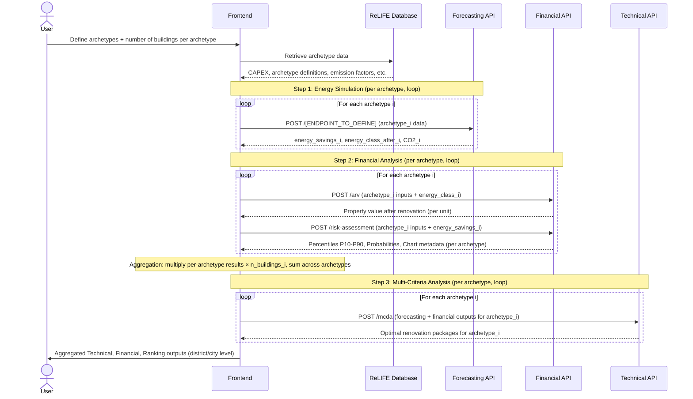

# ReLIFE RSE Tool - API Flow Diagram

**Renovation Strategy Explorer (RSE)**

**Purpose:** The Renovation Strategy Explorer (RSE) is an Energy Renovation Action Support Tool designed for local and regional authorities, policymakers, and urban planners. It enables large-scale analysis of building stock renovation scenarios by working at the **archetype level**: users define one or more building archetypes, specify the number of buildings belonging to each archetype, and the tool computes energy and financial results per archetype — then scales them up by multiplying by the number of buildings. This delivers aggregated district- or city-level insights into energy savings potential, CO₂ reduction, and investment requirements across entire building portfolios.

This document shows the sequence of API calls needed to implement the RSE tool.

---

## Key Difference vs. HRA and PRA Tools

> **IMPORTANT: Archetype × Count Scaling**
>
> Unlike the HRA (single building, homeowner) and PRA (single building portfolio, professional consultant) tools, the RSE operates on **building archetypes**, not individual buildings.
>
> The overall workflow per archetype is identical to that of the PRA tool. The critical difference is in aggregation:
>
> - Energy simulations and financial calculations are performed **once per archetype**.
> - Final aggregated results (total energy savings, total CO₂ reduction, total CAPEX, aggregate NPV, etc.) are obtained by **multiplying the per-archetype result by the number of buildings assigned to that archetype**.
> - Results are then **summed across all archetypes** to give district- or city-wide totals.

---

## Output Level Comparison by API

### Financial API

| Aspect | HRA (Private) | PRA (Professional) | RSE (Professional) |
|--------|---------------|--------------------|--------------------|
| **Output Level** | `"private"` | `"professional"` | `"professional"` |
| **Percentiles** | P10-P90 for all indicators | P10-P90 for all indicators | P10-P90 for all indicators (per archetype) |
| **Success Metrics** | MonthlyAvgSavings, SuccessRate | 3 Probabilities (NPV>0, PBP<lifetime, DPP<lifetime) | 3 Probabilities (per archetype, then aggregated) |
| **Visualization** | cash_flow_data (1 timeline chart) | chart_metadata (5 distribution histograms) | chart_metadata (5 distribution histograms per archetype) |
| **Aggregation** | N/A (single building) | N/A (single building or portfolio of buildings) | Per-archetype results × building count, summed across archetypes |

For detailed comparison of `"private"` vs `"professional"` output, see [PRIVATE_VS_PROFESSIONAL_OUTPUT.md](../PRIVATE_VS_PROFESSIONAL_OUTPUT.md).

### Forecasting API

> **To be defined by Daniele** — same inputs/outputs as PRA tool, applied once per archetype. Daniele should update inputs/outputs according to the actual needs of the endpoints.

### Technical API

> **To be defined by Eric** — same inputs/outputs as PRA tool, applied once per archetype. Eric should update inputs/outputs according to the actual needs of the endpoints.

---

## API Call Flow



---

## 1. User Inputs

Each API team should specify which inputs they need from the user.

### RSE-Specific Inputs

Before any API call, the user defines their building stock portfolio. For each entry the user must provide:

- **Archetype definition** — either by selecting a standard archetype from the ReLIFE Database (filtered by construction period, country, building type, etc.) or by providing a full custom building definition.
- **Number of buildings** — how many buildings of that archetype exist in the district or city being analysed.

Any number of archetypes can be added to build up the full portfolio.

---

### Forecasting API

> **Note to Daniele**: The inputs/outputs below follow the same structure as the PRA tool. Please update them according to the actual needs of your endpoints for the RSE use case.

**Required Inputs (per archetype):**

#### Building
| Key | Type | Description |
|------|------|-------------|
| `name` | str | Building name or archetype identifier. |
| `azimuth_relative_to_true_north` | float (°) | Orientation of the building relative to north. (0=N, 90=E, 180=S, 270=W) |
| `latitude`, `longitude` | float | Coordinates (used for weather and solar position). |
| `exposed_perimeter` | float (m) | External perimeter. |
| `height` | float (m) | Building height (floor to roof). |
| `wall_thickness` | float (m) | Average wall layer total thickness. |
| `n_floors` | int | Number of floors. |
| `building_type_class` | str | Type of building (e.g., *Residential_apartment*, *Office*). |
| `net_floor_area` | float (m²) | Conditioned floor area. |

#### <h3 style="color:#df1b12; margin-bottom:0px; font-weight:bold"><strong>Envelope Elements: `"building_surface"`</strong></h3>

Describes all external and internal surfaces forming the building envelope.

#### Common attributes
| Key | Description |
|------|-------------|
| `name` | Surface name. |
| `type` | `"opaque"`, `"transparent"`, `"adiabatic"`, `"adjacent"`. |
| `area` | Surface area (m²). |
| `sky_view_factor` | Fraction of visible sky (0–1). |
| `u_value` | Thermal transmittance (W/m²K). |
| `solar_absorptance` | Fraction of solar radiation absorbed (0–1). |
| `thermal_capacity` | Thermal capacity (J/KgK). |
| `orientation.azimuth` | Azimuth (0 = N, 90 = E, 180 = S, 270 = W). |
| `orientation.tilt` | Tilt angle (0 = horizontal, 90 = vertical). |
| `name_adj_zone` | Linked adjacent zone (if applicable). |

#### Transparent surfaces
Include window-specific attributes:
| Key | Description |
|------|-------------|
| `g_value` | Solar transmittance of glazing. |
| `height`, `width` | Window dimensions (m). |
| `parapet` | Window sill height above floor (m). |
| `shading`, `shading_type` | Boolean and type of shading (e.g., *horizontal_overhang*). |
| `width_or_distance_of_shading_elements` | Distance or overhang width. |
| `overhang_proprieties` | Additional geometric data for shading devices. |

---

#### <h3 style="color:#df1b12; margin-bottom:0px; font-weight:bold"><strong>Unit Definitions: `"units"`</strong></h3>

Defines unit conventions for each physical quantity.

| Key | Example | Meaning |
|------|----------|----------|
| `area` | `"m²"` | Surface area unit. |
| `u_value` | `"W/m²K"` | Heat transmittance. |
| `thermal_capacity` | `"J/kgK"` | Heat storage capacity. |
| `azimuth`, `tilt` | `"degrees"` | Orientation conventions. |
| `internal_gain` | `"W/m²"` | Internal gain density. |
| `internal_gain_profile` | `"Normalized 0–1"` | Profile normalization rule. |
| `HVAC_profile` | `"0: off, 1: on"` | HVAC operating schedule encoding. |

---

#### <h3 style="color:#df1b12; margin-bottom:0px; font-weight:bold"><strong>Thermal, System, and Operational Settings: `"building_parameters"`</strong></h3>

##### Temperature Setpoints
| Key | Description |
|------|-------------|
| `heating_setpoint`, `heating_setback` | Comfort and setback temperatures (°C). |
| `cooling_setpoint`, `cooling_setback` | Cooling comfort and setback (°C). |
| `units` | `"°C"`. |

##### System Capacities
| Key | Description |
|------|-------------|
| `heating_capacity`, `cooling_capacity` | Maximum system capacities (W). |
| `units` | `"W"`. |

##### Airflow Rates
| Key | Description |
|------|-------------|
| `infiltration_rate` | Airflow in air changes per hour (ACH). |
| `units` | `"ACH"`. |

##### Internal Gains
Each internal source (occupants, appliances, lighting) defines:
| Key | Description |
|------|-------------|
| `name` | Gain type. |
| `full_load` | Peak power density (W/m²). |
| `weekday`, `weekend` | 24-hour normalized (0–1) schedules. |

##### Construction
| Key | Description |
|------|-------------|
| `wall_thickness` | Wall thickness (m). |
| `thermal_bridges` | Linear thermal bridge coefficient (W/m·K). |

##### Climate Parameters
| Key | Description |
|------|-------------|
| `coldest_month` | Index of coldest month (1 = Jan, 12 = Dec). |

##### HVAC and Ventilation Profiles
Hourly normalized profiles for system operation:

| Profile | Description |
|----------|-------------|
| `heating_profile` | 24-hour on/off (0–1) heating activity. |
| `cooling_profile` | 24-hour on/off cooling activity. |
| `ventilation_profile` | 24-hour on/off ventilation schedule. |

---

#### System

##### Emitter block (room-side heat delivery)

| Field | Type | Example | Meaning |
|---|---|---|---|
| `emitter_type` | `str` | `"Floor heating 1"` | Emitter family/preset. |
| `nominal_power` | `float` | `8` | Nominal emitter power (kW thermal). |
| `emission_efficiency` | `float` | `90` | Emission efficiency in **%**. |
| `flow_temp_control_type` | `str` | `"Type 2 - Based on outdoor temperature"` | How the emitter flow temperature is determined. |
| `selected_emm_cont_circuit` | `int` | `0` | Index if multiple heating zones/circuits exist (0-based). |

##### Distribution block (piping network & auxiliaries)

| Field | Type | Example | Meaning |
|---|---|---|---|
| `heat_losses_recovered` | `bool` | `True` | If pipe losses are partly useful to the heated space. |
| `distribution_loss_recovery` | `float` | `90` | % of distribution losses recovered inside the conditioned volume. |
| `distribution_aux_power` | `float` | `30` | Auxiliary electric power (W) of distribution. |

##### Generator block (plant production side)

| Field | Type | Example | Meaning |
|---|---|---|---|
| `full_load_power` | `float` | `27` | Generator thermal capacity at full load (kW). |
| `gen_flow_temp_control_type` | `str` | `"Type A - Based on outdoor temperature"` | Generator flow control strategy. |

For more information, refer to `Guidelines`: <https://eurac-eebgroup.github.io/pybuildingenergy-docs/iso_52016_input/>

---

#### <h3 style="color:#ff2c2c; margin-bottom:0px; font-weight:bold"><strong>Inputs for photovoltaic system and Heat pump will be available soon</strong></h3>

---

#### Input if archetype is selected from ReLIFE Database:
- `category` (str): Name of the building typology. "Single family house", "Multi family house", "Office", etc.
- `countries`: list of countries to include.
- `names`: list of archetype names to include.

#### Input for co-benefit:
- `energy_source` (str): Name of the energy source. "grid_electricity", "natural_gas", "lpg", "diesel", "biomass", "district_heating", "solar_pv", "wind", "heat_pump_electric".
- `country`: country to select the emission factors to be used (e.g. "IT", "DE", "FR", etc.).
- `annual_energy_consumption` (float): annual energy consumption (kWh) directly coming from simulation.

**Optional Inputs:**
- There are no optional parameters; all can be preloaded from archetypes in the ReLIFE Database.

**Data from ReLIFE Database:**
- All building inputs from the archetypes database.
- `Emission factors`: values of emission factors for each system type and country.

---

### Financial API

> **Note**: Financial API inputs and outputs are **identical to the PRA tool**. API calls are made once per archetype. Final aggregated results are obtained by multiplying per-archetype financial outputs by the number of buildings assigned to that archetype, then summing across all archetypes.

**Required Inputs from User (per archetype):**
- `project_lifetime` (int, 1-30 years) — shared across all archetypes or set per archetype
- Property location: `lat`, `lng`
- Property details: `floor_area`, `construction_year`, `number_of_floors`, `property_type`

**Optional Inputs from User (per archetype):**
- `capex` (float) — If not provided, retrieved from database
- `annual_maintenance_cost` (float) — If not provided, retrieved from database
- `loan_amount` (float, default: 0.0)
- `loan_term` (int, default: 0)
- `floor_number` (int, default: null)
- `renovated_last_5_years` (bool, default: true)

**Frontend-Defined Inputs (Not User-Facing):**
- `output_level` (string) — Automatically set to `"professional"` for the RSE tool.

**Data from ReLIFE Database:**
- `capex` (when not provided by user)
- `annual_maintenance_cost` (when not provided by user)

---

### Technical API

> **Note to Eric**: Technical API inputs and outputs are **identical to the PRA tool** — applied once per archetype. Please update inputs/outputs according to the actual needs of your endpoints for the RSE use case.

**Required Inputs (per archetype):**
- [To be defined by Technical team]

**Optional Inputs:**
- [To be defined by Technical team]

---

## 2. API Endpoints & Data Flow

### Forecasting API

> **Note to Daniele**: Endpoint definition and detailed inputs/outputs below should be updated to reflect the actual API contract for the RSE use case.

**Endpoint:** `POST /[TO_BE_DEFINED]`

**Inputs (per archetype):**
- Archetype building inputs (defined above)
- Data from ReLIFE Database

**Outputs (per archetype, required by other APIs):**
- `annual_energy_savings` (float, kWh/year) — Required by Financial API
- `energy_class` (string, EPC label after renovation) — Required by Financial API
- [Other outputs to be defined] — May be required by Technical API

**Aggregation (performed by Frontend):**
| Metric | Aggregation |
|--------|-------------|
| Total annual energy savings | $\sum_{i} \text{energy\_savings}_i \times n_{\text{buildings}_i}$ |
| Total CO₂ reduction | $\sum_{i} \text{CO2\_reduction}_i \times n_{\text{buildings}_i}$ |

---

### Financial API

**Endpoints:**

#### POST `/arv` - After Renovation Value (per archetype)

**Input Example:**
```json
{
  "lat": 37.981,
  "lng": 23.728,
  "floor_area": 85.0,
  "construction_year": 1960,
  "number_of_floors": 6,
  "property_type": "Apartment",
  "floor_number": 3,
  "energy_class": "B+",  // FROM FORECASTING API
  "renovated_last_5_years": false
}
```

**Output Example (per archetype unit):**
```json
{
  "price_per_sqm": 1235.50,
  "total_price": 105017.50
}
```

**Aggregation (performed by Frontend):**
| Metric | Aggregation |
|--------|-------------|
| Total portfolio property value uplift | $\sum_{i} \Delta\text{ARV}_i \times n_{\text{buildings}_i}$ |

---

#### POST `/risk-assessment` - Monte Carlo Risk Analysis (per archetype)

**Input Example:**
```json
{
  "annual_energy_savings": 27400,  // FROM FORECASTING API
  "project_lifetime": 20,
  "output_level": "professional",  // SET BY FRONTEND (always "professional" for RSE)
  "capex": 60000,  // OPTIONAL: From user or DB
  "annual_maintenance_cost": 2000,  // OPTIONAL: From user or DB
  "loan_amount": 25000,  // OPTIONAL
  "loan_term": 15  // OPTIONAL
  // NOTE: "indicators" is NOT an input - automatically determined by API based on output_level
}
```

**Output Example — Professional Level (per archetype):**
```json
{
  "point_forecasts": {
    "NPV": 5432.10,
    "IRR": 5.7,
    "ROI": 15.2,
    "PBP": 8.3,
    "DPP": 10.1
  },
  "percentiles": {
    "NPV": {
      "P10": 2100, "P20": 3200, "P30": 4100, "P40": 4800,
      "P50": 5432, "P60": 6100, "P70": 6900, "P80": 7800, "P90": 9800
    },
    "IRR": {
      "P10": 3.1, "P20": 4.0, "P30": 4.6, "P40": 5.2,
      "P50": 5.7, "P60": 6.3, "P70": 7.0, "P80": 7.9, "P90": 8.9
    },
    "ROI": {"P10": 10.2, "P50": 15.2, "P90": 21.0},
    "PBP": {"P10": 7.1, "P50": 8.3, "P90": 10.2},
    "DPP": {"P10": 8.9, "P50": 10.1, "P90": 12.3}
  },
  "probabilities": {
    "Pr(NPV > 0)": 0.8435,
    "Pr(PBP < 20y)": 0.9124,
    "Pr(DPP < 20y)": 0.7563
  },
  "metadata": {
    "n_sims": 10000,
    "project_lifetime": 20,
    "output_level": "professional",
    "chart_metadata": {
      "NPV": {
        "bins": {
          "centers": [1200, 1450, 1700, "...30 bins..."],
          "counts": [45, 123, 289, "..."],
          "edges": [1075, 1325, 1575, "..."]
        },
        "statistics": {"mean": 5500.0, "std": 2300.0, "P10": 2100.0, "P50": 5432.1, "P90": 9800.0}
      },
      "IRR": {"bins": {"...": "..."}, "statistics": {"...": "..."}},
      "ROI": {"bins": {"...": "..."}, "statistics": {"...": "..."}},
      "PBP": {"bins": {"...": "..."}, "statistics": {"...": "..."}},
      "DPP": {"bins": {"...": "..."}, "statistics": {"...": "..."}}
    }
  }
}
```

**Aggregation (performed by Frontend after all archetype calls complete):**

| Metric | Aggregation |
|--------|-------------|
| Total CAPEX | $\sum_{i} \text{CAPEX}_i \times n_{\text{buildings}_i}$ |
| Total NPV (P50) | $\sum_{i} \text{NPV}_{i,\text{P50}} \times n_{\text{buildings}_i}$ |
| Total NPV (P10/P90) | $\sum_{i} \text{NPV}_{i,\text{P10/P90}} \times n_{\text{buildings}_i}$ |
| Portfolio-wide Pr(NPV > 0) | Weighted average across archetypes |

> **Note**: Distribution histograms (`chart_metadata`) are shown per archetype. Aggregated totals (sum × count) are displayed at the district/city level as point estimates.

**Status:** Documented (same endpoint as PRA tool; aggregation is frontend responsibility)

---

### Technical API

> **Note to Eric**: Endpoint definition and detailed inputs/outputs below should be updated to reflect the actual API contract for the RSE use case. The pattern below follows the PRA tool structure applied per archetype.

**Endpoint:** `POST /[TO_BE_DEFINED]`

**Inputs (per archetype):**
- Percentiles from Financial API (NPV, IRR, ROI, PBP, DPP) for this archetype
- [Outputs from Forecasting API for this archetype — to be defined]
- [Other inputs to be defined]

**Outputs (per archetype):**
- Optimal renovation package
- Technology rankings
- [Other outputs to be defined]

**Status:** To be documented

---

## 3. Frontend Implementation

### Sequential Flow

```mermaid
flowchart TD
    RSEInput[RSE INPUT<br/>---<br/>Portfolio Definition:<br/>- N archetypes, each with n_buildings<br/>- Archetype selection: DB / custom / modified<br/>---<br/>Technical Inputs per Archetype:<br/>- Building geometry: lat, lng, height, n_floors<br/>- Envelope U-values, thermal capacity<br/>- HVAC system type, efficiency<br/>- Window characteristics: g-value, orientation<br/>---<br/>Financial Inputs:<br/>- Project lifetime 1-30 years<br/>- CAPEX optional<br/>- Annual maintenance cost optional<br/>- Loan amount, loan term optional<br/>- Shared or per-archetype overrides]

    DB[(ReLIFE Database<br/>---<br/>CAPEX<br/>Maintenance costs<br/>Building Archetypes<br/>Emission factors<br/>Historical data)]

    Loop{Loop over<br/>each archetype}

    Forecasting[FORECASTING SERVICE per archetype<br/>---<br/>Outputs:<br/>- energy_savings_i<br/>- energy_class_after_i<br/>- CO2_i]

    Financial[FINANCIAL SERVICE per archetype<br/>---<br/>POST /arv<br/>POST /risk_assessment<br/>---<br/>ARV output per unit:<br/>- Property value after renovation<br/>---<br/>Risk output per archetype:<br/>- Percentiles P10-P90 for NPV, IRR, ROI, PBP, DPP<br/>- 3 Probabilities: NPV>0, PBP<lifetime, DPP<lifetime<br/>- 5 Chart metadata for distributions]

    Technical[TECHNICAL SERVICE per archetype<br/>---<br/>POST /mcda<br/>---<br/>Multi-Criteria Analysis:<br/>- Scenario comparison<br/>- Optimal packages per archetype]

    Aggregation[FRONTEND AGGREGATION<br/>---<br/>Multiply per-archetype results × n_buildings_i<br/>Sum across all archetypes<br/>---<br/>Total energy savings<br/>Total CO₂ reduction<br/>Total CAPEX<br/>Total NPV P10-P90<br/>Total property value uplift]

    RSEUI[RSE UI — DISTRICT / CITY LEVEL OUTPUT<br/>---<br/>Energy Output:<br/>- Total annual energy savings kWh/year<br/>- Total CO₂ reduction tCO₂/year<br/>- EPC class distribution across archetypes<br/>---<br/>Financial Output:<br/>- Total CAPEX<br/>- Aggregated NPV range P10-P90<br/>- Total property value uplift ARV<br/>- Per-archetype distribution charts<br/>---<br/>Ranking Output:<br/>- Ranked renovation strategies per archetype<br/>- Portfolio-level cost-benefit comparison]

    RSEInput --> Loop
    DB --> Loop
    Loop --> Forecasting
    Forecasting --> Financial
    Financial --> Technical
    Technical --> Aggregation
    Aggregation --> RSEUI

    style RSEInput fill:#f7f7f7
    style DB fill:#eaf6ee
    style Loop fill:#f2eeff
    style Forecasting fill:#e6f1ff
    style Financial fill:#fffaeb
    style Technical fill:#fdedef
    style Aggregation fill:#f2eeff
    style RSEUI fill:#e7f5f8
```



---

## 4. Comparison: RSE vs. PRA vs. HRA

| Aspect | HRA | PRA | RSE |
|--------|-----|-----|-----|
| **Target user** | Homeowner | Financial institutions, ESCOs, professional consultants | Local / regional authority |
| **Building scope** | Single building | Single building or portfolio of buildings | Multiple archetypes × n_buildings (district / city scale) |
| **Input method** | Single building, 3 pathways (archetype / custom / modified) | Per building, 3 pathways; multiple buildings can be added to the portfolio | N archetypes (selected from ReLIFE DB or fully custom) + number of buildings per archetype |
| **Financial output level** | `"private"` | `"professional"` | `"professional"` |
| **Aggregation** | None | Optional: per-building results can be summed across the portfolio | Mandatory: per-archetype results × n_buildings, summed across all archetypes |
| **Primary output** | Personalized renovation plan for the homeowner | Risk-adjusted investment analysis per building or portfolio | District / city-level energy & financial impact of renovation scenarios |
| **MCDA / ranking** | Yes (persona-based) | Yes (professional, per building) | Yes (per archetype, aggregated to portfolio view) |

---

**Last Updated:** February 20, 2026  
**Version:** 1.0  
**Tool:** Renovation Strategy Explorer (RSE)
