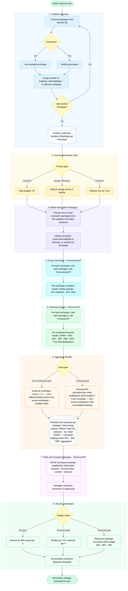

# RSE Tool – Draft Flowchart

**Renovation Strategy Explorer (RSE)**  
_Target user: public authorities, policymakers, urban planners_

---

```mermaid
flowchart TD
    classDef startEnd   fill:#d1fae5,stroke:#34d399,color:#000
    classDef portNode   fill:#e0f2fe,stroke:#38bdf8,color:#000
    classDef goalNode   fill:#fef3c7,stroke:#fbbf24,color:#000
    classDef pkgNode    fill:#ede9fe,stroke:#a78bfa,color:#000
    classDef fcastNode  fill:#cffafe,stroke:#22d3ee,color:#000
    classDef finNode    fill:#dcfce7,stroke:#4ade80,color:#000
    classDef aggNode    fill:#fff7ed,stroke:#fb923c,color:#000
    classDef mcdaNode   fill:#fdf4ff,stroke:#c084fc,color:#000
    classDef dashNode   fill:#f0fdf4,stroke:#34d399,color:#000
    classDef decNode    fill:#fef9c3,stroke:#facc15,color:#000
    classDef sumNode    fill:#f8fafc,stroke:#94a3b8,color:#000

    START([Public Authority User]):::startEnd

    START --> S1A

    subgraph STEP1[1. Portfolio Definition]
        S1A[Choose Archetypes from ReLIFE DB]:::portNode
        S1A --> S1B{Customise?}:::decNode
        S1B -->|No| S1C[Use standard archetype]:::portNode
        S1B -->|Yes| S1D[Modify parameters]:::portNode
        S1C --> S1E[Assign number of buildings: total buildings + % split per archetype]:::portNode
        S1D --> S1E
        S1E --> S1F{Add another\narchetype?}:::decNode
        S1F -->|Yes| S1A
        S1F -->|No| S1G[("Portfolio confirmed: Number of Buildings per Archetype")]:::sumNode
    end

    S1G --> S2A

    subgraph STEP2[2. Choose Renovation Goal]
        S2A{Primary goal}:::decNode
        S2A -->|Financial| S2B[Max budget: X €]:::goalNode
        S2A -->|Energy Efficiency| S2C[Reduce energy use by X kWh/yr]:::goalNode
        S2A -->|Emission| S2D[Reduce CO₂ by X t/yr]:::goalNode
    end

    S2B --> S3A
    S2C --> S3A
    S2D --> S3A

    subgraph STEP3[3. Define Renovation Packages]
        S3A[Choose one or more renovation packages from the available renovation measures]:::pkgNode
        S3A --> S3B[Define renovation scope:total buildings to renovate, or number per archetype]:::pkgNode
    end

    S3B --> F1

    subgraph STEP4[4. Energy Simulation - Forecasting API]
        F1[For each archetype i and each package p call Forecasting API]:::fcastNode
        F1 --> F2[Per-archetype simulation results: energy savings · CO₂ reduction · EPC class]:::fcastNode
    end

    F2 --> FIN1

    subgraph STEP5[5. Financial Analysis - Financial API]
        FIN1[For each archetype i and each package p: call Financial API]:::finNode
        FIN1 --> FIN2[Per-archetype financial results: CAPEX · ARV  · NPV · IRR · PBP · DPP, P10–P90 distributions]:::finNode
    end

    FIN2 --> G1

    subgraph STEP6[6. Aggregate Results
    ]
        G1{Goal type?}:::decNode
        G1 -->|EE or Emission goal| G_EE[Scale per archetype: result_i × nᵢ  ← user-defined building count Sum across archetypes → portfolio totals]:::aggNode
        G1 -->|Financial goal| G_FIN[Financial API calculates:how many buildings fit within budget X € per archetype → sum across archetypes= total renovatable buildings]:::aggNode
        G_EE --> G_OUT[("Portfolio-level summary per package:• Total energy savings  kWh/yr• Total CO₂ reduction   t/yr• Total CAPEX  /  renovated building count• NPV · IRR · PBP  aggregated")]:::sumNode
        G_FIN --> G_OUT
    end

    G_OUT --> M1

    subgraph STEP7[7. Rank and Compare Packages - Technical API]
        M1[MCDA scoring per package weighted by stated goal financial · environmental · comfort · technical]:::mcdaNode
        M1 --> M2[Packages ranked by closeness to stated goal]:::mcdaNode
    end

    M2 --> D1

    subgraph STEP8[8. Results Dashboard]
        D1{Display mode}:::decNode
        D1 -->|EE goal| D2[Ranked by kWh saved per €]:::dashNode
        D1 -->|Emission goal| D3[Ranked by t CO₂ reduced per €]:::dashNode
        D1 -->|Financial goal| D4[Ranked by buildings renovated within budget\nROI · NPV · IRR]:::dashNode
        D2 --> D5[All secondary indicators displayed alongside]:::dashNode
        D3 --> D5
        D4 --> D5
    end

    D5 --> END([Renovation strategy presented to user]):::startEnd

    style STEP1 fill:#f0f9ff,stroke:#bae6fd,color:#000
    style STEP2 fill:#fffbeb,stroke:#fde68a,color:#000
    style STEP3 fill:#f5f3ff,stroke:#ddd6fe,color:#000
    style STEP4 fill:#ecfeff,stroke:#a5f3fc,color:#000
    style STEP5 fill:#f0fdf4,stroke:#bbf7d0,color:#000
    style STEP6 fill:#fff7ed,stroke:#fed7aa,color:#000
    style STEP7 fill:#fdf4ff,stroke:#f0abfc,color:#000
    style STEP8 fill:#f0fdf4,stroke:#a7f3d0,color:#000
```

---
